# Mermaid Diagrams (Extracted)

This file holds the original Mermaid source for diagrams that were converted to ASCII art in their source files, for traceability and re-rendering.

## [16-Scenario-Cascading-Latency-From-Slow-Dependency.md] Cascading Latency (Sequence Diagram)

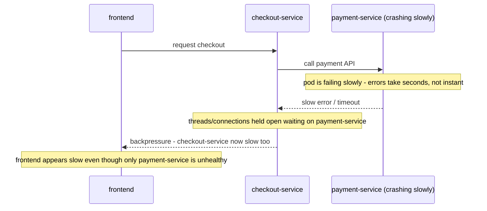
```mermaid
sequenceDiagram
    participant FE as frontend
    participant CO as checkout-service
    participant PAY as payment-service (crashing slowly)

    FE->>CO: request checkout
    CO->>PAY: call payment API
    Note over PAY: pod is failing slowly - errors take seconds, not instant
    PAY-->>CO: slow error / timeout
    Note over CO: threads/connections held open waiting on payment-service
    CO-->>FE: backpressure - checkout-service now slow too
    Note over FE: frontend appears slow even though only payment-service is unhealthy
```

## [20-Scenario-Rolling-Deployment-502-Errors.md] Startup & Termination Races (Sequence Diagram)

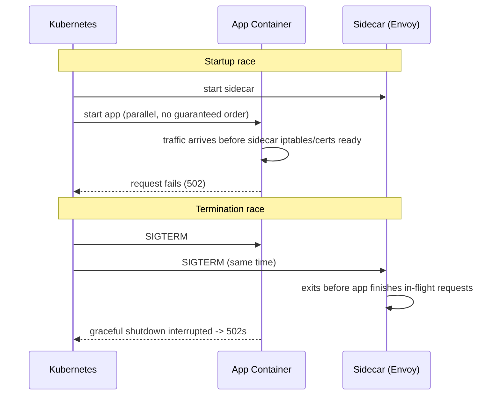
```mermaid
sequenceDiagram
    participant K8s as Kubernetes
    participant App as App Container
    participant Sidecar as Sidecar (Envoy)

    Note over K8s,Sidecar: Startup race
    K8s->>Sidecar: start sidecar
    K8s->>App: start app (parallel, no guaranteed order)
    App->>App: traffic arrives before sidecar iptables/certs ready
    App-->>K8s: request fails (502)

    Note over K8s,Sidecar: Termination race
    K8s->>App: SIGTERM
    K8s->>Sidecar: SIGTERM (same time)
    Sidecar->>Sidecar: exits before app finishes in-flight requests
    App-->>K8s: graceful shutdown interrupted -> 502s
```

## [21-Scenario-Rescheduled-Pod-Discovery-vs-Draining.md] Discovery vs. Draining Timeline (Sequence Diagram)

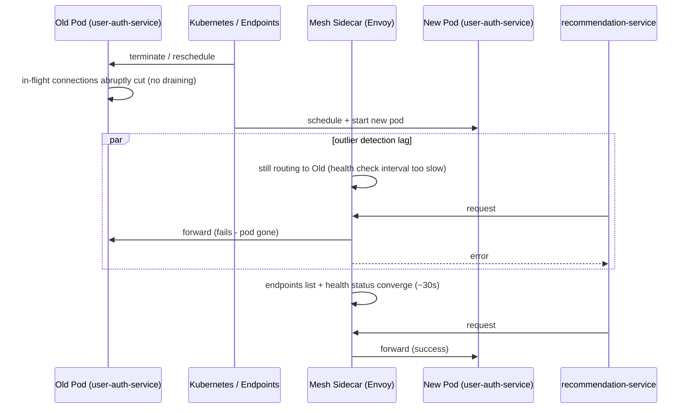
```mermaid
sequenceDiagram
    participant Old as Old Pod (user-auth-service)
    participant K8s as Kubernetes / Endpoints
    participant Mesh as Mesh Sidecar (Envoy)
    participant New as New Pod (user-auth-service)
    participant Caller as recommendation-service

    K8s->>Old: terminate / reschedule
    Old->>Old: in-flight connections abruptly cut (no draining)
    K8s->>New: schedule + start new pod
    par outlier detection lag
        Mesh->>Mesh: still routing to Old (health check interval too slow)
        Caller->>Mesh: request
        Mesh->>Old: forward (fails - pod gone)
        Mesh-->>Caller: error
    end
    Mesh->>Mesh: endpoints list + health status converge (~30s)
    Caller->>Mesh: request
    Mesh->>New: forward (success)
```

## [24-Advanced-Multi-Region-Active-Active-Failover.md] Three-Layer Architecture (Diagram)

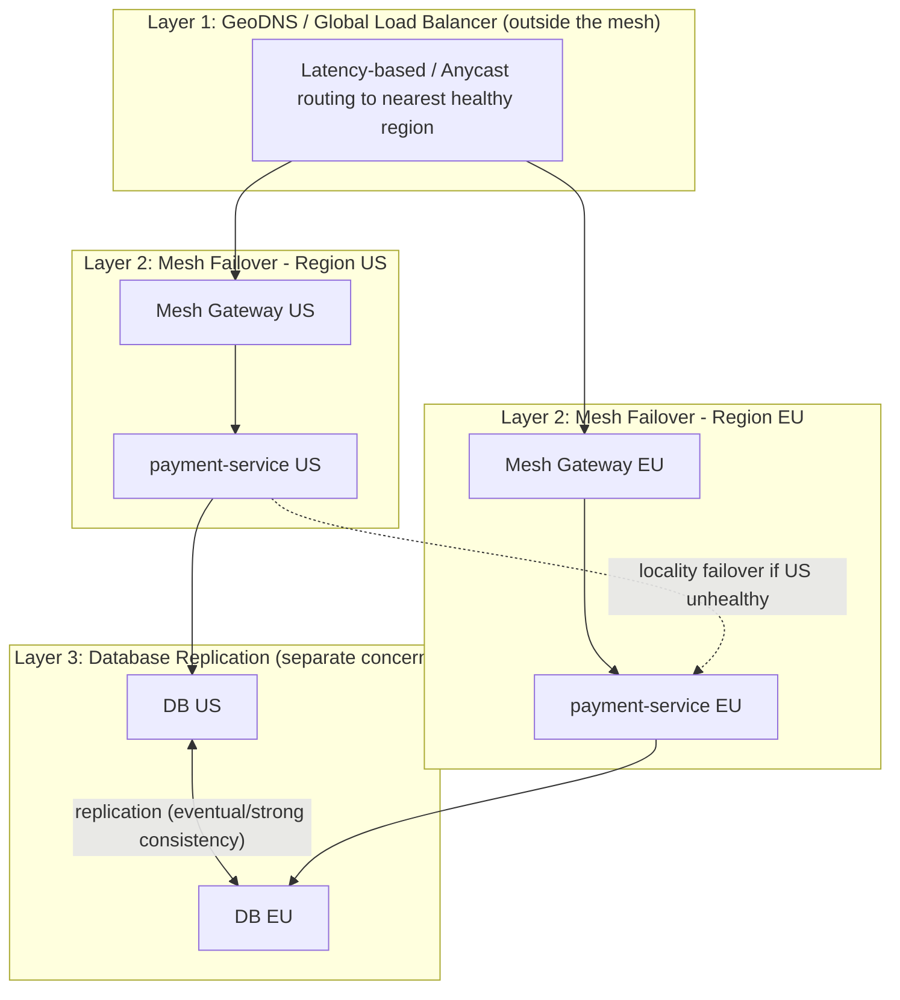
```mermaid
flowchart TB
    subgraph L1["Layer 1: GeoDNS / Global Load Balancer (outside the mesh)"]
        DNS["Latency-based / Anycast routing to nearest healthy region"]
    end
    subgraph L2US["Layer 2: Mesh Failover - Region US"]
        GW_US["Mesh Gateway US"] --> SVC_US["payment-service US"]
    end
    subgraph L2EU["Layer 2: Mesh Failover - Region EU"]
        GW_EU["Mesh Gateway EU"] --> SVC_EU["payment-service EU"]
    end
    subgraph L3["Layer 3: Database Replication (separate concern)"]
        DB_US["DB US"] <-->|"replication (eventual/strong consistency)"| DB_EU["DB EU"]
    end
    DNS --> GW_US
    DNS --> GW_EU
    SVC_US -.->|"locality failover if US unhealthy"| SVC_EU
    SVC_US --> DB_US
    SVC_EU --> DB_EU
```

## [25-Advanced-Multi-Tenant-Platform-Design.md] Namespace / RBAC Isolation Architecture (Diagram)

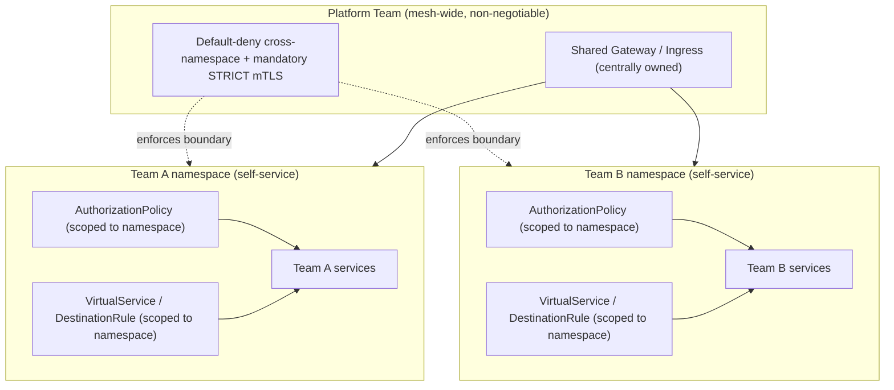
```mermaid
flowchart TB
    subgraph Platform["Platform Team (mesh-wide, non-negotiable)"]
        RootPolicy["Default-deny cross-namespace + mandatory STRICT mTLS"]
        SharedGW["Shared Gateway / Ingress (centrally owned)"]
    end
    subgraph TeamA["Team A namespace (self-service)"]
        AuthA["AuthorizationPolicy (scoped to namespace)"]
        VSA["VirtualService / DestinationRule (scoped to namespace)"]
        SvcA["Team A services"]
    end
    subgraph TeamB["Team B namespace (self-service)"]
        AuthB["AuthorizationPolicy (scoped to namespace)"]
        VSB["VirtualService / DestinationRule (scoped to namespace)"]
        SvcB["Team B services"]
    end
    RootPolicy -.enforces boundary.-> TeamA
    RootPolicy -.enforces boundary.-> TeamB
    SharedGW --> TeamA
    SharedGW --> TeamB
    AuthA --> SvcA
    VSA --> SvcA
    AuthB --> SvcB
    VSB --> SvcB
```

## [26-Advanced-Mesh-Wide-Certificate-Rotation-At-Scale.md] Dual-Root-Trust Rotation (Sequence Diagram)

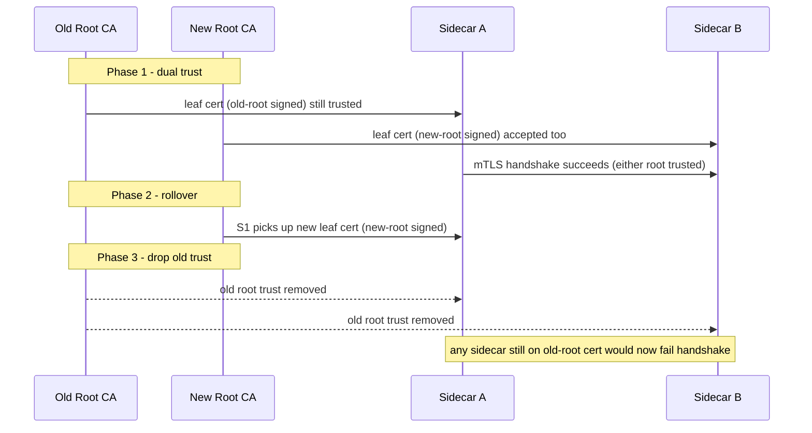
```mermaid
sequenceDiagram
    participant Old as Old Root CA
    participant New as New Root CA
    participant S1 as Sidecar A
    participant S2 as Sidecar B

    Note over Old,New: Phase 1 - dual trust
    Old->>S1: leaf cert (old-root signed) still trusted
    New->>S2: leaf cert (new-root signed) accepted too
    S1->>S2: mTLS handshake succeeds (either root trusted)

    Note over Old,New: Phase 2 - rollover
    New->>S1: S1 picks up new leaf cert (new-root signed)

    Note over Old,New: Phase 3 - drop old trust
    Old-->>S1: old root trust removed
    Old-->>S2: old root trust removed
    Note over S1,S2: any sidecar still on old-root cert would now fail handshake
```

## [Service Mesh Interview Mastery - Scratch to 15yr Architect.md] Part 1 — The Story: Why Does Service Mesh Even Exist (Microservices Call Graph)

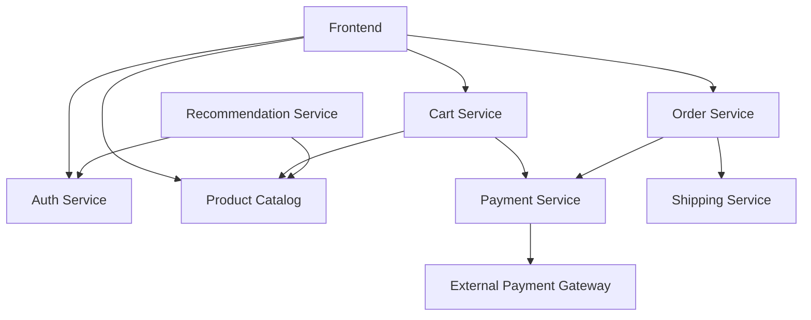
```mermaid
graph TD
    FE[Frontend] --> AUTH[Auth Service]
    FE --> CART[Cart Service]
    FE --> CATALOG[Product Catalog]
    CART --> CATALOG
    CART --> PAY[Payment Service]
    FE --> ORDER[Order Service]
    ORDER --> PAY
    ORDER --> SHIP[Shipping Service]
    REC[Recommendation Service] --> AUTH
    REC --> CATALOG
    PAY --> BANK[External Payment Gateway]
```

## [Service Mesh Interview Mastery - Scratch to 15yr Architect.md] Part 1 — The Story: Why Does Service Mesh Even Exist (Without Service Mesh: Every Team Reinvents the Wheel)

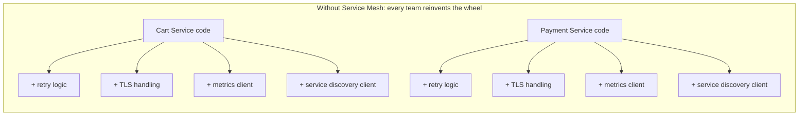
```mermaid
graph LR
    subgraph "Without Service Mesh: every team reinvents the wheel"
    A[Cart Service code] --> A1[+ retry logic]
    A --> A2[+ TLS handling]
    A --> A3[+ metrics client]
    A --> A4[+ service discovery client]
    B[Payment Service code] --> B1[+ retry logic]
    B --> B2[+ TLS handling]
    B --> B3[+ metrics client]
    B --> B4[+ service discovery client]
    end
```

## [Service Mesh Interview Mastery - Scratch to 15yr Architect.md] Part 2 — Sidecar Pattern, Control Plane vs Data Plane (Sidecar + App Container)

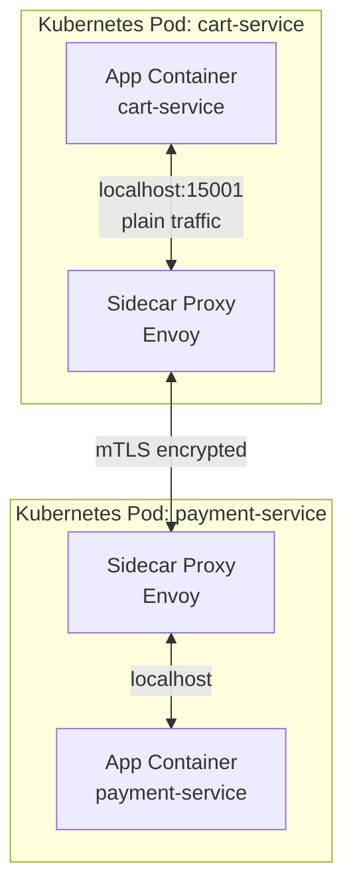
```mermaid
graph TB
    subgraph Pod["Kubernetes Pod: cart-service"]
        APP[App Container<br/>cart-service]
        PROXY[Sidecar Proxy<br/>Envoy]
        APP <-->|localhost:15001<br/>plain traffic| PROXY
    end
    PROXY <-->|mTLS encrypted| PROXY2

    subgraph Pod2["Kubernetes Pod: payment-service"]
        APP2[App Container<br/>payment-service]
        PROXY2[Sidecar Proxy<br/>Envoy]
        PROXY2 <-->|localhost| APP2
    end
```

## [Service Mesh Interview Mastery - Scratch to 15yr Architect.md] Part 2 — Sidecar Pattern, Control Plane vs Data Plane (Control Plane vs Data Plane)

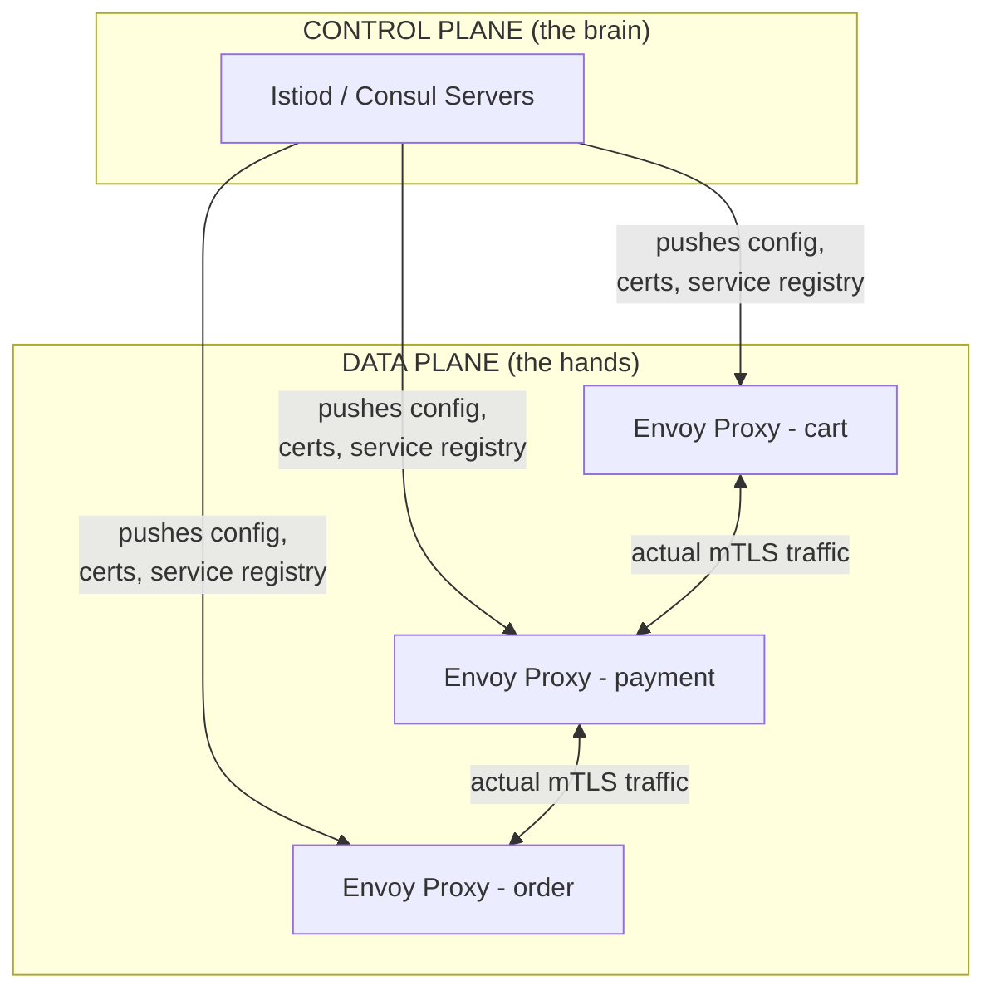
```mermaid
graph TB
    subgraph CP["CONTROL PLANE (the brain)"]
        ISTIOD[Istiod / Consul Servers]
    end
    subgraph DP["DATA PLANE (the hands)"]
        E1[Envoy Proxy - cart]
        E2[Envoy Proxy - payment]
        E3[Envoy Proxy - order]
    end
    ISTIOD -->|pushes config,<br/>certs, service registry| E1
    ISTIOD -->|pushes config,<br/>certs, service registry| E2
    ISTIOD -->|pushes config,<br/>certs, service registry| E3
    E1 <-->|actual mTLS traffic| E2
    E2 <-->|actual mTLS traffic| E3
```

## [Service Mesh Interview Mastery - Scratch to 15yr Architect.md] Part 2 — Sidecar Pattern, Control Plane vs Data Plane (Sidecar Injection via Mutating Webhook)

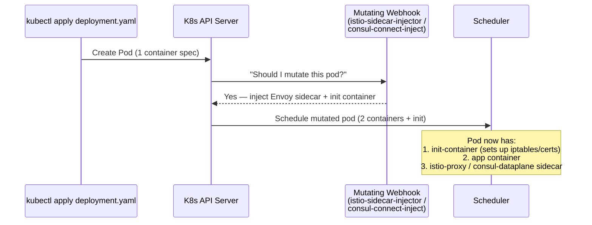
```mermaid
sequenceDiagram
    participant Dev as kubectl apply deployment.yaml
    participant API as K8s API Server
    participant Webhook as Mutating Webhook<br/>(istio-sidecar-injector /<br/>consul-connect-inject)
    participant Sched as Scheduler
    Dev->>API: Create Pod (1 container spec)
    API->>Webhook: "Should I mutate this pod?"
    Webhook-->>API: Yes — inject Envoy sidecar + init container
    API->>Sched: Schedule mutated pod (2 containers + init)
    Note over Sched: Pod now has:<br/>1. init-container (sets up iptables/certs)<br/>2. app container<br/>3. istio-proxy / consul-dataplane sidecar
```

## [Service Mesh Interview Mastery - Scratch to 15yr Architect.md] Part 3 — Security: mTLS and Zero Trust (mTLS Handshake Sequence)

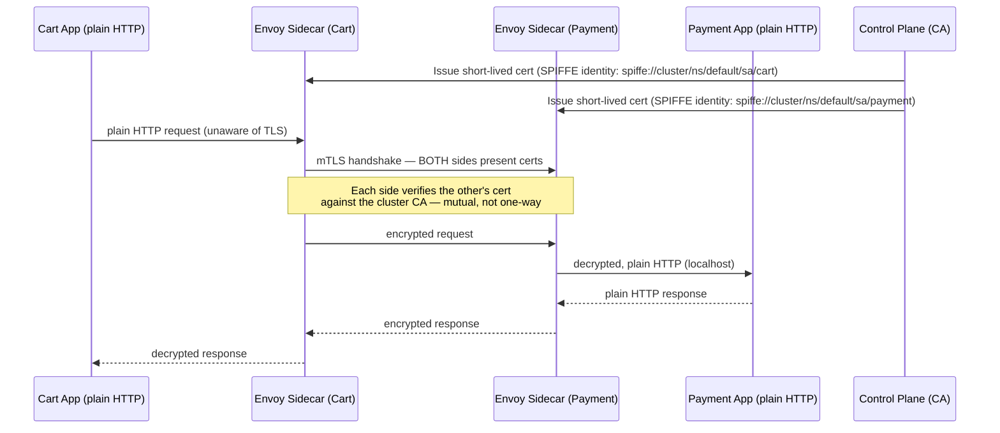
```mermaid
sequenceDiagram
    participant App1 as Cart App (plain HTTP)
    participant P1 as Envoy Sidecar (Cart)
    participant P2 as Envoy Sidecar (Payment)
    participant App2 as Payment App (plain HTTP)
    participant CA as Control Plane (CA)

    CA->>P1: Issue short-lived cert (SPIFFE identity: spiffe://cluster/ns/default/sa/cart)
    CA->>P2: Issue short-lived cert (SPIFFE identity: spiffe://cluster/ns/default/sa/payment)
    App1->>P1: plain HTTP request (unaware of TLS)
    P1->>P2: mTLS handshake — BOTH sides present certs
    Note over P1,P2: Each side verifies the other's cert<br/>against the cluster CA — mutual, not one-way
    P1->>P2: encrypted request
    P2->>App2: decrypted, plain HTTP (localhost)
    App2-->>P2: plain HTTP response
    P2-->>P1: encrypted response
    P1-->>App1: decrypted response
```

## [Service Mesh Interview Mastery - Scratch to 15yr Architect.md] Part 3 — Security: mTLS and Zero Trust (Micro-segmentation Authorization)

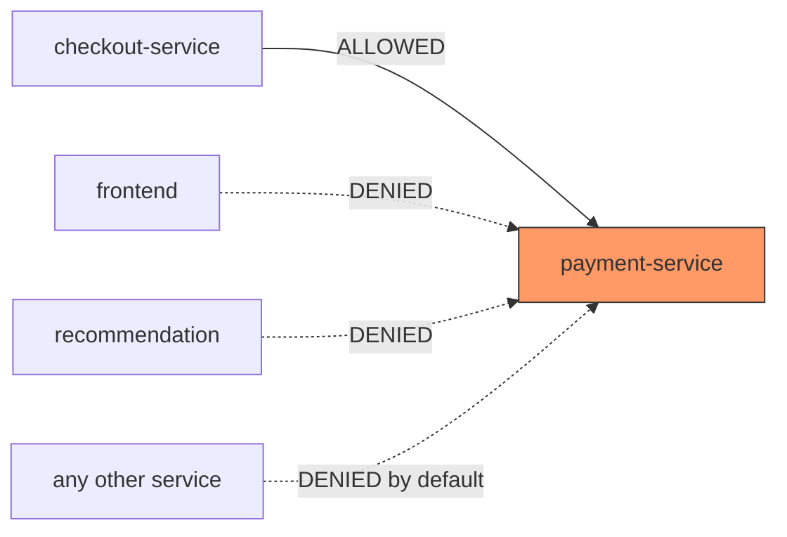
```mermaid
graph LR
    CHECKOUT[checkout-service] -->|ALLOWED| PAYMENT[payment-service]
    FRONTEND[frontend] -.->|DENIED| PAYMENT
    RECOMMEND[recommendation] -.->|DENIED| PAYMENT
    ANY[any other service] -.->|DENIED by default| PAYMENT
    style PAYMENT fill:#f96,stroke:#333
```

## [Service Mesh Interview Mastery - Scratch to 15yr Architect.md] Part 4 — Traffic Management: Canary, Retries, Circuit Breaking (Canary / Traffic Splitting)

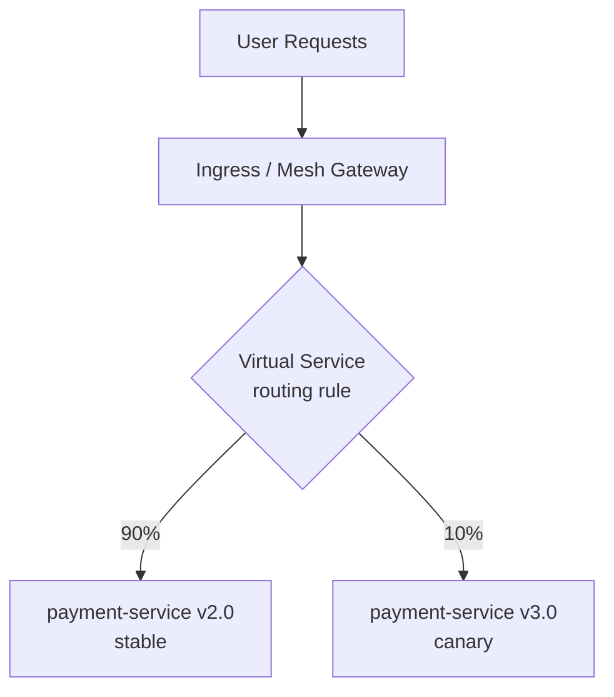
```mermaid
graph TD
    USER[User Requests] --> GW[Ingress / Mesh Gateway]
    GW --> VS{Virtual Service<br/>routing rule}
    VS -->|90%| V1[payment-service v2.0<br/>stable]
    VS -->|10%| V2[payment-service v3.0<br/>canary]
```

## [Service Mesh Interview Mastery - Scratch to 15yr Architect.md] Part 4 — Traffic Management: Canary, Retries, Circuit Breaking (Retries, Timeouts, Circuit Breaking)

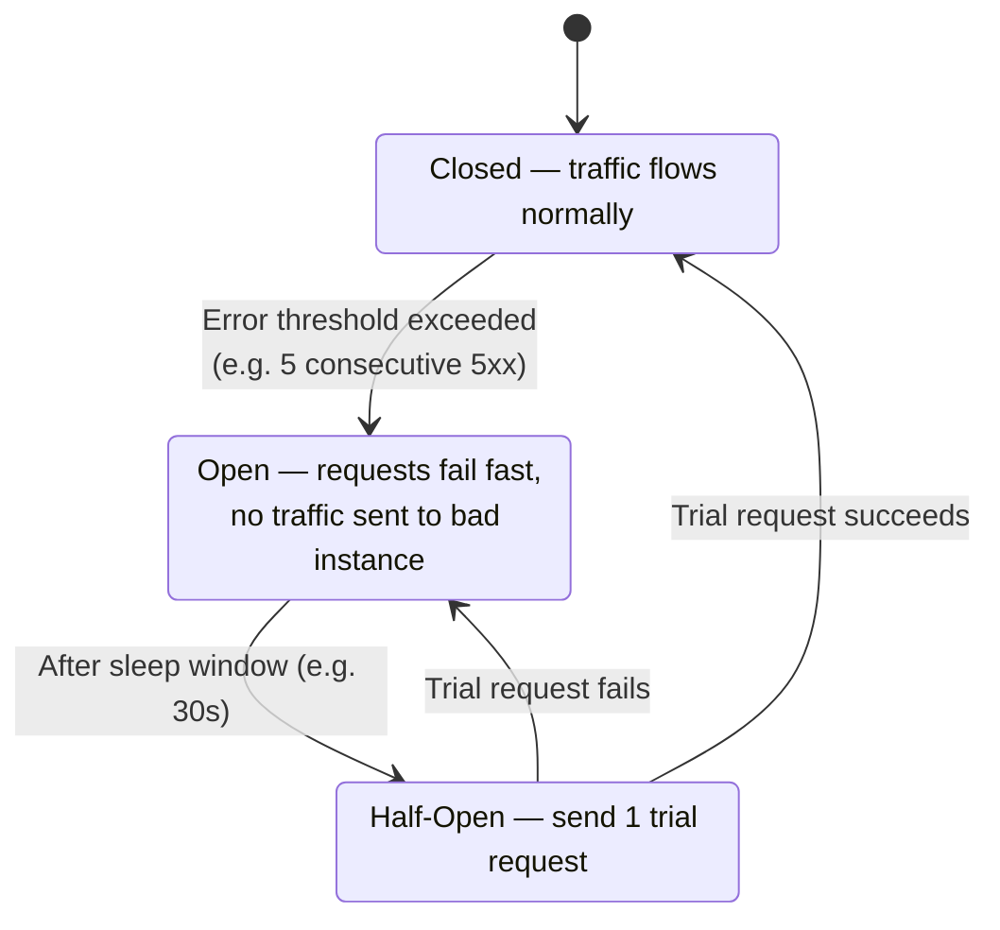
```mermaid
stateDiagram-v2
    [*] --> Closed
    Closed --> Open: Error threshold exceeded<br/>(e.g. 5 consecutive 5xx)
    Open --> HalfOpen: After sleep window (e.g. 30s)
    HalfOpen --> Closed: Trial request succeeds
    HalfOpen --> Open: Trial request fails
    Closed: Closed — traffic flows normally
    Open: Open — requests fail fast,<br/>no traffic sent to bad instance
    HalfOpen: Half-Open — send 1 trial request
```

## [Service Mesh Interview Mastery - Scratch to 15yr Architect.md] Part 5 — Observability: Metrics, Tracing, Kiali/Grafana (Uniform Telemetry Flow)

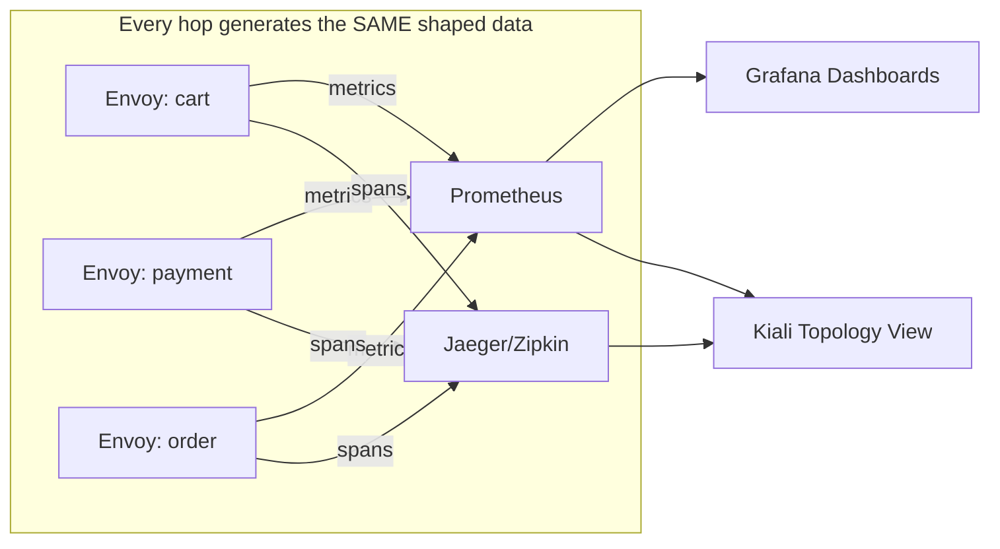
```mermaid
graph LR
    subgraph "Every hop generates the SAME shaped data"
    E1[Envoy: cart] -->|metrics| PROM[Prometheus]
    E2[Envoy: payment] -->|metrics| PROM
    E3[Envoy: order] -->|metrics| PROM
    E1 -->|spans| JAEGER[Jaeger/Zipkin]
    E2 -->|spans| JAEGER
    E3 -->|spans| JAEGER
    end
    PROM --> GRAFANA[Grafana Dashboards]
    JAEGER --> KIALI[Kiali Topology View]
    PROM --> KIALI
```

## [Service Mesh Interview Mastery - Scratch to 15yr Architect.md] Part 6 — Multi-Cluster, Multi-Datacenter, Hybrid VM (Multi-Cluster with Mesh Gateways)

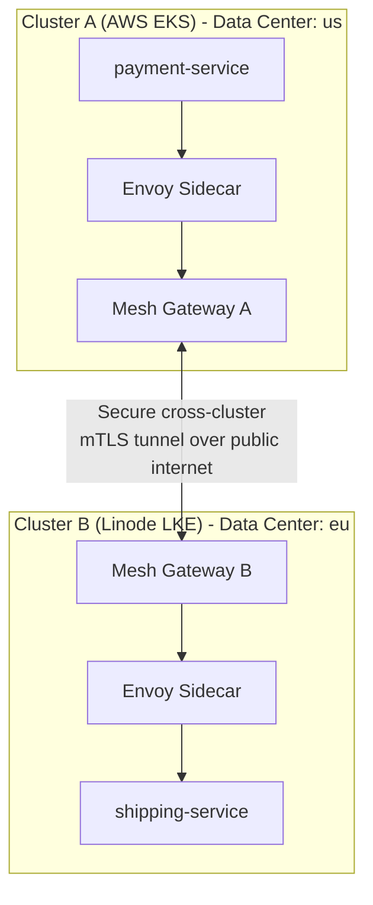
```mermaid
graph TB
    subgraph "Cluster A (AWS EKS) - Data Center: us"
        PAY[payment-service] --> PROXY1[Envoy Sidecar]
        PROXY1 --> MGW1[Mesh Gateway A]
    end
    subgraph "Cluster B (Linode LKE) - Data Center: eu"
        MGW2[Mesh Gateway B] --> PROXY2[Envoy Sidecar]
        PROXY2 --> SHIP[shipping-service]
    end
    MGW1 <-->|Secure cross-cluster<br/>mTLS tunnel over public internet| MGW2
```

## [Service Mesh Interview Mastery - Scratch to 15yr Architect.md] Part 6 — Multi-Cluster, Multi-Datacenter, Hybrid VM (Consul Cluster Peering Flow)

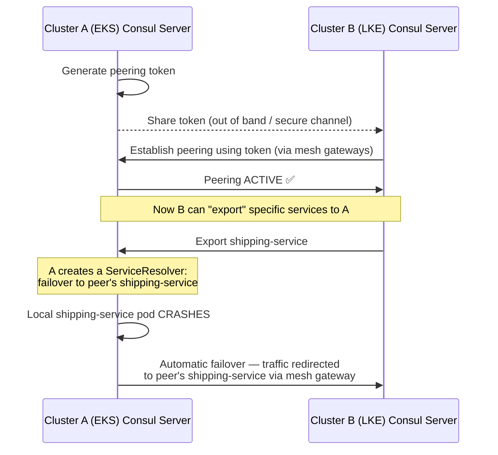
```mermaid
sequenceDiagram
    participant A as Cluster A (EKS) Consul Server
    participant B as Cluster B (LKE) Consul Server
    A->>A: Generate peering token
    A-->>B: Share token (out of band / secure channel)
    B->>A: Establish peering using token (via mesh gateways)
    A->>B: Peering ACTIVE ✅
    Note over A,B: Now B can "export" specific services to A
    B->>A: Export shipping-service
    Note over A: A creates a ServiceResolver:<br/>failover to peer's shipping-service
    A->>A: Local shipping-service pod CRASHES
    A->>B: Automatic failover — traffic redirected<br/>to peer's shipping-service via mesh gateway
```

## [Service Mesh Interview Mastery - Scratch to 15yr Architect.md] Part 6 — Multi-Cluster, Multi-Datacenter, Hybrid VM (Hybrid: Kubernetes + Legacy VMs)

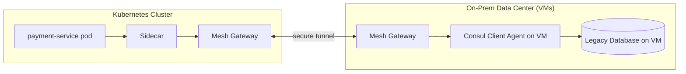
```mermaid
graph LR
    subgraph K8sCluster["Kubernetes Cluster"]
        PAY2[payment-service pod] --> SC[Sidecar]
        SC --> MGW3[Mesh Gateway]
    end
    subgraph VMDataCenter["On-Prem Data Center (VMs)"]
        MGW4[Mesh Gateway] --> AGENT[Consul Client Agent on VM]
        AGENT --> DB[(Legacy Database on VM)]
    end
    MGW3 <-->|secure tunnel| MGW4
```

## [Service Mesh Interview Mastery - Scratch to 15yr Architect.md] Part 7 — Istio Deep-Dive Architecture (Control Plane / Data Plane Architecture)

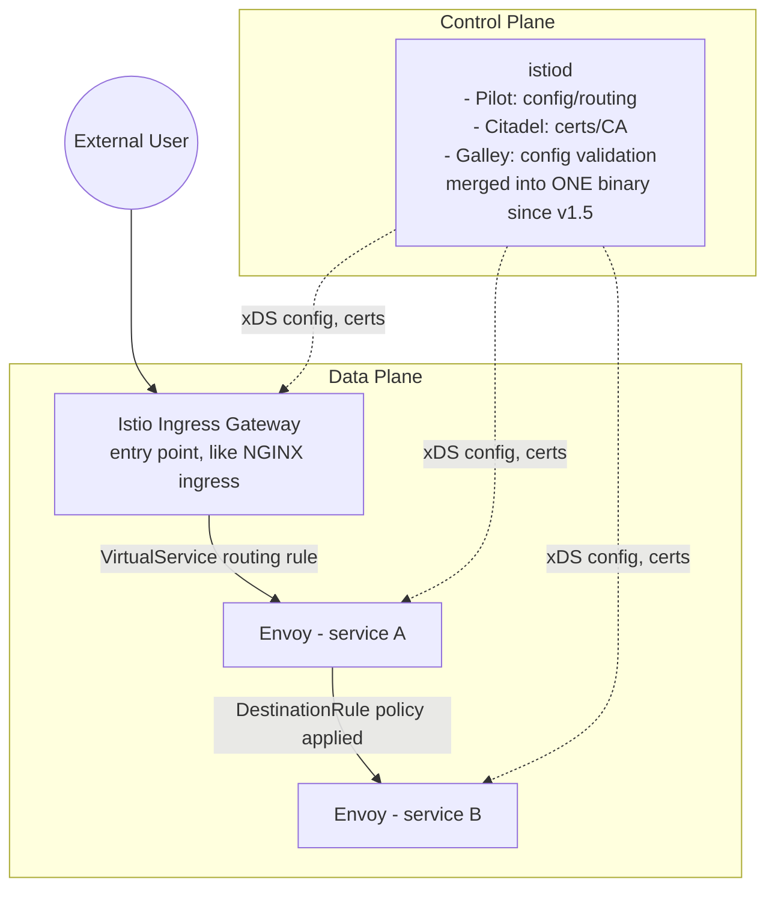
```mermaid
graph TB
    subgraph "Control Plane"
        ISTIOD[istiod<br/>- Pilot: config/routing<br/>- Citadel: certs/CA<br/>- Galley: config validation<br/>merged into ONE binary since v1.5]
    end
    subgraph "Data Plane"
        IGW[Istio Ingress Gateway<br/>entry point, like NGINX ingress]
        E1[Envoy - service A]
        E2[Envoy - service B]
    end
    USER((External User)) --> IGW
    IGW -->|VirtualService routing rule| E1
    E1 -->|DestinationRule policy applied| E2
    ISTIOD -.->|xDS config, certs| IGW
    ISTIOD -.->|xDS config, certs| E1
    ISTIOD -.->|xDS config, certs| E2
```

## [Service Mesh Interview Mastery - Scratch to 15yr Architect.md] Part 7 — Istio Deep-Dive Architecture (VirtualService vs DestinationRule Sequence)

```mermaid
sequenceDiagram
    participant U as User
    participant GW as Istio Gateway
    participant VS as VirtualService (routing)
    participant DR as DestinationRule (policy)
    participant Pod as payment-service v2 pod
    U->>GW: HTTPS request
    GW->>VS: Evaluate routing rules
    VS->>DR: Route matched → apply destination policy
    DR->>Pod: Load-balanced, circuit-breaker-aware connection
    Pod-->>U: Response (traced + metrics collected along the way)
```

## [Service Mesh Interview Mastery - Scratch to 15yr Architect.md] Part 7 — Istio Deep-Dive Architecture (Istio Gateway vs Ingress Gateway vs Kubernetes Ingress)

```mermaid
graph LR
    A[Kubernetes Ingress Resource] -.->|generic K8s API,<br/>needs a controller like nginx-ingress| B[Any ingress controller]
    C[Istio Gateway CRD] -->|Istio-specific,<br/>L4-L6 config: ports, TLS, hosts| D[Istio Ingress Gateway pod<br/>= Envoy running standalone]
    C --> E[Paired with VirtualService<br/>for L7 routing rules]
```

## [Service Mesh Interview Mastery - Scratch to 15yr Architect.md] Part 8 — Consul Deep-Dive Architecture

```mermaid
graph TB
    subgraph "Control Plane (HQ office)"
        CS1[Consul Server 1]
        CS2[Consul Server 2]
        CS3[Consul Server 3]
        CS1 <-.Raft consensus.-> CS2
        CS2 <-.Raft consensus.-> CS3
    end
    subgraph "Data Plane (personal assistants)"
        CC1[Consul Client Agent + Envoy - Pod A]
        CC2[Consul Client Agent + Envoy - Pod B]
    end
    CS1 -->|gossip protocol +<br/>service catalog, certs| CC1
    CS2 -->|gossip protocol +<br/>service catalog, certs| CC2
    CC1 <-->|mTLS data traffic| CC2
```

## [Service Mesh Interview Mastery - Scratch to 15yr Architect.md] Part 9 — Scenario-Based Interview Questions (Scenario 1: Cascading Latency Diagnosis Flow)

```mermaid
graph TD
    A[Check Kiali/Consul UI topology] --> B{Is payment-service<br/>showing high error rate<br/>or high p99 latency?}
    B -->|Yes| C[Check outlier detection /<br/>circuit breaker status]
    C --> D{Is DestinationRule configured<br/>with reasonable timeouts?}
    D -->|No timeout set| E[Root cause: default timeout too high<br/>or missing entirely — requests hang]
    D -->|Yes but no circuit breaker| F[Root cause: unhealthy pod<br/>keeps receiving traffic — no ejection]
```

## [Service Mesh Interview Mastery - Scratch to 15yr Architect.md] Part 9 — Scenario-Based Interview Questions (Scenario 2: Flagger/Argo Rollouts Automated Rollback)

```mermaid
graph LR
    FLAGGER[Flagger/Argo Rollouts] -->|watches| PROM[Prometheus metrics<br/>from Envoy sidecars]
    FLAGGER -->|if error rate > threshold| ACTION[Automatically set<br/>canary weight back to 0%]
    FLAGGER -->|if healthy| PROMOTE[Gradually increase weight<br/>10% -> 30% -> 60% -> 100%]
```

## [Service Mesh Interview Mastery - Scratch to 15yr Architect.md] Part 9 — Scenario-Based Interview Questions (Scenario 3: Retry Storm Collapse)

```mermaid
graph TD
    A[payment-service overloaded, p99 = 4s] --> B[5 callers each retry x5]
    B --> C[Load multiplies ~5x-25x]
    C --> D[Service fully collapses -<br/>retries caused the outage, not prevented it]
```

## [Service Mesh Interview Mastery - Scratch to 15yr Architect.md] Part 9 — Scenario-Based Interview Questions (Scenario 4: Unauthorized Bypass Allow/Deny)

```mermaid
graph LR
    CHECKOUT[checkout-service] -->|"ALLOW (explicit intention)"| PAYMENT[payment-service]
    FRONTEND -.->|"DENY (default, no intention)"| PAYMENT
```

## [Service Mesh Interview Mastery - Scratch to 15yr Architect.md] Part 9 — Scenario-Based Interview Questions (Scenario 6: Sidecar Race Condition During Rolling Deployment)

```mermaid
sequenceDiagram
    participant K8s as Kubernetes
    participant App as App Container
    participant Sidecar as Envoy Sidecar
    Note over K8s: Pod starting
    K8s->>Sidecar: Start sidecar
    K8s->>App: Start app (in parallel, no guaranteed order!)
    App->>Sidecar: App starts serving traffic BEFORE sidecar's<br/>iptables rules / cert are ready -> requests fail
    Note over K8s: Pod terminating
    K8s->>App: SIGTERM sent to app
    K8s->>Sidecar: SIGTERM sent to sidecar (same time!)
    Sidecar->>Sidecar: Sidecar exits BEFORE app finishes<br/>in-flight requests/graceful shutdown -> 502s
```

## [Service Mesh Interview Mastery - Scratch to 15yr Architect.md] Part 9 — Scenario-Based Interview Questions (Scenario 7: Zero-Downtime Mesh Migration Steps)

```mermaid
graph TD
    A[1. Install control plane<br/>no impact - no pods touched yet] --> B[2. Enable injection on ONE<br/>non-critical namespace/service first]
    B --> C[3. Rolling restart that service -<br/>verify 2/2 containers, check logs, check Kiali]
    C --> D[4. Verify mTLS in PERMISSIVE mode<br/>- both plaintext and mTLS accepted]
    D --> E[5. Gradually enable injection<br/>service by service, canary-style]
    E --> F[6. Once ALL services in mesh,<br/>flip mTLS to STRICT mode]
    F --> G[7. Apply default-deny authorization,<br/>then allow-list explicit paths]
```

## [Service Mesh Interview Mastery - Scratch to 15yr Architect.md] Part 10 — Advanced Scenario Questions (Advanced Scenario 1: Multi-Region Active-Active Failover)

```mermaid
graph TB
    subgraph "Region US (EKS)"
        direction TB
        MGW_US[Mesh Gateway US]
        SVC_US[payment-service US]
    end
    subgraph "Region EU (LKE/GKE)"
        direction TB
        MGW_EU[Mesh Gateway EU]
        SVC_EU[payment-service EU]
    end
    GLB[Global Load Balancer / GeoDNS] -->|latency-based routing| MGW_US
    GLB -->|latency-based routing| MGW_EU
    MGW_US <-->|Cluster peering /<br/>WAN federation, mTLS| MGW_EU
    SVC_US -.->|Locality-aware failover<br/>if US region unhealthy| SVC_EU
```

## [Service Mesh Interview Mastery - Scratch to 15yr Architect.md] Part 10 — Advanced Scenario Questions (Advanced Scenario 2: Certificate Rotation via SDS)

```mermaid
sequenceDiagram
    participant CA as Control Plane CA
    participant Sidecar as Envoy Sidecar
    Note over CA,Sidecar: Well before cert expiry (e.g. at 2/3 of TTL)
    Sidecar->>CA: Request new cert (SDS - Secret Discovery Service)
    CA-->>Sidecar: New cert issued
    Sidecar->>Sidecar: Hot-swap cert in memory,<br/>NO restart, NO connection drop
```

## [Service Mesh Interview Mastery - Scratch to 15yr Architect.md] Part 10 — Advanced Scenario Questions (Advanced Scenario 3: Sidecar Mode vs Ambient Mode)

```mermaid
graph TB
    subgraph "Sidecar Mode (traditional)"
        P1[Pod: App + Envoy sidecar<br/>1 sidecar PER POD]
    end
    subgraph "Ambient Mode"
        P2[Pod: App only, no sidecar]
        ZTUNNEL[ztunnel - node-level L4 proxy<br/>shared by ALL pods on the node]
        WAYPOINT[Waypoint proxy - optional,<br/>namespace-level, for L7 features]
        P2 --> ZTUNNEL
        ZTUNNEL --> WAYPOINT
    end
```

## [Service Mesh Interview Mastery - Scratch to 15yr Architect.md] Part 10 — Advanced Scenario Questions (Advanced Scenario 4: GitOps Policy Enforcement)

```mermaid
graph LR
    DEV[Developer PR] --> REVIEW[Code Review]
    REVIEW --> ARGOCD[ArgoCD applies to cluster]
    ARGOCD --> GATEKEEPER{OPA Gatekeeper<br/>admission check}
    GATEKEEPER -->|Violates STRICT mTLS policy| REJECT[Rejected at admission,<br/>never reaches etcd]
    GATEKEEPER -->|Compliant| APPLY[Applied]
```

## [Service Mesh Interview Mastery - Scratch to 15yr Architect.md] Part 10 — Advanced Scenario Questions (Advanced Scenario 6: Fault Injection for Chaos Engineering)

```mermaid
graph TD
    A[VirtualService fault injection] --> B[Inject 500ms delay<br/>on 10% of requests to payment-service]
    A --> C[Inject 5xx abort<br/>on 5% of requests to shipping-service]
    B --> D[Observe: does checkout-service<br/>timeout/circuit-break correctly?]
    C --> E[Observe: does frontend show<br/>a graceful error, not a blank crash?]
```

## [Service Mesh Interview Mastery - Scratch to 15yr Architect.md] Part 13 — How to Answer Scenario Questions in the Real Interview (STAR Answer Framework)

```mermaid
graph LR
    S[Situation<br/>1 sentence: what was the system/context] --> T[Trade-off<br/>What are the 2 competing concerns?]
    T --> D[Decision<br/>What did you configure/design and WHY]
    D --> R[Result/Guardrail<br/>How did you verify it worked,<br/>or what would you monitor going forward]
```
