## [Q12_circuit_breaker_resilience4j.md] State Diagram (Mermaid)

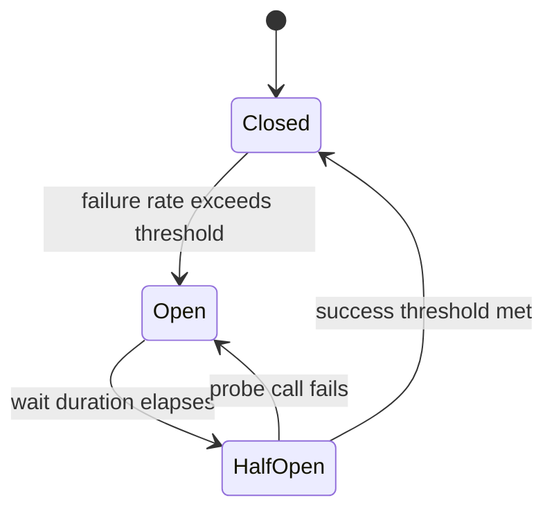

## [40_OAuth 2.0 Explained with API Request and Response Sample  High Level System Design/notes.md] Sequence Diagram

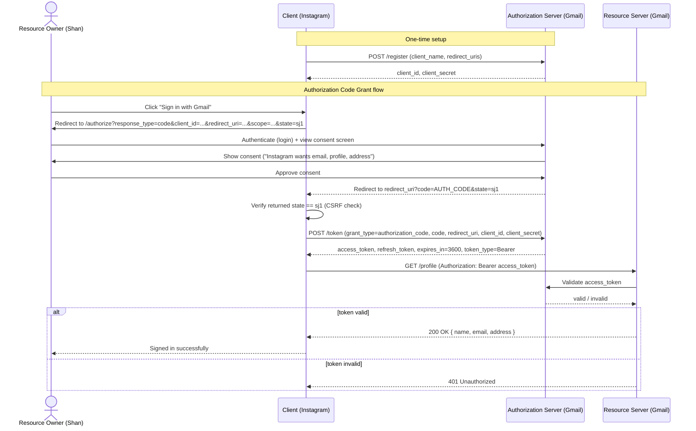

## [16_Spring boot @Transactional Annotation - Part3  Isolation Level and its different types/notes.md] Isolation Level Ladder (Mermaid)

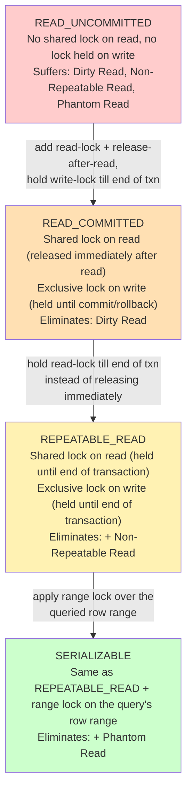

## [Q3_transactional_proxy_flow.md] Sequence Diagram (Mermaid)

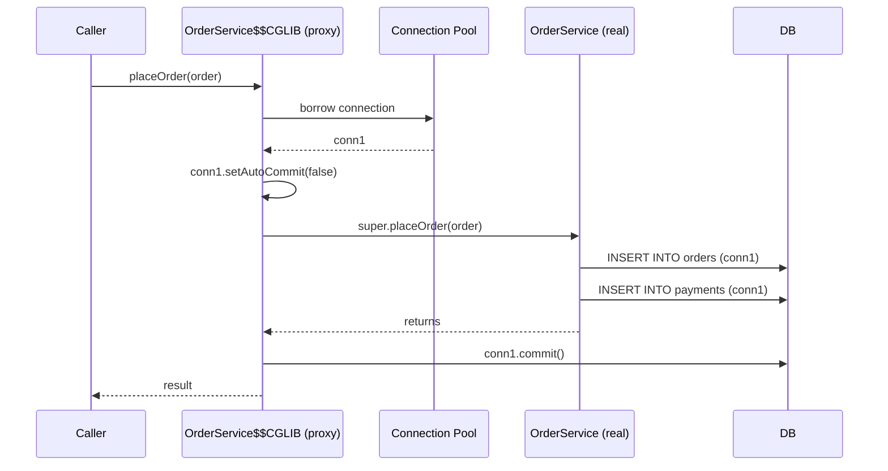

## [webflux-senior-interview-questions.md] Event Loop Architecture (Mermaid)

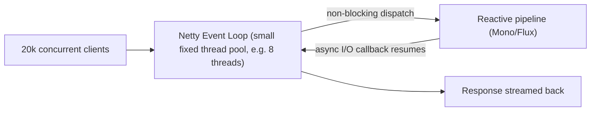

## [36_Spring boot Security (Part-3)  Form Based Authentication & Authorization  Stateful Authentication/notes.md] Sequence Diagram

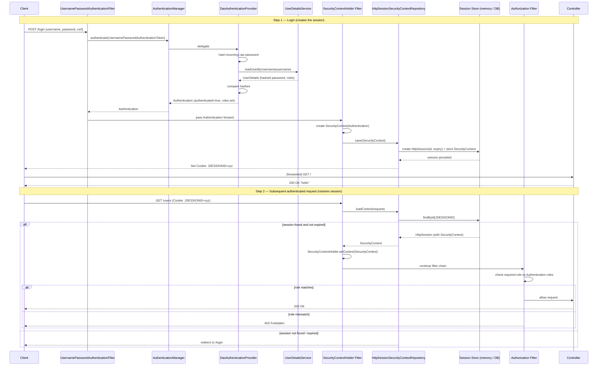

## [Q5_transactional_propagation_deep_dive.md] Side-by-Side Comparison (Mermaid)

```mermaid
flowchart TB
    subgraph REQUIRED["REQUIRED (default)"]
        direction LR
        R1["placeOrder() on conn#42"] --> R2["inventoryService joins SAME conn#42"] --> R3["single commit"]
    end
    subgraph REQUIRES_NEW["REQUIRES_NEW"]
        direction LR
        N1["placeOrder() on conn#42"] --> N2["SUSPEND conn#42"] --> N3["auditService on NEW conn#99"] --> N4["commit conn#99"] --> N5["RESUME conn#42"]
    end
    subgraph NESTED["NESTED"]
        direction LR
        S1["placeOrder() on conn#42"] --> S2["SAVEPOINT sp1"] --> S3["rewardService fails"] --> S4["ROLLBACK TO sp1 (outer TX survives)"]
    end
```

## [15_Spring boot @Transactional Annotation - Part2  Declarative, Programmatic Approach and Propagation/notes.md] Propagation Decision Flow

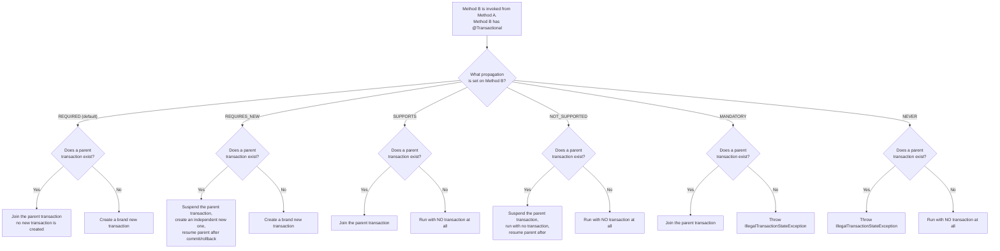

## [43_Spring Boot Actuator in depth/notes.md] Actuator Endpoint Request Flow

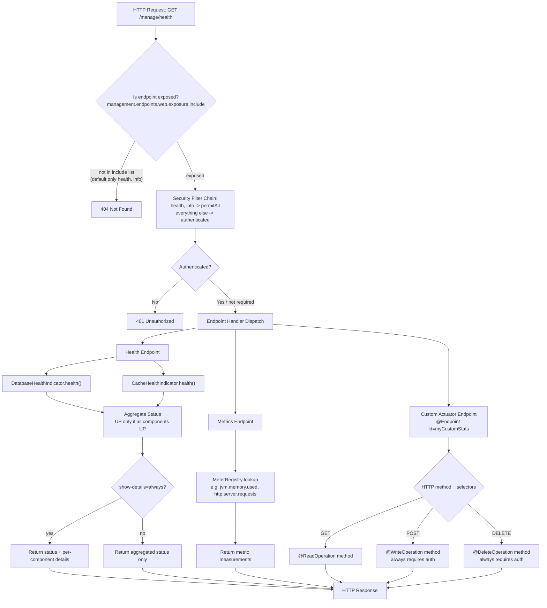

## [Q16_microservices_distributed_traps.md] Sequence Diagram (Mermaid)

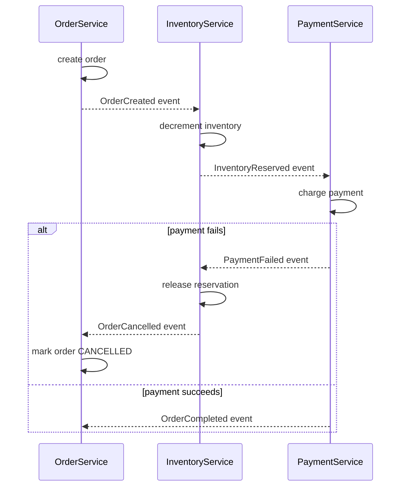

## [Q8_bean_lifecycle.md] Simplified Flow (Mermaid)

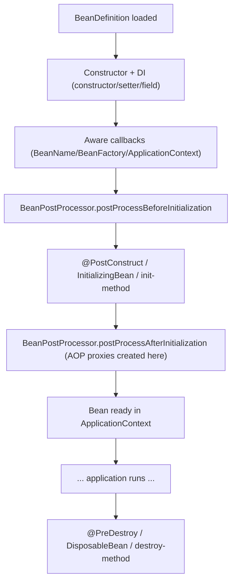

## [Q14_spring_security_jwt_traps.md] JWT Filter Sequence (Mermaid)

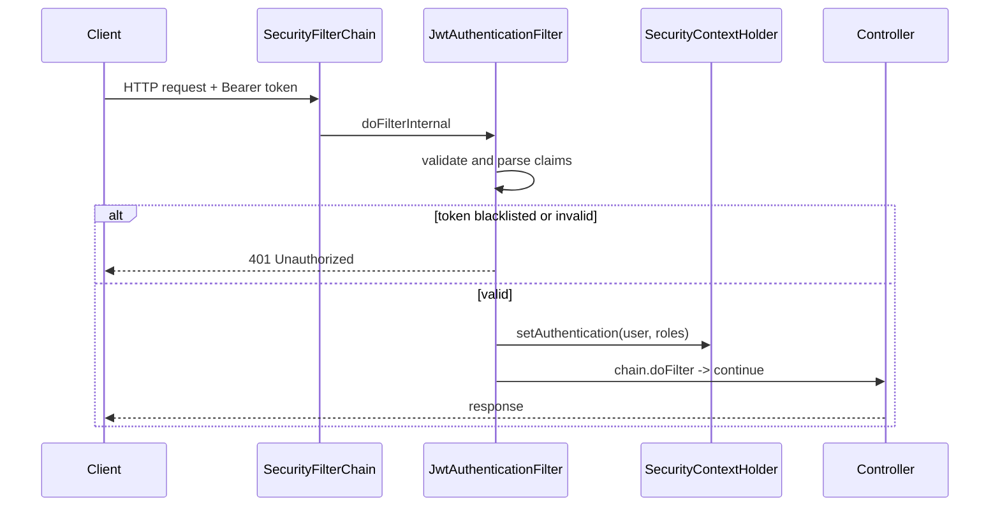

## [Q4_aop_log_execution_time.md] Interceptor Chain (Mermaid)

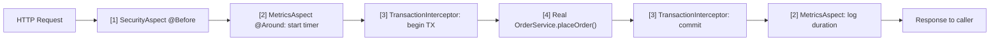

## [Q15_kafka_event_driven_traps.md] Poison Pill → DLT Flow (Mermaid)

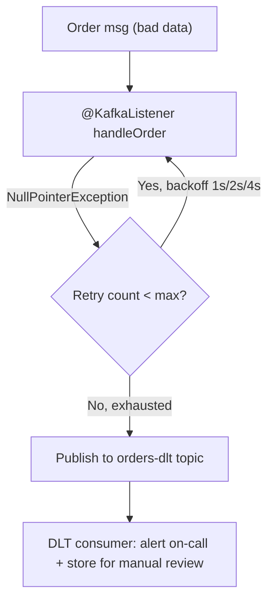

## [42_Spring boot Security (Part-9)  Method Security  Role based Authorization  @PreAuthorize and Post/notes.md] How Method Security Works (Flow)

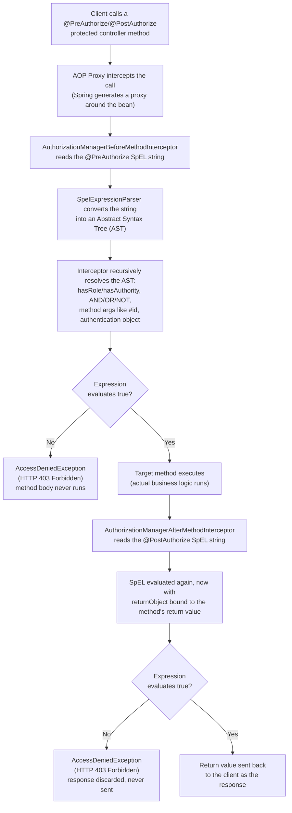

## [37_Spring boot Security (Part-4)  Basic Authentication & Authorization  Stateless Authentication/notes.md] The Authentication Flow (Sequence Diagram)

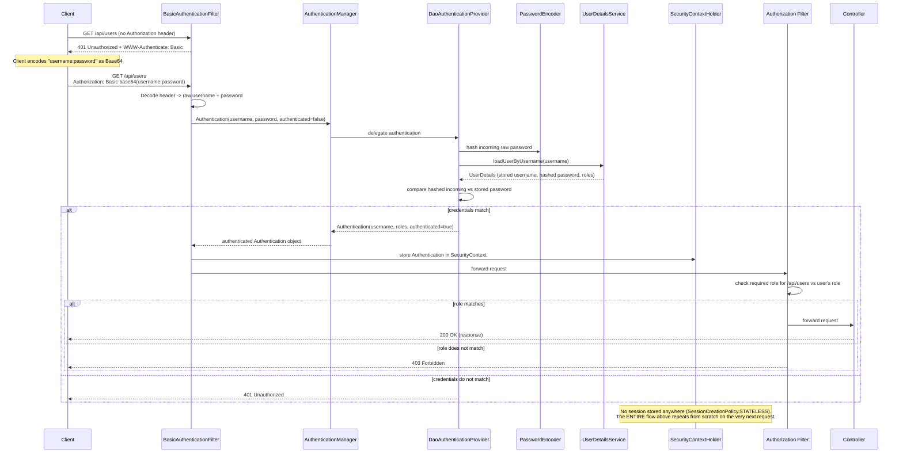

## [41_Spring boot Security (Part-8)  OAUTH2 Authentication Implementation/notes.md] Login + Token Exchange + Stateless Validation Flow

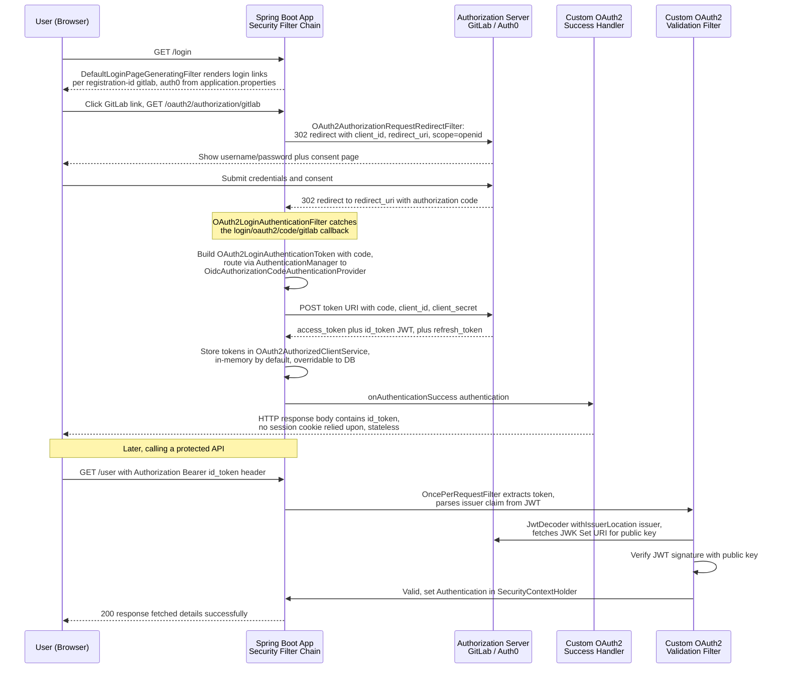

## [44_Spring Boot ConfigurationProperties in-depth/notes.md] How `@ConfigurationProperties` Binding Works

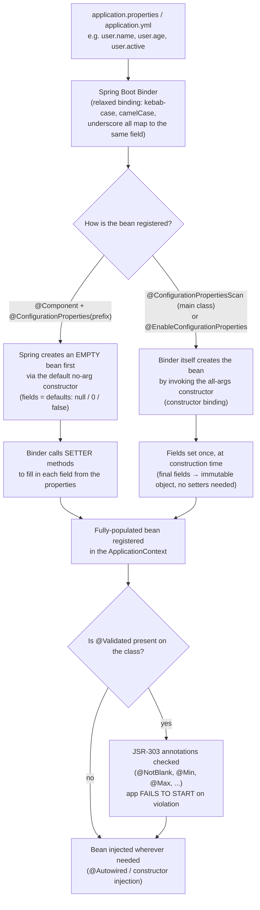

## [38_JWT Explained  JWT vs SessionID  JSON Web Token  Security Challenges with JWT & its Handling/notes.md] JWT Encoding Flow (Mermaid)

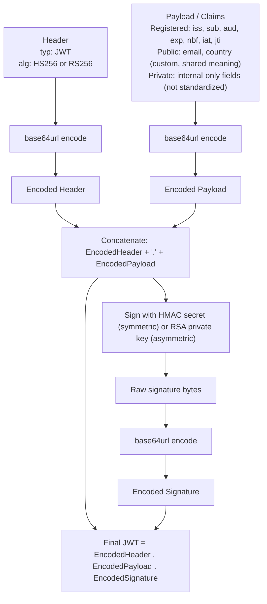

## [38_JWT Explained  JWT vs SessionID  JSON Web Token  Security Challenges with JWT & its Handling/notes.md] JWT Validation Flow

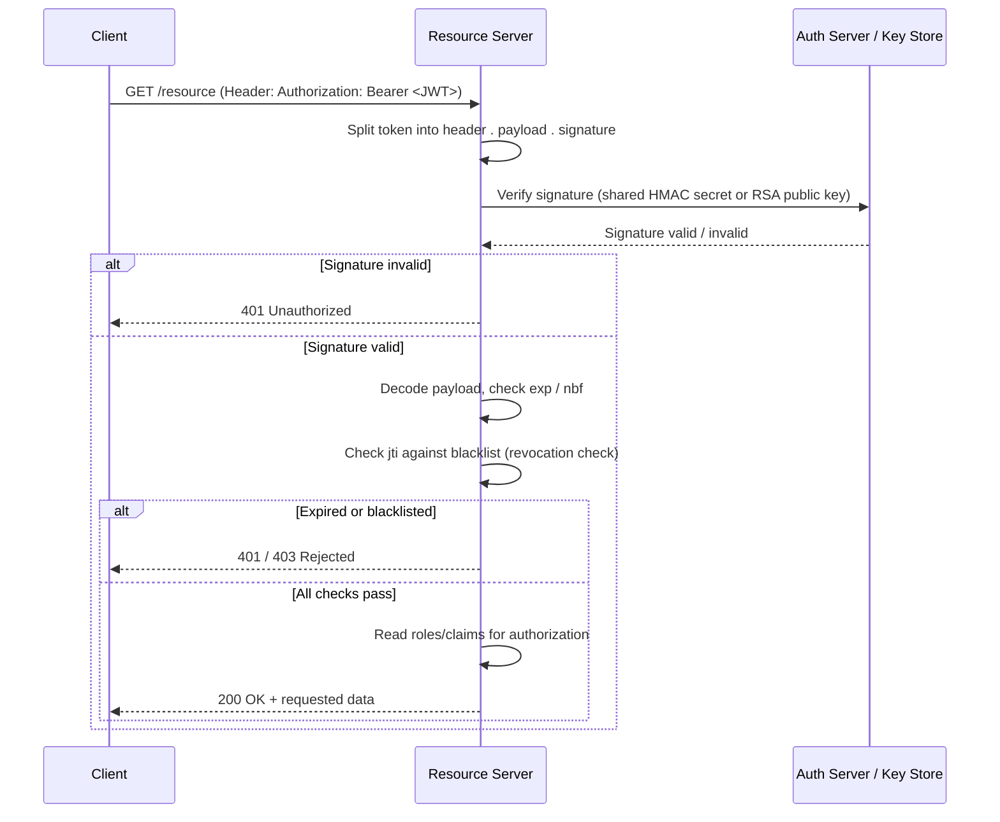
