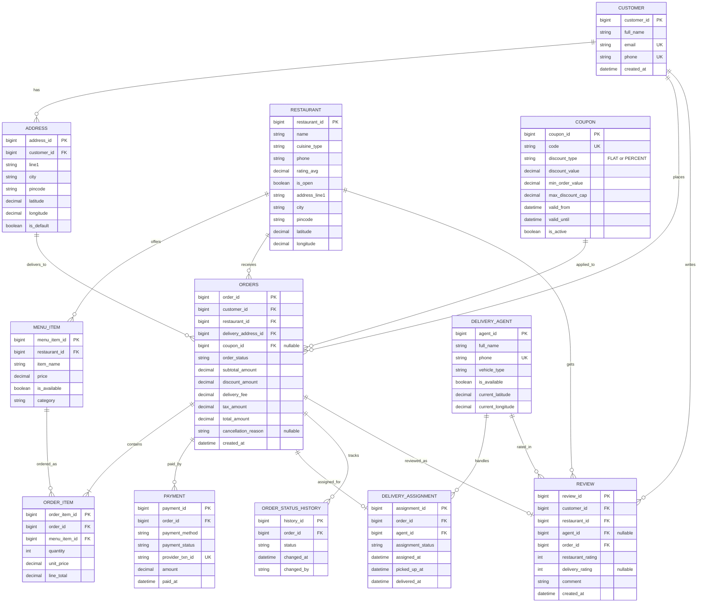

# Designing an Online Food Delivery Service Like Swiggy

## Requirements
1. The food delivery service should allow customers to browse restaurants, view menus, and place orders.
2. Restaurants should be able to manage their menus, prices, and availability.
3. Delivery agents should be able to accept and fulfill orders.
4. The system should handle order tracking and status updates.
5. The system should support multiple payment methods.
6. The system should handle concurrent orders and ensure data consistency.
7. The system should be scalable and handle a high volume of orders.
8. The system should provide real-time notifications to customers, restaurants, and delivery agents.

## UML Class Diagram

<!-- 
|| = exactly one
o| = zero or one
|{ = one or many
o{ = zero or many
-- = relationship connector
: label = relationship name (verb phrase)
-->

## ER Diagram (Interview 2026)

### Interview Notes
1. Keep mutable order state in `ORDER_STATUS_HISTORY` for auditability; derive current state from latest entry.
2. Store `unit_price` inside `ORDER_ITEM` to preserve historical pricing even if menu prices change later.
3. Use one-to-many from `ORDERS` to `PAYMENT` to support retries, split payments, and refunds.
4. Add a unique constraint on `REVIEW(order_id, customer_id)` if one verified review per order is required.
5. `ADDRESS` table is for **Customer only** (multiple saved delivery addresses). `RESTAURANT` embeds its address as columns directly — restaurants have exactly one address and no shared FK is needed. If a shared address service is required later, use a polymorphic `owner_type` + `owner_id` discriminator pattern.
6. `COUPON.coupon_id` on `ORDERS` is nullable — orders without promo codes are the majority case.
7. `REVIEW` stores both `restaurant_rating` and `delivery_rating` in one row to avoid a separate agent review join. `agent_id` is nullable since self-pickup orders have no agent.
8. **Key indexes to mention in interview:**
   - `ORDERS(customer_id, created_at DESC)` — customer order history
   - `ORDERS(restaurant_id, created_at DESC)` — restaurant dashboard
   - `ORDERS(order_status)` — operations/support queues
   - `DELIVERY_ASSIGNMENT(agent_id, assignment_status)` — find active assignment for agent
   - `COUPON(code)` — promo code lookup at checkout
   - `ORDER_STATUS_HISTORY(order_id, changed_at DESC)` — order tracking

## Database Design

### Polyglot Persistence Strategy

| Database | Type | Used For | Why |
|---|---|---|---|
| **PostgreSQL** | Relational (ACID) | `CUSTOMER`, `RESTAURANT`, `MENU_ITEM`, `ORDERS`, `ORDER_ITEM`, `PAYMENT`, `COUPON`, `REVIEW` | Order placement and payment require atomic transactions — can't afford partial writes |
| **Redis** | In-memory Cache | Active restaurant menus, coupon validation, delivery agent location, session tokens | Menu reads are 90% of traffic; Redis handles 100k+ reads/sec with TTL-based invalidation |
| **Elasticsearch** | Search Engine | Restaurant search by name, cuisine, location; dish search | Full-text + geo-distance queries that SQL handles poorly at scale |
| **MongoDB** | Document Store | Notification payloads, user activity logs, flexible restaurant metadata | Schema varies across restaurant types; avoids rigid column constraints |
| **ClickHouse** | Columnar / Time-Series | `ORDER_STATUS_HISTORY`, delivery SLA reports, fraud detection | Append-only audit logs are perfectly suited for columnar time-series reads |

### Entity-to-Database Mapping (Interview Ready)

| Entity / Data | Primary Database | Secondary Use | Interview Justification |
|---|---|---|---|
| `CUSTOMER` | PostgreSQL | Redis (session/profile cache) | Identity and profile updates need ACID consistency |
| `ADDRESS` | PostgreSQL | Redis (default address cache) | Delivery address must be consistent with order placement |
| `RESTAURANT` | PostgreSQL | Elasticsearch (search index), Redis (hot list cache) | Source of truth in SQL; search and discovery in ES |
| `MENU_ITEM` | PostgreSQL | Redis (menu cache), Elasticsearch (dish search) | Frequent reads; cache + full-text search reduce DB load |
| `ORDERS` | PostgreSQL | ClickHouse (analytics replication) | Core transactional table; append to analytics pipeline |
| `ORDER_ITEM` | PostgreSQL | ClickHouse (basket analytics) | Billing correctness with `unit_price` snapshot |
| `PAYMENT` | PostgreSQL | ClickHouse (payment funnel metrics) | Payment state must be strongly consistent |
| `DELIVERY_AGENT` | PostgreSQL | Redis (live geo/location state) | Master profile in SQL, high-frequency location in Redis |
| `DELIVERY_ASSIGNMENT` | PostgreSQL | Redis (active assignment lookup), ClickHouse (SLA metrics) | Dispatch needs transactional writes + fast active reads |
| `ORDER_STATUS_HISTORY` | PostgreSQL | ClickHouse (time-series reporting) | Audit log in SQL, large-scale timeline analysis in columnar DB |
| `COUPON` | PostgreSQL | Redis (coupon code validation cache) | Prevent invalid promotions while handling checkout spikes |
| `REVIEW` | PostgreSQL | Elasticsearch (searchable review text) | Durable writes in SQL with optional search indexing |
| Notifications / events | MongoDB | - | Flexible payload schema across channels (push/SMS/email) |

### One-Line Rule

Use **PostgreSQL as system-of-record** for all business entities; use Redis/Elasticsearch/ClickHouse/MongoDB as specialized read-optimized or analytics/event stores.

### Interview Answer (30 seconds)

> "I'd use **PostgreSQL** as the primary transactional store for orders and payments since ACID compliance is non-negotiable. **Redis** sits in front for menu reads and agent location — those are extremely high-frequency reads. **Elasticsearch** powers restaurant and dish search with geo-distance support. For analytics and audit history I'd use a columnar store like **ClickHouse**. This is a polyglot persistence approach — each store chosen for its specific strength."

### Key Tradeoffs to Mention

1. **PostgreSQL over MySQL** — better support for `JSONB`, window functions, and `FOR UPDATE SKIP LOCKED` for concurrent order queue processing.
2. **Redis TTL for menus** — when a restaurant updates a menu item, invalidate the Redis key so the next read hits PostgreSQL and refreshes cache.
3. **Agent location in Redis** — `DELIVERY_AGENT.current_latitude/longitude` in PostgreSQL is for record-keeping only; live location updates (every few seconds) go to Redis to avoid DB write storms.
4. **Coupon validation via Redis** — before hitting PostgreSQL, check if coupon code exists and is active in Redis. Reduces DB load at checkout surge.

## Implementations
#### [Java Implementation](fooddeliveryservice/) 

## Classes, Interfaces and Enumerations
1. The **Customer** class represents a customer who can place orders. It contains customer details such as ID, name, email, and phone number.
2. The **Restaurant** class represents a restaurant that offers menu items. It contains restaurant details such as ID, name, address, and a list of menu items. It provides methods to add and remove menu items.
3. The **MenuItem** class represents an item on a restaurant's menu. It contains details such as ID, name, description, price, and availability status.
4. The **Order** class represents an order placed by a customer. It contains order details such as ID, customer, restaurant, list of order items, status, and assigned delivery agent. It provides methods to add and remove order items, update order status, and assign a delivery agent.
5. The **OrderItem** class represents an item within an order. It contains the selected menu item and the quantity ordered.
6. The **OrderStatus** enum represents the different statuses an order can have, such as PENDING, CONFIRMED, PREPARING, OUT_FOR_DELIVERY, DELIVERED, and CANCELLED.
7. The **DeliveryAgent** class represents a delivery agent who fulfills orders. It contains details such as ID, name, phone number, and availability status.
8. The **FoodDeliveryService** class is the main class that manages the food delivery service. It follows the Singleton pattern to ensure only one instance of the service exists. It provides methods to register customers, restaurants, and delivery agents, retrieve available restaurants and menus, place orders, update order status, cancel orders, and assign delivery agents to orders. It also handles notifications to customers, restaurants, and delivery agents.