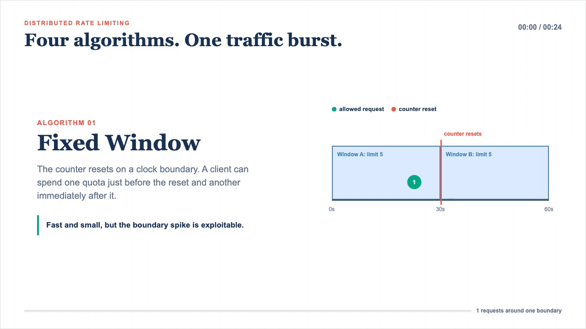

# Distributed Rate Limiter — Complete Interview Guide
> Control how many requests a client can make in a time window, at scale, without becoming a bottleneck.

## Algorithm Animation



[Open the MP4 version](rate-limiter-algorithms-comparison.mp4) | [Open the animation source](rate-limiter-algorithms-animation.html)

---

# PAGE 1 — Title & Rapid Answer Script

## What Is a Distributed Rate Limiter?
A service (or middleware) that counts incoming requests per client and rejects excess ones with HTTP 429,
using shared state (Redis) so every API Gateway instance enforces the same limit.

---

## Rapid Answer Script (speak this in 2-3 minutes)

```
"A rate limiter sits between the Load Balancer and your backend services.
 Every request hits the API Gateway, which extracts the client identity —
 user ID, API key, or IP — and asks Redis: does this client have budget left?

 I'd implement Token Bucket with a Redis Lua script.
 Each user gets a bucket with, say, 100 tokens that refills at 10 tokens/sec.
 The Lua script atomically reads the current token count, calculates how many
 tokens refilled since the last request, deducts one, and returns allow or reject.
 Atomic execution means two simultaneous requests on different Gateway instances
 can never both see 'tokens = 1' and both go through.

 On rejection I return HTTP 429 with Retry-After and X-RateLimit-Reset headers
 so the client can back off intelligently.

 Rate-limit policies — who gets 100/min vs 1000/min — live in a Postgres table
 and are cached in Redis for an hour so the hot path never touches the DB.

 The whole check adds less than 5 ms to every request."
```

---

# PAGE 2 — Glossary

| Term               | Simple definition                                         | Real-world example                                      |
|--------------------|-----------------------------------------------------------|---------------------------------------------------------|
| Rate Limit         | Max requests allowed in a time window                     | Stripe: 100 API calls/sec per key                       |
| Token Bucket       | Virtual bucket of tokens; one token = one allowed request | AWS API Gateway default algorithm                       |
| Leaky Bucket       | Queue that drains at fixed rate regardless of input rate  | Shaping video upload traffic to S3                      |
| Sliding Window     | Rolling count of requests in the last N seconds           | GitHub REST API: 5000 req/hr per token                  |
| Redis Lua Script   | Code that runs atomically inside Redis (no interleave)    | Stripe's rate limiter uses Redis + Lua for atomicity    |
| 429 Too Many Reqs  | HTTP status meaning "you exceeded your quota"             | Twitter API returns 429 on timeline fetch abuse         |
| X-RateLimit-Reset  | Unix timestamp when the quota refills                     | Client reads this to schedule its retry                 |
| Retry-After        | Seconds the client should wait before retrying            | `Retry-After: 30` in GitHub 429 response                |
| Policy Cache       | Redis copy of rate-limit rules to avoid DB on hot path    | rule: user123 → 1000 req/min cached 1 hr in Redis       |
| Circuit Breaker    | Trips after N Redis failures; fail-open or fail-closed    | 10 Redis timeouts → open circuit for 30 sec             |
| Subject            | The entity being limited (user, IP, API key, tier)        | `subject_type=USER`, `subject_value=user123`            |
| Enforce-by         | Scope of the shared quota (per-user vs per-tenant)        | `enforce_by=TENANT_ID` → all users share one bucket     |

---

# PAGE 3 — Functional & Non-Functional Requirements

## Functional Requirements

```
FR1  Limit requests per client (User ID / API Key / IP) within a time window
FR2  Rules configurable at runtime — no redeploy needed
FR3  Reject excess requests with HTTP 429 + Retry-After header
FR4  Tier-based limits: Free=100 req/min, Premium=1000 req/min, Enterprise=10K/min
FR5  Multi-level limiting: per-user AND per-IP AND per-endpoint simultaneously
FR6  Handle burst requests — a user with full quota can fire all tokens instantly
     (burst_capacity separate from sustained refill_rate; Token Bucket supports this natively)
```

## Non-Functional Requirements

```
Scale      1,000,000 requests/sec across cluster
Latency    <5 ms added per request (rate limit check must NOT be bottleneck)
CAP        Availability > Consistency — slight over-limit is acceptable
           (eventual consistency tolerable; never hard block availability for correctness)
Durability Token state survives Redis replica failover (replication lag <1 ms)
```

---

# PAGE 4 — Decision Framework

## How to Think Through This in an Interview

```
1. DATA SHAPE
   ├── Counters (integers) + timestamps
   ├── Access pattern: READ + WRITE on every single request (hot path)
   └── → Redis (in-memory, <1 ms, atomic operations)

2. CONSISTENCY vs AVAILABILITY
   ├── Slight over-limit is tolerable (CAP = AP)
   ├── Race condition must be prevented (2 instances both see "1 token" → both allow)
   └── → Lua script in Redis (atomic, single-threaded Redis execution)

3. ACCESS PATTERN
   ├── Key-value: rate_limit:{user}:{endpoint} → {tokens, last_refill}
   ├── Write-heavy (every request writes)
   └── → Redis HASH, not SQL DB

4. SCALE & LATENCY
   ├── 1M rps → multiple API Gateway instances needed
   ├── All instances must share same counter → centralized Redis cluster
   └── → Redis Cluster (consistent hashing per user_id)

5. TEAM & OPERATIONAL MATURITY
   ├── Policy changes: Postgres + Redis write-through cache
   └── → Decouple policy storage (SQL, CRUD-friendly) from hot state (Redis)
```

---

# PAGE 5 — Algorithm Comparison Table

```
┌────────────────────────┬───────────┬──────────────┬────────────────────┬──────────────────────┐
│ Algorithm              │ Memory    │ Accuracy     │ Burst Support      │ Production Use       │
├────────────────────────┼───────────┼──────────────┼────────────────────┼──────────────────────┤
│ Fixed Window Counter   │ Very Low  │ Low          │ Yes (edge spike)   │ Simple internal APIs │
│ Sliding Window Log     │ Very High │ Perfect      │ No                 │ Fraud/low-traffic    │
│ Sliding Window Counter │ Low       │ Good (approx)│ No                 │ Middle-ground choice │
│ Token Bucket ★         │ Low       │ Good         │ Yes (by design)    │ AWS, Stripe, GitHub  │
│ Leaky Bucket           │ Medium    │ Good         │ No (smoothed out)  │ Traffic shaping      │
└────────────────────────┴───────────┴──────────────┴────────────────────┴──────────────────────┘
★ = recommended for production API rate limiting
```

---

# PAGE 6 — Algorithm Deep Dives

## Algorithm 1: Fixed Window Counter

```
TIMELINE (window = 60 sec, limit = 100)

  09:59:00            10:00:00            10:01:00
     |                   |                   |
     |<-- Window A ------>|<-- Window B ------>|
     |   (counter=0)      |   (counter=0)      |

  PROBLEM — boundary spike:
     99 req at 10:00:58 ─── last second of Window A ───► allowed
    100 req at 10:01:00 ─── first second of Window B ──► allowed
    ──────────────────────────────────────────────────────────────
    199 requests in 2 seconds  ← violates 100/min spirit

Redis implementation:
  Key  : rate_limit:{user_id}:{window_start_unix}
  Write: INCR rate_limit:user123:1706270400
         EXPIRE rate_limit:user123:1706270400 60
  Read : GET  rate_limit:user123:1706270400
         if value < 100 → allow  else → 429
```

- **Pick when**: Internal microservice-to-microservice calls, not user-facing
- **Avoid when**: User-facing APIs where boundary abuse is exploitable

---

## Algorithm 2: Sliding Window Log

```
TIMELINE (window = 60 sec, limit = 100, current time = 10:00:45)

  Stored in Redis ZSET (score = unix timestamp):
  ┌──────────────────────────────────────────────────────┐
  │  score=10:00:05  req_id=abc                          │
  │  score=10:00:12  req_id=def                          │
  │  score=10:00:30  req_id=ghi  ← 85 entries total     │
  │  score=10:00:44  req_id=jkl                          │
  └──────────────────────────────────────────────────────┘

  Window boundary: 10:00:45 - 60 = 09:59:45
  ZREMRANGEBYSCORE key 0 09:59:44  ← cleanup expired
  ZCOUNT key 09:59:45 10:00:45     ← count = 85
  85 < 100 → allow → ZADD key 10:00:45 new_req_id

Redis commands:
  ZADD  rate_limit_log:user123 {timestamp} {req_uuid}
  ZREMRANGEBYSCORE rate_limit_log:user123 0 {now - 60}
  ZCOUNT rate_limit_log:user123 {now - 60} {now}
```

- **Pick when**: Low-traffic, accuracy-critical APIs (fraud detection, login attempts)
- **Avoid when**: High-traffic (100M users × 100 req = 10B entries in Redis)

---

## Algorithm 3: Sliding Window Counter (Hybrid)

```
TIMELINE (window = 60 sec, limit = 100, current time = 10:00:45)

  Previous window (09:59:00–09:59:59): counter = 80
  Current  window (10:00:00–10:00:59): counter = 30
  Elapsed in current window: 45 sec → 75% of window

  Weighted count formula:
  ┌────────────────────────────────────────────────────────────┐
  │  weighted = (prev × (1 - elapsed%)) + current             │
  │           = (80  × (1 - 0.75))      + 30                  │
  │           = (80  × 0.25)            + 30                  │
  │           = 20 + 30 = 50                                   │
  └────────────────────────────────────────────────────────────┘
  50 < 100 → allow

Redis: two keys per user (current + previous window)
```

- **Pick when**: Good accuracy needed without full log memory cost
- **Avoid when**: Pure accuracy is required (use Sliding Log) or burst support needed (use Token Bucket)

---

## Algorithm 4: Token Bucket ★ (RECOMMENDED)

```
BUCKET STATE  (capacity=100, refill_rate=10 tokens/sec)

  t=0:   [████████████████████] 100 tokens  ← full
  
  t=0:   100 requests arrive instantly
         [                    ]   0 tokens  ← all 100 allowed (burst!)
  
  t=5s:  Refill: 5 × 10 = 50 tokens
         [██████████          ]  50 tokens
  
  t=5s:  50 more requests
         [                    ]   0 tokens  ← all 50 allowed
  
  t=1s:  Only 1 token refilled (10/sec)
         [█                   ]   1 token
         1 request → allowed, 2nd → 429

KEY INSIGHT: capacity = max burst  |  refill_rate = sustained throughput

Redis state (HASH per user+endpoint):
  rate_limit:user123:/api/users
    tokens     → 95
    last_refill → 1706270445  (unix timestamp)

Lua script (ATOMIC — runs as one Redis command):
  ┌──────────────────────────────────────────────────────────┐
  │  local tokens     = redis.call('HGET', key, 'tokens')   │
  │  local last       = redis.call('HGET', key, 'last_refill')│
  │  local elapsed    = now - last                           │
  │  local refilled   = min(capacity, tokens + elapsed×rate) │
  │  if refilled >= 1 then                                   │
  │    redis.call('HMSET', key, 'tokens', refilled-1,        │
  │                             'last_refill', now)          │
  │    return 1  -- allow                                    │
  │  else return 0  -- reject                                │
  │  end                                                     │
  └──────────────────────────────────────────────────────────┘
```

- **Pick when**: Production APIs — this is the industry default
- **Avoid when**: You need perfectly smooth output rate (use Leaky Bucket for traffic shaping)
- **Real examples**: AWS API Gateway, Stripe, GitHub REST API

---

## Algorithm 5: Leaky Bucket

```
QUEUE MODEL  (capacity=100, leak_rate=10 req/sec)

  Requests
  arriving ─► [■■■■■■■■■■■■■■■■■■■■] ──► Backend (10/sec, fixed)
  randomly     bucket queue (cap=100)

  t=0:  50 requests arrive instantly → queued in bucket
  t=5s: 50 processed (10/sec × 5s), bucket empty
  t=0:  100 requests arrive → bucket full
  t=0:  101st request → bucket full → REJECT 429

  DIFFERENCE from Token Bucket:
  Token Bucket → burst of 100 reaches backend instantly
  Leaky Bucket → burst of 100 still exits at 10/sec (smooth output)
```

- **Pick when**: Traffic shaping — smoothing bursts before hitting a rate-sensitive downstream
- **Avoid when**: Synchronous user-facing APIs (queuing adds latency)

---

# PAGE 7 — End-to-End Architecture Views

## Component View

```
                                    ┌─────────────────────────────────────┐
                                    │           REDIS CLUSTER             │
                                    │                                     │
                                    │  Shard 1 (users A-M)                │
                                    │  ┌──────────────────────────────┐   │
                                    │  │ rate_limit:user123:/api/users│   │
                                    │  │   tokens=95, last_refill=... │   │
                                    │  │ policy:user123:/api/users    │   │
                                    │  │   {limit:100,refill:10,...}  │   │
                                    │  └──────────────────────────────┘   │
                                    │                                     │
                                    │  Shard 2 (users N-Z)                │
                                    └─────────────────────────────────────┘
                                                     ▲  ▲  ▲
                                                     │  │  │  (all share same Redis)
Client                                               │  │  │
  │                                    ┌─────────────┘  │  └──────────────┐
  ▼                                    │                │                 │
┌──────┐   ┌──────────────┐   ┌────────────────┐ ┌────────────────┐ ┌────────────────┐
│Client│──►│Load Balancer │──►│  API Gateway 1  │ │  API Gateway 2  │ │  API Gateway 3  │
└──────┘   └──────────────┘   │  (Rate Limiter) │ │  (Rate Limiter) │ │  (Rate Limiter) │
                               └────────┬───────┘ └────────┬───────┘ └────────┬───────┘
                                        │                   │                  │
                                        ▼                   ▼                  ▼
                               ┌────────────────────────────────────────────────────────┐
                               │                   BACKEND SERVICES                     │
                               │   UserSvc     OrderSvc     PaymentSvc     SearchSvc    │
                               └────────────────────────────────────────────────────────┘
                                                     ▲
                                                     │  (policy lookup on cache miss)
                               ┌─────────────────────┴──────────────────────────────────┐
                               │                    POLICY DATABASE                     │
                               │              (Postgres — rate_limit_rules)             │
                               └────────────────────────────────────────────────────────┘
```

---

## ER View (Database Schema)

```
┌─────────────────────────────────┐         ┌────────────────────────────────────────┐
│           clients               │         │          rate_limit_rules               │
├─────────────────────────────────┤         ├────────────────────────────────────────┤
│ client_id      UUID  PK         │         │ rule_id        UUID  PK                 │
│ api_key        VARCHAR(255) UNQ │         │ subject_type   ENUM(USER_ID,API_KEY,    │
│ tier           ENUM(FREE,       │         │                     IP,TIER,GLOBAL)     │
│                PREMIUM,         │◄────────│ subject_value  VARCHAR(255)             │
│                ENTERPRISE)      │         │                (user_123, PREMIUM,      │
│ quota          INT              │         │                 null for GLOBAL)        │
│ created_at     TIMESTAMPTZ      │         │ endpoint       VARCHAR(500)             │
└─────────────────────────────────┘         │                ('*' = all endpoints)    │
                                            │ algorithm      ENUM(TOKEN_BUCKET,       │
                                            │                     FIXED_WINDOW,       │  ← NEW (from webp)
                                            │                     SLIDING_WINDOW)     │
                                            │ request_limit  INT                      │
                                            │ window_sec     INT                      │
                                            │ burst_capacity INT                      │  ← NEW (from webp)
                                            │ refill_rate    DECIMAL(10,2)            │
                                            │ enforce_by     VARCHAR(50)              │
                                            │                (USER_ID/API_KEY/        │
                                            │                 IP/TENANT)             │
                                            │ is_active      BOOLEAN DEFAULT true     │  ← NEW (from webp)
                                            │ created_at     TIMESTAMPTZ              │
                                            │ updated_at     TIMESTAMPTZ              │  ← NEW (from webp)
                                            ├────────────────────────────────────────┤
                                            │ INDEX(subject_type,subject_value,      │
                                            │       endpoint)                        │
                                            └────────────────────────────────────────┘

ENFORCE_BY — PER-USER vs PER-TENANT (KEY DESIGN DECISION):
┌─────────────────────────────────────────┐  ┌──────────────────────────────────────────┐
│  CASE A: enforce_by = USER_ID           │  │  CASE B: enforce_by = TENANT_ID          │
├─────────────────────────────────────────┤  ├──────────────────────────────────────────┤
│  subject_type  = TIER                   │  │  subject_type  = TIER                    │
│  subject_value = PREMIUM                │  │  subject_value = PREMIUM                 │
│  enforce_by    = USER_ID                │  │  enforce_by    = TENANT_ID               │
│  limit         = 1000 req/min           │  │  limit         = 10,000 req/min          │
├─────────────────────────────────────────┤  ├──────────────────────────────────────────┤
│  What this means:                       │  │  What this means:                        │
│  Rule applies to all premium users BUT  │  │  Rule applies to all premium tenants BUT │
│  quota is tracked PER INDIVIDUAL USER   │  │  quota is SHARED ACROSS ENTIRE TENANT    │
│                                         │  │                                          │
│  userA: 1000/min bucket                 │  │  org-ABC: 10,000/min SHARED bucket       │
│  userB: 1000/min bucket  (separate)     │  │    userA ─┐                              │
│  userC: 1000/min bucket  (separate)     │  │    userB ─┼─► same 10K bucket            │
│                                         │  │    userC ─┘                              │
│  Redis key:                             │  │  Redis key:                              │
│  rate_limit:user123:/api/users          │  │  rate_limit:tenant-ABC:/api/users        │
└─────────────────────────────────────────┘  └──────────────────────────────────────────┘
Interview line: "enforce_by decides whether each user has their own bucket
                or all users in an org drain from one shared bucket."

REDIS STRUCTURES:
┌──────────────────────────────────────────────────────────────────────────────┐
│  Token State (HASH)                                                          │
│  Key format A: rate_limit:{subject}:{endpoint}                               │
│               e.g. rate_limit:user123:/api/users                             │
│  Key format B: r1:{policy_id}:{enforce_by}:{value}:{resource}  (from image) │
│               e.g. r1:rule-5:USER_ID:user123:/api/users                      │
│  Field: tokens      → 95                                                     │
│  Field: last_refill → 1706270445                                             │
│  TTL : 3600 sec (auto-expire inactive buckets)                               │
├──────────────────────────────────────────────────────────────────────────────┤
│  Policy Cache (STRING/JSON)                                                  │
│  Key : policy:{subject}:{endpoint}                                           │
│        e.g. policy:user123:/api/users                                        │
│  Val : {"limit":100,"window":60,"refill_rate":10,                            │
│         "burst_capacity":100,"algorithm":"TOKEN_BUCKET",                     │
│         "enforce_by":"USER_ID"}                                              │
│  TTL : 3600 sec (revalidate hourly or on write-through update)               │
├──────────────────────────────────────────────────────────────────────────────┤
│  Sliding Window Log (ZSET — only if using SWL algorithm)                     │
│  Key  : rate_limit_log:{subject}                                             │
│  Score: unix timestamp   Member: request UUID                                │
└──────────────────────────────────────────────────────────────────────────────┘
```

---

## Sequence View — One Critical Write Flow (Request Allowed)

```
Client        Load Balancer     API Gateway       Redis          Policy DB    Backend
  │                │                │               │               │            │
  │──GET /api/users─►               │               │               │            │
  │                │───────────────►│               │               │            │
  │                │                │─validate JWT──►               │            │
  │                │                │                               │            │
  │                │                │  GET policy:user123:/api/users│            │
  │                │                │──────────────►│               │            │
  │                │                │◄── cache HIT ─┤               │            │
  │                │                │  {limit:100, refill:10}       │            │
  │                │                │                               │            │
  │                │                │  EVAL lua_script              │            │
  │                │                │  (key, capacity=100,          │            │
  │                │                │   refill=10, now=ts)          │            │
  │                │                │──────────────►│               │            │
  │                │                │               │ [ATOMIC]      │            │
  │                │                │               │ tokens=95+5=  │            │
  │                │                │               │ min(100,100)  │            │
  │                │                │               │ = 100-1 = 99  │            │
  │                │                │◄── return 1 ──┤               │            │
  │                │                │  (allowed)    │               │            │
  │                │                │                               │            │
  │                │                │───────────────────────────────────────────►│
  │                │                │◄─── 200 OK + {users:[...]} ───────────────┤
  │◄──200 OK ──────────────────────┤               │               │            │
  │  X-RateLimit-Limit: 100        │               │               │            │
  │  X-RateLimit-Remaining: 99     │               │               │            │
  │  X-RateLimit-Reset: 1712340788 │               │               │            │


── REJECTED FLOW (no tokens left) ──────────────────────────────────────────────

  │──GET /api/users─►               │               │               │            │
  │                │───────────────►│               │               │            │
  │                │                │  EVAL lua_script              │            │
  │                │                │──────────────►│               │            │
  │                │                │◄── return 0 ──┤               │            │
  │                │                │  (rejected)   │               │            │
  │◄── 429 ────────────────────────┤               │               │            │
  │  X-RateLimit-Limit:     100     │               │               │            │
  │  X-RateLimit-Remaining: 0       │               │               │            │
  │  X-RateLimit-Reset:  {ts}       │               │               │            │
  │  Retry-After:        1          │               │               │            │
  │  Body: {error:"rate_limit_exceeded", retry_after:1}             │            │


── CACHE MISS FLOW (policy not in Redis) ────────────────────────────────────────

  │                │                │  GET policy:user123:/api/users│            │
  │                │                │──────────────►│               │            │
  │                │                │◄── nil ───────┤               │            │
  │                │                │                               │            │
  │                │                │── SELECT limit,refill FROM rate_limit_rules─►
  │                │                │   WHERE subject_value='user123'             │
  │                │                │◄── {limit:100, refill:10} ─────────────────┤
  │                │                │                               │            │
  │                │                │  SET policy:user123 {..} EX 3600           │
  │                │                │──────────────►│               │            │
  │                │                │  (now proceed to EVAL Lua)    │            │
```

---

## Sequence View — Policy Update (Write-Through Cache)

```
Admin         Policy Svc        Policy DB         Redis          API Gateways
  │               │                │               │                │
  │─PUT /rules/5─►│               │               │                │
  │               │─UPDATE rules──►│               │                │
  │               │◄── OK ─────────┤               │                │
  │               │                                │                │
  │               │── SET policy:user123 {limit:200} EX 3600 ──────►│
  │               │── PUBLISH policy_update {rule_id: 5} ──────────►│
  │               │                                │                │
  │               │                                │  [subscribers] │
  │               │                                │  DEL local cache│
  │               │                                │  (next request  │
  │               │                                │  fetches new   │
  │               │                                │  policy)       │
  │◄── 200 OK ────┤               │               │                │
```

---

# PAGE 8 — Scaling & Optimization Techniques

## 12 Techniques (know all of these for senior interviews)

```
Technique 1 — Redis Lua scripts for atomicity
  Single atomic operation: check + decrement tokens in one EVAL call.
  Prevents race condition: two instances both reading tokens=1 → both allowing.
  Faster than separate GET + DECR (one roundtrip vs two).

Technique 2 — Policy caching in Redis
  Cache rules with 1hr TTL → 99% cache hit rate (rules rarely change).
  Reduces Policy DB load by ~100×.
  Write-through on admin updates: immediate propagation, no stale limits.

Technique 3 — Token Bucket algorithm
  Supports bursts naturally (burst_capacity = max instant requests allowed).
  Smooth refill — no sudden resets at window boundaries.
  Production-proven: AWS API Gateway, Stripe, GitHub all use Token Bucket.

Technique 4 — Distributed rate limiting via Redis Cluster
  Consistent hashing: hash(user_id) → same shard every time.
  All API Gateway instances share same Redis state → coordinated enforcement.
  Read replicas for GET (policy cache), master only for EVAL (token state writes).

Technique 5 — Multi-tier rate limiting
  Check per-user + per-IP + per-endpoint + global simultaneously.
  Enforce strictest: if ANY level exceeded → reject 429.
  Prevents: user quota abuse + IP DDoS + endpoint brute-force + cluster overload.

Technique 6 — Horizontal scaling of API Gateway
  Stateless API Gateway instances (10–100+) — no local state.
  All token state in Redis (shared) → instances are interchangeable.
  Auto-scale based on CPU/latency; Redis Cluster scales independently.

Technique 7 — Redis optimizations
  TTL on inactive buckets (3600s): auto-expire → saves memory.
  Connection pooling: each gateway maintains 50 Redis connections.
  Pipelining: batch multiple EVAL calls in one network roundtrip.

Technique 8 — Graceful degradation (circuit breaker)
  After 10 consecutive Redis failures → open circuit for 30 sec.
  Open circuit: fail OPEN (allow all, log error) — availability > strict limiting.
  Half-open after 30s: try one request → success → close circuit.

Technique 9 — 429 response headers for client backoff
  X-RateLimit-Limit:     total quota
  X-RateLimit-Remaining: tokens left
  X-RateLimit-Reset:     unix timestamp when bucket refills to 1 token
  Retry-After:           seconds to wait (ceil((1 - tokens) / refill_rate))
  Why: helps clients implement exponential backoff; avoids hammering the API.

Technique 10 — Monitoring & alerting
  Track: request count, rejection rate (% 429s), Redis latency (p50/p99),
         policy cache hit rate, per-endpoint breakdown.
  Alert: rejection rate > 5% (attack or misconfigured limit).
  Alert: Redis p99 latency > 10ms (scaling issue, investigate shards).

Technique 11 — Dynamic limit adjustment
  Auto-reduce limits if cluster at 80% capacity (protect backend).
  DDoS spike detected → temporarily stricter limits (circuit-level protection).
  Allowlist: trusted IPs / internal services bypass rate limiting entirely.

Technique 12 — Write-through cache + Redis Pub/Sub propagation
  On admin rule change:
    1. UPDATE rate_limit_rules SET limit=200 WHERE rule_id=5
    2. SET policy:user123:/api/users {limit:200,...} EX 3600   ← write-through
    3. PUBLISH policy_update {rule_id:5}
  All API Gateway instances subscribe to policy_update channel.
  On message: DEL local policy cache for that rule → next request re-fetches.
  Propagation latency: <1 sec (vs 1 hour if TTL-only approach).
```

---

# PAGE 9 — Capacity Estimation

## Mini-Framework

```
GIVEN:
  Traffic       = 1,000,000 req/sec
  Users         = 50,000,000 active users
  Read:Write    = every request is both a read and write (token check + update)
  Token Bucket  = HASH with 2 fields (tokens + last_refill) per user per endpoint

REDIS MEMORY:
  Token state per user per endpoint:
    key size   = ~40 bytes  (rate_limit:user123:/api/users)
    value size = ~30 bytes  (HASH: tokens=int, last_refill=int)
    overhead   = ~100 bytes (Redis per-key overhead)
    total/key  ≈ 170 bytes

  Assume avg 3 endpoints per user:
    50M users × 3 endpoints × 170 bytes = 25.5 GB Redis memory

  Policy cache per user per endpoint:
    ~200 bytes per entry × 50M × 3 = ~30 GB
    (but most inactive users' keys expire after 1 hr → actual ~5-10% hot = 1.5-3 GB)

REDIS THROUGHPUT:
  1M req/sec → 1M Lua EVAL/sec
  Redis single node: ~100K-500K commands/sec
  Need: 1M / 300K = ~4 Redis master shards minimum
  With 2× headroom → 8 shards recommended

LATENCY BUDGET (target <5 ms added):
  Policy cache lookup : 0.5 ms  (Redis GET)
  Lua script EVAL     : 1.0 ms  (Redis atomic op)
  Network roundtrip   : 1.0 ms  (co-located Redis)
  Total               : ~2.5 ms  ✓ within 5ms budget

API GATEWAY INSTANCES:
  Each handles ~50K req/sec → 1M / 50K = 20 instances minimum
  With 2× headroom → 40 instances

STORAGE (Policy DB - Postgres):
  50M users × 5 rules avg = 250M rows
  Each row ~200 bytes → 50 GB (easily fits on one Postgres primary)
  Read load: ~0 (99%+ cache hit rate)
```

---

# PAGE 9 — Interview Scripts

## Requirement Clarification Script

```
"Before designing, let me clarify a few things:

  1. What's the scale — requests per second? 1M? 100K?
  2. What do we key rate limits on — user ID, API key, IP, or all three?
  3. Should limits be configurable without a redeploy?
  4. Do different tiers (free vs premium) get different limits?
  5. Is slight over-limiting acceptable, or do we need hard exact limits?
     (This decides whether we need sliding window log vs token bucket)
  6. Should rate limiting add < 5ms latency, or is 20ms OK?
  7. What happens if Redis goes down — fail open or fail closed?"
```

---

## Trade-Off Script

```
"There are two main trade-offs I want to call out:

  Algorithm choice:
  ─ Sliding Window Log gives perfect accuracy but uses O(requests) memory.
    At 1M users × 100 req/min, that's 100M timestamps in Redis — not viable.
  ─ Token Bucket gives ~good accuracy, supports bursts naturally, low memory
    (just 2 integers per user), and is production-proven (AWS, Stripe, GitHub).
  ─ I'll go Token Bucket unless you need fraud-detection-level precision.

  Consistency vs Availability on Redis failure:
  ─ Fail open: allow all requests when Redis is down.
    Risk: temporary abuse window.
  ─ Fail closed: reject all with 503 when Redis is down.
    Risk: full outage for all users.
  ─ My choice: fail open with circuit breaker + alerting.
    Rate limiting is a best-effort protection; full outage is worse."
```

---

## Final Recommendation Script

```
"My recommendation:
  ─ Token Bucket algorithm with Redis Lua script for atomic check + refill.
  ─ Redis Cluster (8 shards) as shared state across all API Gateway instances.
  ─ Postgres for policy storage, Redis as write-through cache (1hr TTL).
  ─ Redis Pub/Sub for <1sec policy propagation on admin updates.
  ─ Circuit breaker: 10 failures → fail open for 30 sec → auto-recover.
  ─ 429 responses include Retry-After + X-RateLimit-Reset headers.
  ─ Multi-level limits: per-user, per-IP, per-endpoint — reject if any exceeded.

  This gives us <5ms latency, handles 1M rps, supports bursts naturally,
  and stays available even during Redis hiccups."
```

---

# PAGE 10 — Senior Trap Questions

## Q1: "How do you handle race conditions in distributed rate limiting?"

```
WEAK ANSWER: "Use locks in Redis."
  ── WHY IT'S WRONG: Distributed locks (SETNX + EXPIRE) have timeout complexity,
     deadlock risk, and add latency. Redis is already single-threaded.

STRONG ANSWER:
  "Redis is single-threaded — commands execute serially.
   The race condition is two API Gateway instances both reading tokens=1,
   both deciding to allow, and both decrementing → tokens=-1.

   The fix: Redis Lua script.
   The entire check-and-decrement runs as one atomic command inside Redis.
   No other command can interleave between the READ and the WRITE.
   No locks needed, no deadlocks, no extra latency beyond the single EVAL call."
```

---

## Q2: "Token Bucket vs Leaky Bucket — when would you pick Leaky Bucket?"

```
WEAK ANSWER: "They're basically the same thing."

STRONG ANSWER:
  "Different output behaviour.
   Token Bucket: Burst of 100 requests hits the backend all at once.
                 Good for APIs where latency matters to users.
   Leaky Bucket: Burst of 100 queues up and exits at 10/sec — smooth output.
                 Good for traffic shaping before a rate-sensitive downstream,
                 e.g., limiting how fast you push messages to a 3rd party webhook
                 endpoint that charges per call or has its own rate limit.

   For our API Gateway use case → Token Bucket.
   For shaping outbound traffic to external services → Leaky Bucket."
```

---

## Q3: "What happens if Redis goes down?"

```
WEAK ANSWER: "Restart Redis."

STRONG ANSWER:
  "Two options — both valid, different trade-offs:

  Fail open:  Allow all requests during Redis outage.
  ── Pro: zero availability impact for users.
  ── Con: brief window of unlimited access (abuse risk).
  ── OK for: most APIs where temporary burst is acceptable.

  Fail closed: Return 503 during Redis outage.
  ── Pro: no abuse window.
  ── Con: all users blocked — availability collapses.
  ── OK for: financial APIs where over-limit is a compliance issue.

  Implementation: Circuit breaker.
  After 10 consecutive Redis timeouts → open circuit for 30 sec.
  During open: fail open (log + alert).
  After 30 sec: half-open → try one request → if success → close circuit.

  My default: fail open. Rate limiting is a best-effort protection.
  Full outage is worse than a brief permissive window."
```

---

## Q4: "How do you handle multi-region rate limiting?"

```
WEAK ANSWER: "Put Redis in one region and route everything there."

STRONG ANSWER:
  "Three options:

  Option A — Per-region limits (simplest):
    Redis cluster in each region: us-east, eu-west, ap-south.
    User gets 100 req/min per region → effectively 300 globally.
    ── OK if slight global over-limit is acceptable.
    ── No cross-region latency.

  Option B — Global Redis (strict):
    Single Redis cluster in one region.
    All API Gateways worldwide route to it.
    ── Exact global limit.
    ── +50-100ms latency for distant regions. Unacceptable for <5ms target.

  Option C — Gossip / CRDT (complex):
    Each region tracks local count.
    Periodically sync deltas across regions.
    ── Approximate global limit with low latency.
    ── Complex to implement correctly.

  My recommendation: Option A (per-region) for most cases.
  Only Option B if strict global compliance is required (fintech, healthcare)."
```

---

## Q5: "Fixed Window vs Sliding Window — explain the boundary problem."

```
"Fixed Window resets the counter at a sharp boundary.
 A user can make 100 requests at 10:00:59 (last second of window 1)
 and 100 more at 10:01:00 (first second of window 2) →
 200 requests in 2 seconds while claiming they respected 100/min.

 Visual:
   Window 1  |  Window 2
   ──────────|──────────
             |
   99 req ───┤─── 100 req  ← 199 in 2 sec!
   at :59    |   at :00

 Token Bucket has no boundary — it's a continuous refill.
 No sudden reset → no exploitable spike."
```

---

# PAGE 11 — What NOT to Say

```
╔══════════════════════════════════════════════════════════════════════════════╗
║  TRAP PHRASE                  │  WHY IT'S WRONG                             ║
╠══════════════════════════════════════════════════════════════════════════════╣
║ "Store counters in the DB"    │ DB can't handle 1M rps writes; adds 10-50ms ║
║ "Use GET then INCR in Redis"  │ Race condition — two threads both see 1,    ║
║                               │ both allow, tokens go to -1                 ║
║ "Use Redis SETNX for locks"   │ Lock complexity, deadlock risk, more latency║
║ "It depends" with no answer   │ Say: IF accuracy critical → Sliding Window  ║
║                               │ Log. IF production API → Token Bucket.      ║
║ "Rate limiting must be 100%   │ CAP: at 1M rps, slight over-limit is fine. ║
║  accurate"                    │ Trading strict consistency for availability  ║
║                               │ is the right call.                          ║
║ "Put Redis in every service"  │ Rate limit state must be CENTRALIZED.       ║
║                               │ Per-service Redis means no global enforcement║
║ "Fail closed is always safer" │ Full outage is often worse than brief burst.║
║                               │ Always discuss the trade-off.               ║
║ "Leaky Bucket = Token Bucket" │ Different output: leaky = smooth output;    ║
║                               │ token = burst allowed to backend instantly  ║
╚══════════════════════════════════════════════════════════════════════════════╝
```

---

# PAGE 12 — Key Numbers to Memorize

```
┌─────────────────────────────────────────────────────────┐
│  Redis single node throughput  ~300K-500K ops/sec        │
│  Redis p99 latency (co-located) <1 ms                    │
│  Target added latency per req   <5 ms                    │
│  Policy cache TTL               3600 sec (1 hour)        │
│  Token state TTL (inactive)     3600 sec                 │
│  Redis pub/sub propagation      <1 sec                   │
│  Circuit breaker threshold      10 consecutive failures  │
│  Circuit breaker open duration  30 sec                   │
│  Free tier limit (typical)      100 req/min              │
│  Premium tier limit (typical)   1000 req/min             │
│  Enterprise tier (typical)      10,000 req/min           │
│  Login endpoint brute-force     10 req/min               │
│  Redis HASH memory per user     ~170 bytes               │
│  HTTP status for rate limit     429 Too Many Requests    │
│  Header for retry guidance      Retry-After: {seconds}   │
│  Header for quota total         X-RateLimit-Limit        │
│  Header for remaining           X-RateLimit-Remaining    │
│  Header for reset time          X-RateLimit-Reset        │
└─────────────────────────────────────────────────────────┘
```

---

# PAGE 13 — Whiteboard Draw Order

```
Step 1 — High-level flow (30 sec)
  Client → LB → API Gateway → Redis → Backend
  (draw boxes and arrows only)

Step 2 — Zoom into API Gateway (60 sec)
  Auth check → extract subject → policy lookup → token bucket check → forward/reject

Step 3 — Redis structures (45 sec)
  Draw two boxes:
  ┌──────────────────────┐   ┌──────────────────────┐
  │  Token State (HASH)  │   │  Policy Cache (JSON) │
  │  tokens=99           │   │  limit=100           │
  │  last_refill=ts      │   │  refill_rate=10      │
  └──────────────────────┘   └──────────────────────┘

Step 4 — Token Bucket visual (30 sec)
  Draw the bucket, show refill and drain arrows

Step 5 — Lua script (mention, don't write in full)
  "Atomic: read tokens → calculate refill → decrement → write → return allow/reject"

Step 6 — 429 response (20 sec)
  Show the 4 headers: Limit, Remaining, Reset, Retry-After

Step 7 — Scale-out (20 sec)
  Add 3 API Gateway boxes → all pointing to same Redis cluster
  "Shared state → no race conditions → horizontal scaling"
```

---

# PAGE 14 — How to Adapt This Guide for Any Company

## Fintech (e.g., Stripe, Brex, Razorpay)

```
─ Fail closed on Redis outage (over-limit = compliance/fraud risk)
─ Per-endpoint limits on /payments, /transfers (very strict: 10/min)
─ Sliding Window Log for audit trail (exact timestamps stored)
─ Allowlist for internal settlement systems (bypass limits)
─ Key concern: "Did we prove we rejected this request? Audit log."
```

## E-Commerce (e.g., Flipkart, Amazon, Shopify)

```
─ Flash sale protection: /product/{id} → 100 req/sec per IP during sale
─ Search endpoint: 30 req/min per user (expensive Elasticsearch query)
─ Checkout: 5 req/min per user (fraud signal if retrying fast)
─ Fail open (availability > strict limits; missed sale > no sale)
─ Key concern: "Don't block legitimate buyers during flash sales."
```

## Social Platform (e.g., Twitter, Instagram, LinkedIn)

```
─ Timeline fetch: 180 req/15min (Twitter's actual limit)
─ Post creation: 300 tweets/3hr per user
─ Tiered by verification: verified accounts get higher limits
─ DM sending: 1000/day (anti-spam)
─ Key concern: "Block bots without blocking power users."
```

## SaaS (e.g., Salesforce, HubSpot, Twilio)

```
─ API key-based limits (not user-based) — tenant isolation
─ Enforce-by = TENANT_ID for shared quota across org's users
─ Enterprise contracts: custom limits per tenant in DB
─ Usage metering for billing: same counter drives both rate limit + invoice
─ Key concern: "Fair usage across tenants; upsell path for heavy users."
```

---

# PAGE 15 — Common Follow-Up Questions

```
Q: How do you test your rate limiter?
A: Unit test Lua script logic. Integration test: spin up Redis in Docker,
   fire 101 requests — verify first 100 succeed and 101st returns 429.
   Load test: 1000 concurrent threads × 10 sec → measure rejection rate,
   verify no race conditions (rejection count should match exactly limit × users).

Q: How do you handle mobile clients with bad Retry-After parsing?
A: Also include reset time as ISO 8601 in the body
   ({"reset_at":"2024-04-05T10:01:28Z"}) in addition to Unix timestamp header.

Q: What if a single user ID is being used by thousands of IPs (shared API key)?
A: Multi-level limiting: per-API-key limit (high) AND per-IP limit (lower).
   Abuse through one IP hits the per-IP limit without affecting other users.

Q: How do you prevent someone from slightly under-limiting to game the system?
A: Token Bucket naturally handles this — refill is continuous, not windowed.
   There's no gaming a boundary since there is no boundary.

Q: How do you rate limit WebSocket connections?
A: Apply limit on connection establishment (HTTP upgrade) via token bucket.
   For message-level limiting inside WebSocket: track message count per
   connection in Redis, check before processing each message frame.

Q: Can you do rate limiting without Redis? What if Redis is too expensive?
A: Local in-memory limiting per instance (no Redis needed),
   but limits are per-instance not global. If you have 10 instances,
   effective global limit = 10× per-instance limit. Acceptable for
   internal APIs where rough limiting is fine. Not acceptable for
   public APIs where users can route to specific instances.

Q: How do you warm up rate limit state after a Redis restart?
A: Token buckets are lazy-initialized on first request (default = full bucket).
   That's correct behaviour — after restart, all users start with full quota.
   No warm-up needed. Policy cache refills from DB on first cache miss.
```

---

# PAGE 16 — Final Quick Revision Cheat Sheet

```
╔══════════════════════════════════════════════════════════════════════════╗
║          DISTRIBUTED RATE LIMITER — ONE-PAGE CHEAT SHEET                ║
╠══════════════════════════════════════════════════════════════════════════╣
║                                                                          ║
║  ALGORITHM PICK:                                                         ║
║  Token Bucket → production APIs (burst + smooth refill)                  ║
║  Sliding Window Log → fraud/login (perfect accuracy, low traffic only)   ║
║  Fixed Window → internal only (boundary spike bug)                       ║
║  Leaky Bucket → outbound traffic shaping (not user-facing sync APIs)     ║
║                                                                          ║
║  ATOMICITY: Redis Lua script (EVAL). Never GET + DECR separately.        ║
║                                                                          ║
║  REDIS STATE (Token Bucket):                                             ║
║  HASH  rate_limit:{subject}:{endpoint}  {tokens, last_refill}  TTL=1hr  ║
║  JSON  policy:{subject}:{endpoint}      {limit, refill, ...}   TTL=1hr  ║
║                                                                          ║
║  FLOW (happy path):                                                      ║
║  Auth → GET policy (cache) → EVAL Lua → forward → return headers        ║
║                                                                          ║
║  429 HEADERS (must know all 4):                                          ║
║  X-RateLimit-Limit      → total quota                                    ║
║  X-RateLimit-Remaining  → left this window                               ║
║  X-RateLimit-Reset      → unix ts when quota refills                     ║
║  Retry-After            → seconds to wait                                ║
║                                                                          ║
║  POLICY PROPAGATION:                                                     ║
║  Admin update → UPDATE Postgres + SET Redis (write-through) +            ║
║  PUBLISH pub/sub → API Gateways invalidate local cache → <1 sec          ║
║                                                                          ║
║  REDIS FAILURE:                                                          ║
║  Circuit breaker (10 failures → open 30 sec) → fail OPEN (not closed)   ║
║                                                                          ║
║  MULTI-LEVEL LIMITS:                                                     ║
║  per-user + per-IP + per-endpoint + global → ANY exceeded → 429          ║
║                                                                          ║
║  SCALE (1M rps):                                                         ║
║  ~8 Redis shards  |  ~40 API Gateway instances  |  1 Postgres primary    ║
║                                                                          ║
║  KEY NUMBERS:                                                            ║
║  Redis latency <1ms | Added latency <5ms | TTL=3600s | CB=10 fails/30s  ║
║                                                                          ║
║  INTERVIEW LINE:                                                         ║
║  "Token Bucket in Redis Lua — atomic, burst-friendly, proven at AWS      ║
║   and Stripe, adds under 5ms, survives Redis failure via circuit         ║
║   breaker with fail-open."                                               ║
╚══════════════════════════════════════════════════════════════════════════╝
```

---

# PAGE 17 — LLD: Strategy Pattern Implementation (Code Round)

> **Interview context**: After HLD discussion, interviewers at product companies ask you to write running code using OOP design patterns. For rate limiter, the answer is always **Strategy Pattern** — each algorithm is a strategy, the API Gateway picks one at runtime based on config.

---

## Why Strategy Pattern?

```
RateLimiterStrategy (interface)
        ↑
 ┌──────┴──────┬──────────────┬──────────────┬───────────────┐
 │             │              │              │               │
TokenBucket  LeakyBucket  FixedWindow  SlidingWindowLog  SlidingWindowCounter
        
RateLimiterFactory.get(config) → returns the right strategy at runtime
APIGateway.handleRequest()     → calls strategy.isAllowed()
```

---

## 1. Strategy Interface

```java
public interface RateLimiterStrategy {
    boolean isAllowed(String clientId);
}
```

---

## 2. Config Object (loaded from Redis/Postgres)

```java
public class RateLimiterConfig {
    public enum AlgorithmType {
        TOKEN_BUCKET, LEAKY_BUCKET, FIXED_WINDOW, SLIDING_WINDOW_LOG, SLIDING_WINDOW_COUNTER
    }

    private final AlgorithmType algorithmType;
    private final int maxRequests;      // e.g. 10 requests
    private final int windowSizeSeconds; // e.g. per 60 seconds
    private final int refillRatePerSecond; // for token bucket

    public RateLimiterConfig(AlgorithmType algorithmType, int maxRequests,
                              int windowSizeSeconds, int refillRatePerSecond) {
        this.algorithmType = algorithmType;
        this.maxRequests = maxRequests;
        this.windowSizeSeconds = windowSizeSeconds;
        this.refillRatePerSecond = refillRatePerSecond;
    }

    public AlgorithmType getAlgorithmType() { return algorithmType; }
    public int getMaxRequests() { return maxRequests; }
    public int getWindowSizeSeconds() { return windowSizeSeconds; }
    public int getRefillRatePerSecond() { return refillRatePerSecond; }
}
```

---

## 3. Token Bucket ★ (most common in interviews)

```java
import java.util.concurrent.ConcurrentHashMap;
import java.util.concurrent.atomic.AtomicInteger;

public class TokenBucketLimiter implements RateLimiterStrategy {

    private final int capacity;           // max tokens in bucket
    private final int refillRatePerSecond;

    // Per-client state stored in Redis in production; local map for demo
    private final ConcurrentHashMap<String, double[]> clientState = new ConcurrentHashMap<>();
    // double[0] = current tokens, double[1] = last refill timestamp (ms)

    public TokenBucketLimiter(int capacity, int refillRatePerSecond) {
        this.capacity = capacity;
        this.refillRatePerSecond = refillRatePerSecond;
    }

    @Override
    public synchronized boolean isAllowed(String clientId) {
        long now = System.currentTimeMillis();
        clientState.putIfAbsent(clientId, new double[]{capacity, now});
        double[] state = clientState.get(clientId);

        double currentTokens = state[0];
        double lastRefill = state[1];

        // Refill tokens based on elapsed time
        double elapsedSeconds = (now - lastRefill) / 1000.0;
        double newTokens = elapsedSeconds * refillRatePerSecond;
        currentTokens = Math.min(capacity, currentTokens + newTokens);
        state[1] = now;

        if (currentTokens >= 1) {
            state[0] = currentTokens - 1;   // consume one token
            return true;
        }

        state[0] = currentTokens;
        return false;  // bucket empty → 429
    }
}
```

**Key interview points:**
- `synchronized` per clientId handles concurrency; in production use Redis Lua atomic script
- Burst-friendly: unused tokens accumulate up to `capacity`
- `refillRatePerSecond` controls smooth replenishment

---

## 4. Leaky Bucket

```java
import java.util.LinkedList;
import java.util.Queue;
import java.util.concurrent.ConcurrentHashMap;

public class LeakyBucketLimiter implements RateLimiterStrategy {

    private final int queueSize;          // max requests in queue
    private final int drainRatePerSecond; // uniform processing rate

    private final ConcurrentHashMap<String, Queue<Long>> clientQueues = new ConcurrentHashMap<>();
    private final ConcurrentHashMap<String, Long> lastDrainTime = new ConcurrentHashMap<>();

    public LeakyBucketLimiter(int queueSize, int drainRatePerSecond) {
        this.queueSize = queueSize;
        this.drainRatePerSecond = drainRatePerSecond;
    }

    @Override
    public synchronized boolean isAllowed(String clientId) {
        long now = System.currentTimeMillis();
        clientQueues.putIfAbsent(clientId, new LinkedList<>());
        lastDrainTime.putIfAbsent(clientId, now);

        Queue<Long> queue = clientQueues.get(clientId);
        long lastDrain = lastDrainTime.get(clientId);

        // Drain queue at uniform rate
        double elapsedSeconds = (now - lastDrain) / 1000.0;
        int drainCount = (int) (elapsedSeconds * drainRatePerSecond);
        for (int i = 0; i < drainCount && !queue.isEmpty(); i++) {
            queue.poll();
        }
        lastDrainTime.put(clientId, now);

        if (queue.size() < queueSize) {
            queue.offer(now);
            return true;
        }

        return false;  // queue full → 429
    }
}
```

**Key interview point:** Use leaky bucket when the downstream service demands uniform traffic (e.g., a fragile 3rd-party API). Introduces latency because requests wait in queue.

---

## 5. Fixed Window Counter

```java
import java.util.concurrent.ConcurrentHashMap;

public class FixedWindowLimiter implements RateLimiterStrategy {

    private final int maxRequests;
    private final long windowSizeMs;

    // double[0] = count, double[1] = window start timestamp
    private final ConcurrentHashMap<String, long[]> clientState = new ConcurrentHashMap<>();

    public FixedWindowLimiter(int maxRequests, int windowSizeSeconds) {
        this.maxRequests = maxRequests;
        this.windowSizeMs = windowSizeSeconds * 1000L;
    }

    @Override
    public synchronized boolean isAllowed(String clientId) {
        long now = System.currentTimeMillis();
        clientState.putIfAbsent(clientId, new long[]{0, now});
        long[] state = clientState.get(clientId);

        long windowStart = state[1];
        if (now - windowStart >= windowSizeMs) {
            // New window: reset counter
            state[0] = 0;
            state[1] = now;
        }

        if (state[0] < maxRequests) {
            state[0]++;
            return true;
        }

        return false;  // limit exceeded → 429
    }
}
```

**Key interview point:** Boundary spike problem — a user can send 2× the limit at window edges (last second of window + first second of next window). Mention this weakness immediately.

---

## 6. Sliding Window Log

```java
import java.util.ArrayDeque;
import java.util.Deque;
import java.util.concurrent.ConcurrentHashMap;

public class SlidingWindowLogLimiter implements RateLimiterStrategy {

    private final int maxRequests;
    private final long windowSizeMs;

    private final ConcurrentHashMap<String, Deque<Long>> clientLogs = new ConcurrentHashMap<>();

    public SlidingWindowLogLimiter(int maxRequests, int windowSizeSeconds) {
        this.maxRequests = maxRequests;
        this.windowSizeMs = windowSizeSeconds * 1000L;
    }

    @Override
    public synchronized boolean isAllowed(String clientId) {
        long now = System.currentTimeMillis();
        clientLogs.putIfAbsent(clientId, new ArrayDeque<>());
        Deque<Long> log = clientLogs.get(clientId);

        // Evict timestamps outside the sliding window
        while (!log.isEmpty() && now - log.peekFirst() >= windowSizeMs) {
            log.pollFirst();
        }

        if (log.size() < maxRequests) {
            log.addLast(now);
            return true;
        }

        return false;  // window full → 429
    }
}
```

**Key interview point:** Most accurate, but memory-heavy — stores one timestamp per request. Impractical at 1M rps. Use only for low-traffic sensitive endpoints (login, password reset).

---

## 7. Sliding Window Counter

```java
import java.util.concurrent.ConcurrentHashMap;

public class SlidingWindowCounterLimiter implements RateLimiterStrategy {

    private final int maxRequests;
    private final long windowSizeMs;

    // long[0] = prev window count, long[1] = curr window count, long[2] = curr window start
    private final ConcurrentHashMap<String, long[]> clientState = new ConcurrentHashMap<>();

    public SlidingWindowCounterLimiter(int maxRequests, int windowSizeSeconds) {
        this.maxRequests = maxRequests;
        this.windowSizeMs = windowSizeSeconds * 1000L;
    }

    @Override
    public synchronized boolean isAllowed(String clientId) {
        long now = System.currentTimeMillis();
        clientState.putIfAbsent(clientId, new long[]{0, 0, now});
        long[] state = clientState.get(clientId);

        long prevCount = state[0];
        long currCount = state[1];
        long windowStart = state[2];

        if (now - windowStart >= windowSizeMs) {
            // Slide: current → previous, reset current
            prevCount = currCount;
            currCount = 0;
            windowStart = now;
            state[2] = windowStart;
        }

        // Weight of previous window in current sliding window
        double elapsedInCurrent = now - windowStart;
        double prevWindowWeight = 1.0 - (elapsedInCurrent / windowSizeMs);
        double estimatedCount = (prevCount * prevWindowWeight) + currCount;

        if (estimatedCount < maxRequests) {
            state[0] = prevCount;
            state[1] = currCount + 1;
            state[2] = windowStart;
            return true;
        }

        state[0] = prevCount;
        state[1] = currCount;
        state[2] = windowStart;
        return false;
    }
}
```

**Key interview point:** Uses a deterministic assumption (uniform distribution) — not 100% precise but memory-efficient. Good balance between accuracy and resource usage.

---

## 8. Factory (Runtime Strategy Selection)

```java
public class RateLimiterFactory {

    public static RateLimiterStrategy create(RateLimiterConfig config) {
        switch (config.getAlgorithmType()) {
            case TOKEN_BUCKET:
                return new TokenBucketLimiter(
                    config.getMaxRequests(),
                    config.getRefillRatePerSecond()
                );
            case LEAKY_BUCKET:
                return new LeakyBucketLimiter(
                    config.getMaxRequests(),
                    config.getRefillRatePerSecond()
                );
            case FIXED_WINDOW:
                return new FixedWindowLimiter(
                    config.getMaxRequests(),
                    config.getWindowSizeSeconds()
                );
            case SLIDING_WINDOW_LOG:
                return new SlidingWindowLogLimiter(
                    config.getMaxRequests(),
                    config.getWindowSizeSeconds()
                );
            case SLIDING_WINDOW_COUNTER:
                return new SlidingWindowCounterLimiter(
                    config.getMaxRequests(),
                    config.getWindowSizeSeconds()
                );
            default:
                throw new IllegalArgumentException("Unknown algorithm: " + config.getAlgorithmType());
        }
    }
}
```

---

## 9. API Gateway (Enforcement Point)

```java
public class APIGateway {

    private final RateLimiterStrategy rateLimiterStrategy;

    public APIGateway(RateLimiterConfig config) {
        this.rateLimiterStrategy = RateLimiterFactory.create(config);
    }

    public int handleRequest(String clientId, String endpoint) {
        if (!isAuthenticated(clientId)) {
            return 401;
        }

        if (!rateLimiterStrategy.isAllowed(clientId)) {
            return 429;  // Too Many Requests
        }

        // Forward to downstream service
        return forwardToBackend(clientId, endpoint);
    }

    private boolean isAuthenticated(String clientId) {
        return clientId != null && !clientId.isEmpty();
    }

    private int forwardToBackend(String clientId, String endpoint) {
        return 200;  // downstream call
    }
}
```

---

## 10. Main — Wiring It Together

```java
public class Main {
    public static void main(String[] args) {
        // Config loaded from Redis/Postgres at runtime
        RateLimiterConfig config = new RateLimiterConfig(
            RateLimiterConfig.AlgorithmType.TOKEN_BUCKET,
            10,   // max 10 requests
            60,   // per 60 seconds
            1     // refill 1 token/second
        );

        APIGateway gateway = new APIGateway(config);

        // Simulate requests from client "user-123"
        for (int i = 1; i <= 12; i++) {
            int status = gateway.handleRequest("user-123", "/api/generate-image");
            System.out.println("Request " + i + " → HTTP " + status);
        }
    }
}

// Output:
// Request 1  → HTTP 200
// ...
// Request 10 → HTTP 200
// Request 11 → HTTP 429
// Request 12 → HTTP 429
```

---

## 11. Interview Script for Code Round

```
"I'll implement this using the Strategy Pattern because the algorithm
 is a runtime decision driven by config — that's the exact problem
 the pattern solves.

 The RateLimiterStrategy interface defines isAllowed(clientId).
 Each algorithm — Token Bucket, Leaky Bucket, etc. — is a concrete strategy.
 RateLimiterFactory reads the config from Redis and returns the right strategy.
 APIGateway calls the strategy; it has no knowledge of which algorithm is running.

 For production, the per-client state in each strategy moves into Redis,
 and the isAllowed logic becomes an atomic Lua script to avoid race conditions.
 The strategy objects become stateless, and Redis holds all the mutable state."
```

---

## 12. Production Upgrade: Redis Lua (Token Bucket)

```lua
-- KEYS[1] = "rate_limit:{clientId}:{endpoint}"
-- ARGV[1] = capacity, ARGV[2] = refillRatePerSecond, ARGV[3] = now (ms)
local key       = KEYS[1]
local capacity  = tonumber(ARGV[1])
local refill    = tonumber(ARGV[2])
local now       = tonumber(ARGV[3])

local state     = redis.call("HMGET", key, "tokens", "last_refill")
local tokens    = tonumber(state[1]) or capacity
local lastRefill= tonumber(state[2]) or now

local elapsed   = (now - lastRefill) / 1000.0
tokens = math.min(capacity, tokens + elapsed * refill)

if tokens >= 1 then
    tokens = tokens - 1
    redis.call("HMSET", key, "tokens", tokens, "last_refill", now)
    redis.call("EXPIRE", key, 3600)
    return 1   -- allowed
else
    redis.call("HMSET", key, "tokens", tokens, "last_refill", now)
    return 0   -- denied → 429
end
```

**Why Lua?** Redis executes Lua atomically — no race between GET and SET. This replaces `synchronized` in the Java strategy and handles all replicas correctly.
