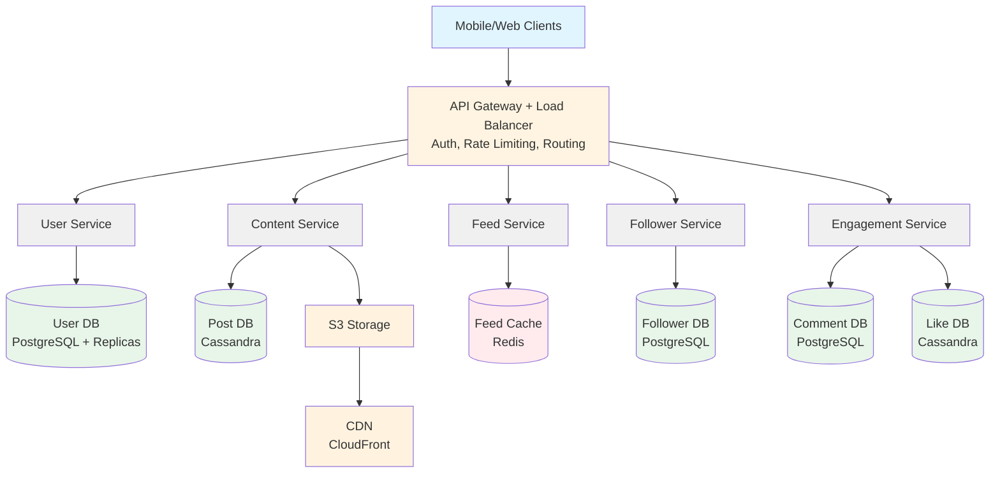
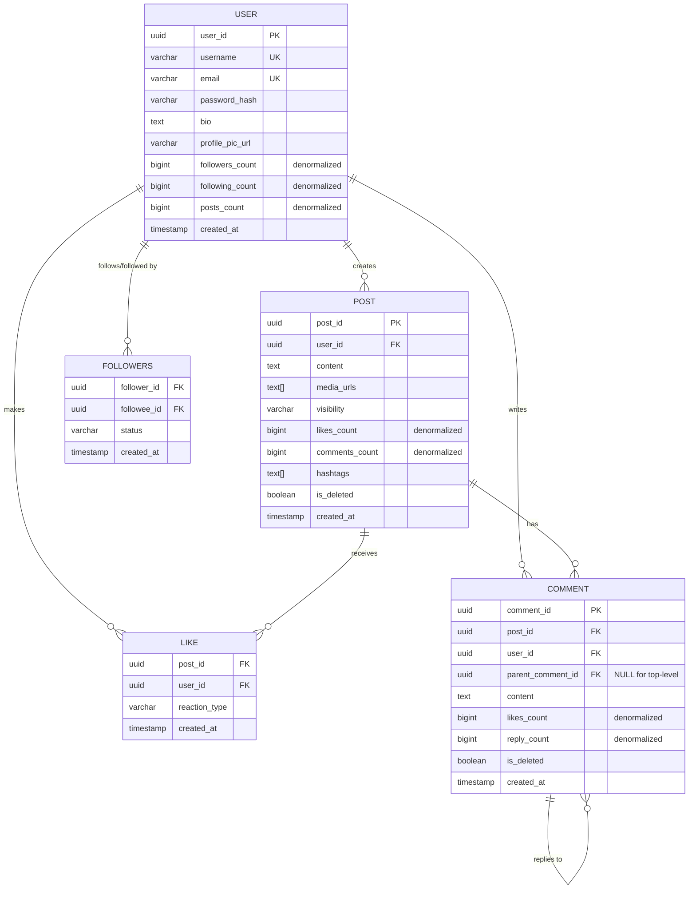
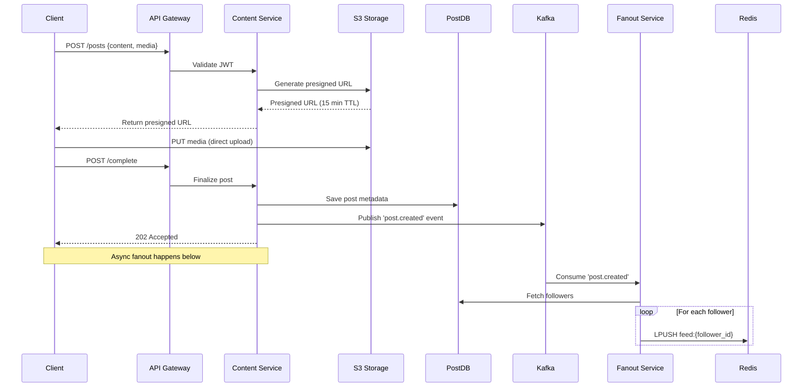
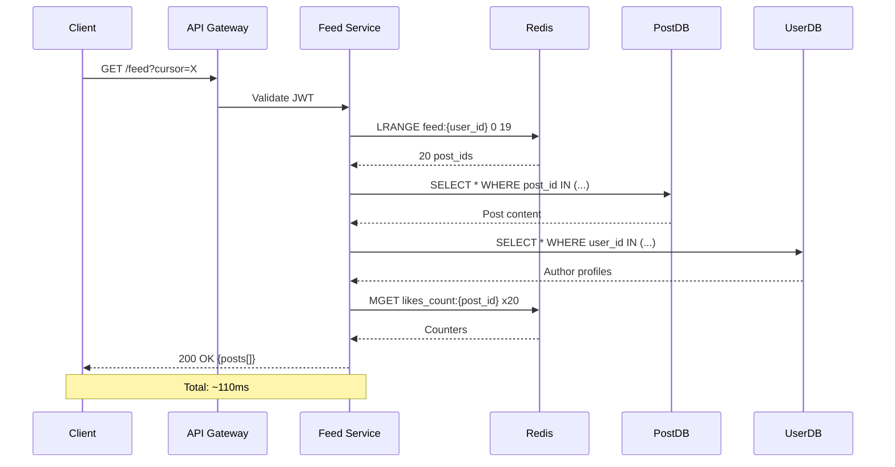
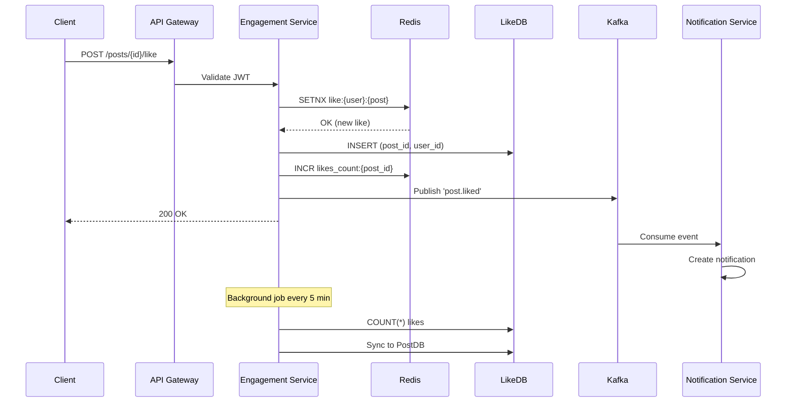
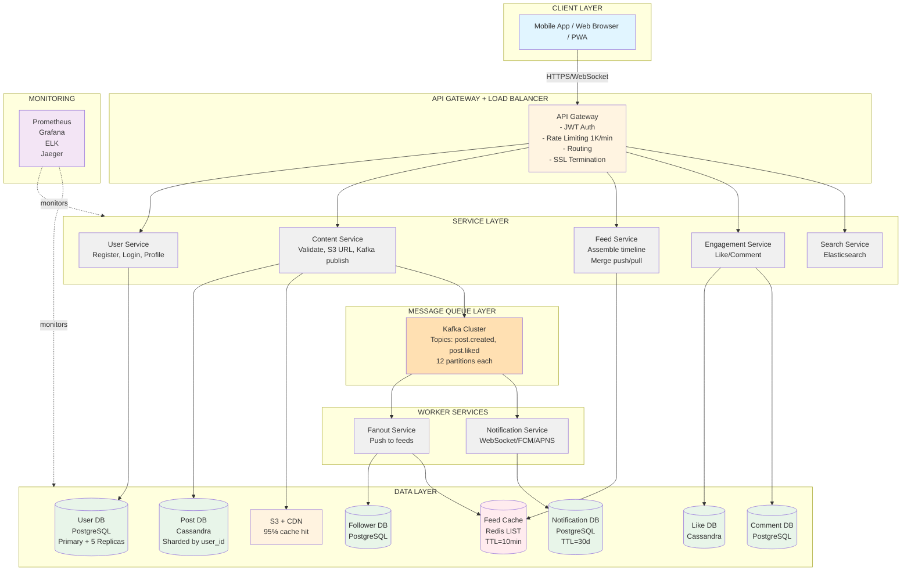

# Social Media Platform — Interview Guide (Facebook / Instagram)
## 🖨️ PRINT-OPTIMIZED VERSION (Mermaid Diagrams Only)

> **Note:** This is the PDF-ready version with only Mermaid diagrams for clean rendering.  
> For the version with both Mermaid + ASCII diagrams (maximum compatibility), see `interview-guide.md`

> One-liner to open with: "Graph database for social connections → Fanout on write for feed generation → CDN for media delivery → Redis cache for hot data"

---

## 🎯 EXECUTIVE SUMMARY (Read this first!)

**What we're building:** Instagram/Facebook-style social media feed system for 500M daily users

**Core challenge:** When someone posts, how do we instantly show it to millions of followers without the database exploding?

**The answer in 3 parts:**
1. **Normal users** (<5K followers): When you post, we immediately copy your post to all your followers' feeds (fanout on write). Their feeds are pre-built and instant.
2. **Celebrities** (>5K followers): When they post, we do nothing. When YOU open your feed, we fetch their posts on-demand (fanout on read). Saves billions of writes.
3. **Speed tricks**: Redis cache for feeds (10ms reads), Cassandra for posts (horizontal scaling), CDN for images (95% cache hit), Kafka for async processing.

**Key numbers:**
- 100M posts/day (1,200 posts/sec)
- 10B feed loads/day (115,000 reads/sec)
- Feed loads in <500ms
- 10TB media uploaded daily

**Tech stack at a glance:**
- PostgreSQL: User profiles, followers, comments (needs relational integrity)
- Cassandra: Posts, likes (high write volume, time-series data)
- Redis: Feed cache, counters (sub-10ms reads)
- Kafka: Async fanout, notifications (decouples write from propagation)
- S3 + CDN: Media storage and global delivery

**If you read nothing else, remember:**
The entire system hinges on the **hybrid fanout model** — push for normal users, pull for celebrities. That's what makes Instagram scale from 1 user to 2 billion.

---

## Step 1: Clarify Requirements (2 min)

### Functional Requirements
| # | Feature | Notes |
|---|---------|-------|
| 1 | Register / Login | Profile management |
| 2 | Create post | text / image / video, up to 500MB |
| 3 | Follow users | Unidirectional follow OR bidirectional friend-request |
| 4 | Like / Comment | Nested threads, reaction types |
| 5 | View feed | Personalized, posts from followed users, reverse-chrono |
| 6 | Search | Users, hashtags, posts with autocomplete |
| 7 | Notifications | Likes, comments, follows, mentions |

### Non-Functional Requirements
- **Scale**: 500M DAU, 2B registered users
- **Volume**: 100M posts/day → 1.2K posts/sec
- **Read/Write**: 100:1 (heavy reads)
- **CAP**: Availability >> Consistency (eventual consistency acceptable)
- **Latency**: Feed load <500ms, Likes/Comments <200ms, Post creation <300ms
- **Media**: 10TB uploaded daily, petabytes total

**💡 Section Summary (Requirements):**
We're building a read-heavy system (100:1 read/write ratio) prioritizing availability over consistency. Key constraints: 500M daily users, 1.2K posts/sec, 115K feed reads/sec, sub-500ms feed loads. Media is the largest challenge at 10TB/day.

---

## Step 2: Core Entities (1 min)

```
User          user_id, username, email, bio, profile_pic_url, followers_count (denorm)
Post          post_id, user_id, content, media_urls[], visibility, likes_count (denorm)
Followers     follower_id, followee_id, status (pending/accepted), created_at
Like          post_id + user_id (composite PK), reaction_type
Comment       comment_id, post_id, parent_comment_id (NULL = top-level), likes_count
Feed          feed:{user_id} → Redis LIST of post_ids (latest 1000)
```

**💡 Section Summary (Core Entities):**
6 main entities: User (profiles), Post (content), Followers (social graph), Like (engagement), Comment (nested threads), Feed (cached timeline). Followers creates many-to-many relationships. Feed is denormalized in Redis for speed. Like uses composite key (post_id + user_id) to prevent duplicates.

---

## Step 3: API Design (2 min)

### User Onboarding
```
POST   /api/v1/users/register          → {user_id, token}
POST   /api/v1/users/login             → {token}
GET    /api/v1/users/{user_id}/profile
PUT    /api/v1/users/{user_id}/profile
```

### Post Operations
```
POST   /api/v1/posts                                       → 202 Accepted (async fanout)
GET    /api/v1/posts/{post_id}
PUT    /api/v1/posts/{post_id}                             (author only)
DELETE /api/v1/posts/{post_id}                             (soft delete)
GET    /api/v1/posts/feed?limit={limit}&cursor={cursor}   (infinite scroll — cursor-based)
GET    /api/v1/users/{user_id}/posts                      (profile timeline)
```

> **WHY CURSOR-BASED PAGINATION INSTEAD OF PAGE NUMBERS? (Beginner Explanation)**
> Page numbers (offset=0, offset=20, offset=40) seem simple, but imagine scrolling through Instagram. While you scroll, new posts are being added at the top. When you ask for "page 2", the database shifts all rows down — you either see duplicates or skip posts entirely.
> A cursor is a bookmark: "give me the next 20 posts after post_id X, created before timestamp Y". No matter how many new posts arrive, your bookmark stays stable. You always get the next 20 posts cleanly.
> Offset pagination also requires the DB to scan and skip rows (slow at high offsets). Cursor pagination hits an index directly — fast even at post #10,000.

### Interactions
```
POST   /api/v1/posts/{post_id}/like
DELETE /api/v1/posts/{post_id}/unlike
GET    /api/v1/posts/{post_id}/comments
POST   /api/v1/comments/{comment_id}           (reply or new comment)
POST   /api/v1/users/{user_id}/follow
DELETE /api/v1/users/{user_id}/unfollow
```

### Social Graph
```
GET    /api/v1/users/{user_id}/followers?limit={limit}&cursor={cursor}   (who follows this user)
GET    /api/v1/users/{user_id}/following?limit={limit}&cursor={cursor}   (who this user follows)
```

> **WHY SEPARATE FOLLOWERS AND FOLLOWING ENDPOINTS?**
> Every social profile page needs both lists: "1.2M followers" and "800 following" are clickable — users browse them to discover accounts. These are two separate reverse lookups on the Followers table: `SELECT follower_id WHERE followee_id = X` vs `SELECT followee_id WHERE follower_id = X`. Exposing them as two distinct endpoints makes the intent explicit at the API layer and allows independent pagination — a celebrity's followers list may have millions of entries while their following list has 200. Cursor-based pagination (same reason as feed) prevents the offset-shift problem as users follow/unfollow in real time.

### Search
```
GET    /api/v1/search?q={query}&type={users|posts}&limit={limit}&cursor={cursor}
```

> **WHY A DEDICATED SEARCH ENDPOINT?**
> Search is fundamentally different from every other read in this system: it needs full-text tokenisation, hashtag indexing, and autocomplete — none of which PostgreSQL or Cassandra handle well at scale. The `type` parameter routes to the correct Elasticsearch index (`users_index` vs `posts_index`) so a single endpoint serves both user lookup ("@john") and content discovery ("#travel"). Elasticsearch supports 10K searches/sec with sub-100ms autocomplete latency (listed in the Scaling table). Without this endpoint the entire Search functional requirement (FR #6) has no API surface.

### Notifications
```
GET    /api/v1/notifications?limit={limit}&cursor={cursor}              (notification inbox)
PUT    /api/v1/notifications/{notification_id}/read                     (mark one as read)
PUT    /api/v1/notifications/read-all                                   (mark all as read)
```

> **WHY NOTIFICATION READ/UNREAD ENDPOINTS?**
> The notification flow is fully described in the LLD (Kafka → Notification Svc → WebSocket/FCM), but without API endpoints there is no way for a client to fetch the inbox on app launch or mark items read. `GET /notifications` loads stored rows from the Notification DB (PostgreSQL, 30-day TTL) for users who missed the real-time WebSocket push — e.g., after a cold start or offline period. The two `PUT` variants cover the two UX actions: tapping a single notification vs the "Mark all read" button. Using `PUT` (not `POST`) is correct here because the operation is idempotent — calling it twice leaves the resource in the same state.

**💡 Section Summary (API Design):**
We have 6 API groups: User (register/login/profile), Post (CRUD + feed), Interactions (like/comment/follow), Social Graph (followers/following lists), Search (users/posts/hashtags), and Notifications (inbox). All use cursor-based pagination for infinite scroll. POST operations return 202 Accepted for async processing. All endpoints use JWT authentication and are rate-limited to 1K requests/minute per user.

---

## Step 4: High Level Design



**API Gateway responsibilities**: Authentication/JWT, Rate Limiting (1K req/min per user), Routing

> **WHY CDN EXISTS? (Beginner Explanation)**
> Imagine every Instagram photo stored in a single warehouse in Virginia. Every user in Tokyo, São Paulo, and London waits for the image to travel across the world — 200ms+ per photo, on every scroll.
> A CDN (Content Delivery Network) is a network of caches spread across the globe. The first time someone in Tokyo requests a photo, it fetches from S3 in Virginia and stores a copy at the Tokyo edge server. The next million Tokyo users get it from next door — under 5ms.
> At 10TB of media uploaded daily, serving everything from origin would require enormous bandwidth and latency. CDN cuts that cost by 95% and makes every scroll feel instant regardless of where the user lives.

**Key database choices**:
| Service | DB | Why |
|---------|-----|-----|
| User Svc | PostgreSQL + replicas | Relational, profile lookups |
| Content Svc | Cassandra | High write throughput, partition by user_id |
| Follower Svc | PostgreSQL (or graph DB) | Bidirectional edge queries |
| Engagement | Cassandra (likes), PostgreSQL (comments) | High write volume |
| Feed | Redis | Sub-10ms LRANGE, ephemeral data |

> **WHY SEPARATE POST SERVICE AND FEED SERVICE? (Beginner Explanation)**
> Think of a restaurant: the kitchen (Content/Post Service) cooks and stores food; the waiter (Feed Service) decides what to put on your plate and delivers it. You don't want the waiter running into the kitchen to cook every time a customer orders.
> Content Service owns creating, validating, and storing individual posts. Feed Service owns the personalized timeline — who sees what, assembled in what order, from Redis cache.
> They scale completely differently: Content Service handles 1.2K post writes/sec; Feed Service handles 115K read requests/sec. Bundling them together means you have to scale both even when only one is under pressure — expensive and fragile.

**💡 Section Summary (High Level Design):**
6 microservices: User (auth/profiles), Content (posts), Feed (timelines), Follower (social graph), Engagement (likes/comments), Search (Elasticsearch). Each service owns its database. API Gateway handles auth, rate limiting, and routing. CDN serves 95% of media. Services scale independently based on their workload.

---

## Step 5: Low Level Design (Deep Dive)

### Feed Generation — The Core Problem

#### Push Model (Fanout on Write) — normal users <5K followers
```
User posts
    → Kafka 'post.created'
    → Fanout Svc reads event
    → Query FollowerDB: SELECT follower_id WHERE followee_id = poster_id   (e.g. 500 followers)
    → For each follower: LPUSH feed:{follower_id} {post_id}
                         LTRIM feed:{follower_id} 0 999   (keep latest 1000)
    → Feed pre-built, read is instant: LRANGE feed:{user_id} 0 19  → <10ms
```

> **WHY FANOUT ON WRITE (PUSH MODEL) EXISTS? (Beginner Explanation)**
> Think of a newspaper printing press — it runs once overnight and drops a copy at every subscriber's doorstep before they wake up. When you open the app, your feed is already sitting there, pre-built.
> That's fanout on write: the moment someone posts, the system immediately pushes that post_id into every follower's Redis cache. Reading your feed is instant because the work was done upfront at write time.
> Without it: every time 500M users open the app, each triggers a DB JOIN across posts and followers. That's 115K queries per second hitting the database — it collapses instantly.

#### Pull Model (Fanout on Read) — celebrities >5K followers
```
User loads feed
    → Feed Svc: check Redis feed:{user_id}  (normal users)
    → For each celebrity followed: SELECT * FROM PostDB WHERE user_id = {celebrity_id} LIMIT 100
    → Merge pushed posts + pulled celebrity posts, sort by timestamp
    → Cache merged result in Redis (TTL = 10 min)
```

> **WHY FANOUT ON READ (PULL MODEL) FOR CELEBRITIES? (Beginner Explanation)**
> Selena Gomez has 400M followers. Fanout on write means 1 post = 400M Redis writes in seconds — like trying to print and deliver 400M newspapers simultaneously. The system would catch fire.
> Pull model flips the logic: don't push anything on post creation. When YOU open your feed, the system pulls that celebrity's latest posts on-demand and stitches them in. All 400M followers share the same single cached query result instead of 400M individual cache entries.
> The trade-off: her post takes up to 10 minutes to appear in your feed (the cache TTL). For a social app, nobody notices. For a stock trading app, that would be catastrophic.

#### Hybrid Model (production reality)
```
<5K followers   → pure PUSH   (pre-built feeds)
1K–5K           → hybrid      (push to active followers, pull for inactive)
>5K followers   → pure PULL   (no fanout, query on-demand)
```

> **WHY A HYBRID MODEL? (Beginner Explanation)**
> Pure push breaks for celebrities. Pure pull is slow for everyone else. The hybrid model draws a line at 5K followers.
> Below 5K: you're a normal user — fanout pre-builds your followers' feeds instantly. Above 5K: you're treated as a celebrity — followers pull your posts on-demand at read time.
> This way the system never fans out to millions of caches, but regular users still get sub-10ms feed loads. The 5K threshold is a tunable config, not a magic number — Instagram uses a similar cut-off in production.

### Feed Ranking — Why Not Just Reverse Chronological?

> **WHY FEED RANKING/SCORING EXISTS? (Beginner Explanation)**
> Reverse-chronological (newest first) is simple and fair. But if you follow 500 accounts, the loudest posters bury everyone else — a news account posting 30 times a day drowns out your friend who posts once a week.
> Ranking scores each post by signals: how close are you to the author? how many likes/comments in the first 10 minutes? is this a video (higher engagement)? did you interact with this person recently? Posts you care most about float to the top.
> This system uses reverse-chronological (simpler, covers the interview). In production, Instagram/Facebook run ML ranking models on the assembled feed as a final step before returning it. Mention this as a possible extension if the interviewer probes deeper.

### Post Creation Flow
```
1. Client: POST /api/v1/posts  {content, media_files, visibility, mentions}
2. Content Svc: validate JWT, content length <5000, media <500MB
3. Media path: generate presigned S3 PUT URL (valid 15 min)
       → client uploads direct to S3
       → S3 triggers Lambda: resize images (150/400/1080px), transcode video (360/720/1080p HLS)
4. Create Post row in Cassandra: partition_key=user_id, clustering_key=created_at DESC
5. Publish to Kafka 'post.created': {post_id, user_id, created_at, media_urls}
6. Return 202 Accepted immediately  ← fanout is ASYNC
```

### Feed Load Flow
```
Client: GET /api/v1/posts/feed?limit=20&offset=0

Step 1 (10ms):  LRANGE feed:{user_id} 0 19           → 20 post_ids from Redis
Step 2 (50ms):  SELECT * FROM PostDB WHERE post_id IN (...)   → post content
Step 3 (30ms):  SELECT * FROM UserDB WHERE user_id IN (...)   → author profiles (or cache)
Step 4 (20ms):  MGET likes_count:{post_id} x20              → engagement counts Redis

Total: ~110ms  (well under 500ms target)
```

> **WHY REDIS FOR FEED CACHE? (Beginner Explanation)**
> Think of Redis as a sticky note on your fridge — you glance at it instantly. The database is a filing cabinet in the basement — accurate, but you have to walk down, find the folder, and read the document.
> At 115K feed loads per second, going to the filing cabinet every time would be catastrophic. Redis stores each user's feed as a pre-built LIST of 1000 post_ids, readable in under 10ms with a single LRANGE command.
> Feed data is also ephemeral — if Redis loses it (crash, restart), the worst case is a slightly slower feed load while it rebuilds from the database. You'd never notice. That's what makes it safe to treat as a cache rather than a source of truth.

### Like Interaction — Idempotency
```
Client: POST /api/v1/posts/{post_id}/like

1. Client-side: debounce 300ms, disable button (optimistic UI)
2. Redis: SETNX like:{user_id}:{post_id}  → if 0, already liked → return 200
3. Like DB: INSERT (post_id, user_id) — Cassandra composite PK prevents duplicate
4. Redis: INCR likes_count:{post_id}
5. Kafka: publish 'post.liked' → Notification Svc
6. Background job (5 min): COUNT(*) from Like DB → sync to PostDB (source of truth)
```

> **WHY LIKE COUNTERS ARE HARD TO UPDATE? (Beginner Explanation)**
> Imagine a viral post getting 50,000 likes in one minute. Every like needs to increment a single counter in a database row. In a normal DB, that means: read the current value → add 1 → write it back. With 50,000 concurrent requests, each one waits for a lock on that row — requests pile up, the database slows down, everything breaks. This is called a write hotspot.
> The solution: Redis INCR is atomic and lock-free. It handles 100K increments per second on a single key without anyone waiting. The trade-off: Redis isn't the source of truth. A background job every 5 minutes counts the real rows in the Like DB and syncs the number back.
> You might show "10,234 likes" when the true count is 10,241. For a social app, a 5-minute lag is invisible. For a bank balance, it would be a disaster.

### Follow / Unfollow
```
Follow:
  1. INSERT INTO Followers (follower_id, followee_id)
  2. INCR followers_count:{followee_id}, INCR following_count:{follower_id} in Redis
  3. Backfill: add followee's last 100 posts to follower's feed in Redis

Unfollow:
  1. DELETE FROM Followers
  2. DECR counts
  3. LREM feed:{follower_id} — purge followee's posts from feed
```

### Notification Flow
```
Kafka topics consumed: 'post.liked', 'post.commented', 'user.followed'
    → Check user preferences (notification settings)
    → Aggregate: 5 likes within 5 min → "John and 4 others liked your post"
    → Deliver: WebSocket (in-app active users) / FCM/APNS (mobile background)
    → Store in Notification DB (PostgreSQL) for inbox, clean after 30 days
```

**💡 Section Summary (Low Level Design):**
The heart of the system is hybrid fanout: push (write to followers' caches) for normal users, pull (fetch on-demand) for celebrities. Posts return 202 immediately, fanout happens async via Kafka. Feed loads in 110ms by reading post_ids from Redis, batch-fetching content from PostDB and UserDB. Likes use Redis INCR for instant feedback, background job syncs to DB every 5 min (eventual consistency). Notifications are aggregated and delivered via WebSocket for active users.

---

## Step 6: Entity Relationship Diagram



**Redis Cache Patterns:**
- `feed:{user_id}` → LIST of post_ids (1000 latest)
- `likes_count:{post_id}` → STRING counter
- `comments_count:{post_id}` → STRING counter
- `like:{user_id}:{post_id}` → STRING flag (idempotency)
- `followers_count:{user_id}` → STRING counter
- `author_latest_post:{user_id}` → STRING cached celebrity posts

**📝 Text Description of ER Diagram:**

This diagram shows 5 main database tables and their connections:

1. **USER table** stores user profiles with fields: user_id (primary key), username, email, password_hash, bio, profile picture URL, and denormalized counters for followers, following, and posts.

2. **POST table** stores posts with fields: post_id (primary key), user_id (foreign key linking to USER), content text, media URLs array, visibility setting, denormalized like and comment counts, hashtags, soft delete flag, and timestamp.

3. **FOLLOWERS table** creates the many-to-many relationship between users: follower_id and followee_id (both foreign keys to USER), status (pending/accepted), and timestamp. This is a self-referential relationship where users can follow other users.

4. **LIKE table** connects users to posts they liked: post_id and user_id together form the primary key (preventing duplicate likes), reaction type (like/love/haha/wow/sad/angry), and timestamp.

5. **COMMENT table** stores both top-level comments and replies: comment_id (primary key), post_id (foreign key), user_id (foreign key), parent_comment_id (NULL for top-level, points to another comment for replies), content, denormalized counters for likes and replies, soft delete flag, and timestamp.

**Redis cache patterns** store temporary data:
- feed:{user_id} → LIST of 1000 most recent post IDs for that user's timeline
- likes_count:{post_id} → Counter updated in real-time
- comments_count:{post_id} → Counter updated in real-time
- like:{user_id}:{post_id} → Flag to prevent duplicate likes (idempotency)
- followers_count:{user_id} → Cached follower count
- author_latest_post:{user_id} → Cached recent posts from celebrities

**Key Relationships:**
- User → Post: One-to-Many (a user creates many posts)
- User → Like: One-to-Many (a user likes many posts)
- Post → Like: One-to-Many (a post has many likes)
- User → Comment: One-to-Many (a user writes many comments)
- Post → Comment: One-to-Many (a post has many comments)
- Comment → Comment: One-to-Many (nested replies, self-referential via parent_id)
- User → Followers: Many-to-Many (a user follows many users and is followed by many)

**💡 Section Summary:**
The database uses PostgreSQL for structured data (users, followers, comments) and Cassandra for high-volume data (posts, likes). Redis caches feed timelines and counters. The Followers table creates the social graph, allowing users to follow each other in a many-to-many relationship.

---

## Step 7: API Flow Diagrams

### Post Creation Flow



**Text Description:**
1. Client sends POST request to create a post with content and media files
2. API Gateway validates JWT authentication token
3. Content Service generates a presigned S3 URL (valid for 15 minutes) and returns it to client
4. Client uploads media files directly to S3 (not through our servers)
5. Client calls POST /complete to finalize the post
6. Content Service saves post metadata to Cassandra PostDB
7. Content Service publishes 'post.created' event to Kafka
8. Returns 202 Accepted to client immediately (fanout happens asynchronously)
9. Fanout Service consumes Kafka event, fetches author's followers from FollowerDB
10. Fanout Service pushes post_id to each follower's feed in Redis using LPUSH

### Feed Load Flow



**Text Description:**
1. Client requests GET /feed with cursor parameter for pagination
2. API Gateway validates JWT
3. Feed Service runs LRANGE on Redis to get 20 post IDs from feed:{user_id}
4. Feed Service batch-fetches post content from PostDB using WHERE post_id IN (...)
5. Feed Service batch-fetches author profiles from UserDB using WHERE user_id IN (...)
6. Feed Service runs MGET on Redis to get like/comment counters for all 20 posts
7. Feed Service assembles JSON response and returns it
8. Total time: ~110ms (10ms Redis + 50ms PostDB + 30ms UserDB + 20ms counters)

### Like Interaction Flow



**Text Description:**
1. Client sends POST /posts/{post_id}/like
2. API Gateway validates JWT
3. Engagement Service checks Redis with SETNX like:{user_id}:{post_id} (idempotency)
4. If key didn't exist (new like), insert row into LikeDB with composite PK (post_id, user_id)
5. Increment likes_count:{post_id} counter in Redis (instant feedback)
6. Publish 'post.liked' event to Kafka
7. Return 200 OK to client immediately
8. Notification Service consumes Kafka event and creates notification
9. Background job runs every 5 minutes: COUNT(*) all likes from LikeDB and sync to PostDB

**💡 Section Summary:**
All APIs follow async patterns: POST operations return 202 Accepted immediately, background workers handle heavy lifting. Read operations use Redis cache first, then batch-fetch from DB. Like interactions use Redis for instant feedback, then eventual consistency with background sync.

---

## Step 8: Detailed Architecture with Data Flow



**📝 Text Description of Detailed Architecture:**

This is a multi-layer architecture diagram showing 7 main layers:

**Layer 1 - Client Layer:**
Mobile apps, web browsers, and progressive web apps connect via HTTPS and WebSocket.

**Layer 2 - API Gateway + Load Balancer:**
Handles JWT authentication, rate limiting (1,000 requests per minute per user), request routing to services, and SSL termination.

**Layer 3 - Service Layer:**
- **User Service**: Handles registration, login, profile management, and user search. Connects to PostgreSQL User DB with 1 primary and 5 read replicas.
- **Content Service**: Validates posts, generates S3 presigned URLs, creates post records, and publishes to Kafka. Connects to Cassandra Post DB (sharded by user_id with time-series clustering) and S3+CDN for media storage.
- **Feed Service**: Assembles personalized timelines, merges push and pull feeds, and manages cache. Connects to Redis Feed Cache (LIST data structure per user, 10-minute TTL).
- **Follower Service**: Not shown in detail but manages follower relationships.
- **Engagement Service**: Manages likes and comments.
- **Search Service**: Powered by Elasticsearch for autocomplete and hashtag indexing.

**Layer 4 - Message Queue Layer:**
Kafka cluster with topics: post.created, post.liked, post.commented, user.followed, notification.send. Each topic has 12 partitions keyed by user_id or post_id for ordered processing.

**Layer 5 - Worker Services:**
- **Fanout Service**: Consumes post.created events, fetches followers from FollowerDB (PostgreSQL with indexed edges), and pushes post IDs to Redis feeds. Implements hybrid fanout (push for <5K followers, pull for celebrities).
- **Notification Service**: Aggregates events, delivers via WebSocket for active users or FCM/APNS for mobile, and stores in Notification DB (PostgreSQL with 30-day TTL).

**Layer 6 - Data Layer:**
- User DB: PostgreSQL primary + 5 replicas
- Post DB: Cassandra sharded by user_id
- Follower DB: PostgreSQL with indexed edges for bidirectional lookups
- Like DB: Cassandra for high write volume
- Comment DB: PostgreSQL for nested thread support
- Feed Cache: Redis with LRU/LFU eviction
- Notification DB: PostgreSQL with 30-day TTL
- S3 + CDN: Original media, thumbnails, HLS videos with 95% cache hit rate

**Layer 7 - Monitoring & Observability:**
Prometheus (metrics), Grafana (dashboards), ELK Stack (logs), Jaeger (distributed tracing).

**Data Flow Highlights:**
1. **Post Creation**: Client → API GW → Content Svc → Kafka → Fanout Svc → Redis feeds
2. **Feed Load**: Client → API GW → Feed Svc → Redis (post_ids) → PostDB (content) → UserDB (profiles)
3. **Like Action**: Client → API GW → Engagement Svc → Redis (counter) → LikeDB → Kafka → Notification
4. **Follow**: Client → API GW → Follower Svc → FollowerDB → Backfill feed cache

**💡 Section Summary:**
The architecture separates concerns into specialized services. Heavy write operations (posts, likes) go to Cassandra. Relational data (users, followers, comments) goes to PostgreSQL. All feeds are cached in Redis. Kafka decouples write operations from fanout propagation. CDN serves 95% of media requests without touching our servers.

---

## Step 9: Common Interview Questions

**Q: Why fanout on write for normal users?**
100:1 read/write ratio. Pre-generating feeds means 1 slow write enables 100 fast reads. LRANGE from Redis = <10ms. For celebrities with 10M followers, 1 post = 10M writes → impractical, so switch to pull.

**Q: How to handle the celebrity hotspot?**
(1) Flag users as celebrity if followers_count > 5K in User table.
(2) Celebrity posts → PostDB only, skip fanout.
(3) Feed load: merge pushed posts (LRANGE) + pulled celebrity posts (query PostDB).
(4) Celebrity posts cached in Redis with higher TTL (1hr vs 10min), all followers share same cache.

**Q: How to ensure like count consistency between cache and DB?**
Eventual consistency: Redis INCR is fast and best-effort. Cron job every 5 min queries `SELECT COUNT(*) GROUP BY post_id` from Like DB → updates PostDB. If Redis count differs from DB by >10%, invalidate and reload. Redis crash → background job rebuilds within 5 min. Accept ±5% drift for <5 min (not a financial system).

**Q: How to prevent duplicate likes?**
3-layer idempotency: (1) Client-side: debounce 300ms + disable button. (2) Redis: `SETNX like:{user_id}:{post_id}` — if key exists, already liked. (3) Cassandra composite PK (post_id, user_id) — duplicate insert fails silently.

**Q: How to handle nested comments efficiently?**
Schema: `parent_comment_id` (NULL = top-level). Load strategy: fetch top-level first (`WHERE parent_comment_id IS NULL LIMIT 20`), lazy-load replies on expand. Max depth = 3 levels. Index: `(post_id, parent_comment_id, created_at)`.

**Q: Why Redis for feed instead of database?**
(1) Speed: LRANGE = <10ms vs DB query = 100ms+. (2) Scale: Redis handles 100K ops/sec. (3) Feed is ephemeral — loss acceptable (rebuild from DB). (4) Reduces DB load by 90%.

**Q: What happens when a user with 1M followers posts?**
Celebrity flag bypasses fanout entirely. Post written to PostDB only. Followers see it on next feed load (pull). Notifications batched — top 1000 engaged followers notified immediately, rest get digest. Prevents: 1M DB writes + 1M Redis writes + 1M push notifications.

**Q: How to handle media upload failures?**
Presigned S3 URL (15 min expiry) → chunked multipart upload (5MB chunks, 10 parallel). Progress in Redis: `upload:{upload_id} = {chunks_uploaded, total_chunks}`. On failure: query missing chunks, upload only those. `POST /upload/{id}/complete` assembles in S3. Exponential backoff (1s, 2s, 4s), circuit breaker after 3 failures.

**Q: How to implement real-time notifications?**
WebSocket + Redis pub/sub: Client opens WS on app launch (JWT auth). Server subscribes to `notifications:{user_id}` Redis channel. Engagement event → Redis pub/sub → WS push to client. Offline: store in Notification DB, deliver on reconnect. Mobile: FCM/APNS instead of persistent WS.

**Q: How to handle privacy controls?**
`visibility` enum on Post (public/friends/private). Fanout on write: only push to follower's feed if `visibility=public` OR `visibility=friends AND is_mutual_follower`. Direct access: check relationship at read time. Mutual follow = bidirectional edge in Followers table. Privacy check cached: `friend:{A}:{B}` in Redis (TTL=1hr).

**Q: How to scale at 500M DAU?**
DB sharding by user_id (1000 shards). 5 PostgreSQL read replicas (99% reads). Redis caching cuts DB load 90%. CDN 95% cache hit for media. Kafka decouples write from fanout. Denormalization avoids COUNT(*) queries. Connection pooling (100 connections/server × 50 servers = 5K total).

**💡 Section Summary (Common Interview Questions):**
Interviewers focus on: hybrid fanout (why/when push vs pull), celebrity hotspot (how to avoid write explosion), consistency (eventual for counters, strong for critical data), idempotency (Redis SETNX + composite PKs), Redis benefits (speed, scale, ephemeral data), nested comments (parent_id + lazy load), real-time notifications (WebSocket + Redis pub/sub), privacy (visibility checks + cache), scaling (sharding, replicas, CDN, Kafka, denormalization).

---

## Step 10: Scaling Techniques

| Technique | Impact |
|-----------|--------|
| Cassandra sharding by user_id | Horizontal scale for posts |
| PostgreSQL read replicas (×5) | 99% reads hit replicas |
| Redis feed cache (TTL=10min) | 90% fewer DB queries |
| CDN (CloudFront) | 95% media cache hit, <50ms |
| Kafka async fanout | Decouples post creation from propagation |
| Denormalization (like/follower counts) | 100ms COUNT → 1ms field read |
| Batch like count sync (5min) | 100× fewer DB writes |
| Elasticsearch for search | 10K searches/sec, <100ms autocomplete |
| Rate limiting (1K req/min) | Prevents abuse |
| Lazy loading (20 posts/scroll) | Page load 5s → 500ms |

**💡 Section Summary (Scaling Techniques):**
10 key techniques enable 500M DAU: Cassandra shards posts by user_id for horizontal scaling. PostgreSQL read replicas handle 99% of reads. Redis cuts DB queries 90%. CDN serves 95% of media (saving origin bandwidth). Kafka decouples writes from fanout. Denormalization trades storage for query speed. Background jobs batch writes (like count sync). Elasticsearch handles 10K searches/sec. Rate limiting prevents abuse. Cursor pagination with lazy loading keeps feeds fast at any scroll depth.

---

## Step 11: Failure Mode Analysis & Disaster Recovery

### Redis Cache Failure

**Scenario: Redis cluster goes down (hardware failure, network partition, OOM)**

**Immediate Impact:**
- Feed loads fall back to DB queries: 10ms → 200ms latency
- Feed Service queries: `SELECT post_id FROM Posts WHERE user_id IN (following_list) ORDER BY created_at DESC LIMIT 1000`
- Throughput drops from 115K req/sec → ~15K req/sec (DB bottleneck)
- Like counters unavailable → serve stale counts from PostDB (5-min lag acceptable)

**Mitigation Strategy:**
1. **Redis Cluster Mode**: 3 master nodes + 3 replicas across AZs
   - Auto-failover in <30 seconds (Redis Sentinel)
   - No single point of failure
2. **Circuit Breaker Pattern**: After 3 consecutive Redis timeouts (>100ms), open circuit for 30s
   - Prevents cascading failures to DB
   - Feed Service bypasses Redis, queries DB directly
3. **Graceful Degradation**:
   - Serve cached feed from user's last session (mobile app local storage)
   - Show "Feed temporarily unavailable" after 10s timeout
4. **Recovery Procedure**:
   - Redis comes back empty → lazy rebuild
   - First 1000 users to load feed: query DB, repopulate Redis
   - Within 10 minutes: 80% of active users' feeds rebuilt
5. **Monitoring Alerts**:
   - Redis memory >85% → alert ops team (scale up or evict LRU keys)
   - Redis hit rate <70% → investigate (normal is 95%+)

**RTO (Recovery Time Objective)**: <5 minutes  
**RPO (Recovery Point Objective)**: 0 (cache is ephemeral, no data loss)

---

### Kafka Lag Spike

**Scenario: Fanout Service falls behind, Kafka consumer lag grows to 10M messages**

**Root Causes:**
- Viral post from celebrity (50M followers, 1 post = 50M fanout operations)
- Fanout Service pod crash (Kubernetes rolling restart took 5 min)
- FollowerDB slow query (missing index on followee_id)

**Immediate Impact:**
- New posts take 30+ minutes to appear in feeds (lag = 10M messages ÷ 20K msg/sec throughput)
- User complaints: "I posted 10 minutes ago, why isn't it in my feed?"

**Detection:**
- Prometheus alert: `kafka_consumer_lag{topic="post.created"} > 100000`
- Grafana dashboard shows lag chart spiking

**Mitigation Strategy:**
1. **Auto-Scaling Fanout Workers**:
   - Kubernetes HPA: scale from 10 → 50 pods when lag >100K
   - Each pod processes 2K msg/sec → 50 pods = 100K msg/sec burst capacity
2. **Priority Queue**:
   - Split Kafka topic by follower count:
     - `post.created.normal` (0-1K followers) → Priority 1, processed first
     - `post.created.influencer` (1K-100K followers) → Priority 2
     - `post.created.celebrity` (>100K followers) → Skip entirely (pull model)
   - Prevents viral celebrity posts from blocking normal users
3. **Rate Limiting at Source**:
   - Content Service: if user has >100K followers, don't publish to Kafka
   - Apply pull model immediately (no fanout)
4. **Manual Intervention (Last Resort)**:
   - Purge messages older than 1 hour from lag queue (acceptable data loss for social feed)
   - Affected users see slightly stale feed, rebuild on next app open

**Prevention:**
- Load test: simulate 10 viral posts/day in staging
- Index tuning: `CREATE INDEX idx_followers_followee ON Followers(followee_id) INCLUDE (follower_id)`
- Canary deployments: roll out Fanout Service changes to 5% traffic first

**RTO**: <15 minutes (auto-scale kicks in)  
**RPO**: 1 hour (acceptable lag for feed freshness)

---

### Database Failover (PostgreSQL Primary Node Failure)

**Scenario: Primary UserDB node crashes (EC2 instance termination, disk failure)**

**Immediate Impact:**
- All writes fail: new user registrations, profile updates, follow actions
- Reads continue from 5 replicas (read-only mode for 30-90 seconds)
- Replication lag: replicas may be 1-5 seconds behind primary

**PostgreSQL HA Setup (Production):**
```
Primary (Writer):       us-east-1a
Replica 1 (Reader):     us-east-1a  (same AZ, synchronous replication)
Replica 2 (Reader):     us-east-1b  (async replication)
Replica 3 (Reader):     us-east-1c  (async replication)
Replica 4 (Reader):     us-west-2a  (cross-region, async, DR)
Replica 5 (Reader):     eu-west-1a  (cross-region, async, geo-distributed)
```

**Failover Procedure (Automated via AWS RDS or Patroni):**
1. **Detection** (15 seconds):
   - Health check fails 3 consecutive times (5s interval)
   - Primary unreachable via TCP port 5432
2. **Promotion** (30 seconds):
   - Patroni elects Replica 1 (same AZ, synchronous) as new primary
   - DNS update: `userdb-primary.internal` → new IP
   - Connection pools drain and reconnect
3. **Write Resume** (45 seconds total):
   - Applications retry failed writes (exponential backoff)
   - User-facing impact: "Profile update failed, retry" for 45s window

**Data Consistency Concerns:**
- **Synchronous replica** (Replica 1): 0 data loss
- **Async replicas** (Replicas 2-5): potential 1-5 second loss window
- Example: User registers at T=0, primary crashes at T=3, async replica promoted → registration lost
- Mitigation: idempotency tokens in application layer, client retries

**Split-Brain Prevention:**
- Patroni uses etcd/Consul for distributed consensus (quorum = 3 nodes)
- Only 1 node can hold "leader" lock at a time
- Old primary fenced off (STONITH: "Shoot The Other Node In The Head")

**Monitoring:**
- Alert: Primary unreachable >10 seconds
- Alert: Replication lag >10 seconds on any replica
- Alert: Failover event occurred (page on-call engineer)

**RTO**: <2 minutes (automated failover)  
**RPO**: 0 seconds (synchronous replica), 5 seconds (async replica promoted)

---

### Cassandra Node Failure (PostDB)

**Scenario: 1 of 12 Cassandra nodes dies (AWS instance retirement, disk full)**

**Immediate Impact:**
- **Replication Factor = 3**: Data on failed node exists on 2 other nodes
- Reads/writes continue with **Quorum consistency** (2 of 3 replicas must respond)
- Slight latency increase: some requests routed to remaining nodes
- No user-facing impact if failure is <10% of cluster

**Auto-Healing:**
1. Cassandra detects node down via gossip protocol (10 seconds)
2. Requests automatically routed to healthy replicas
3. Ops team provisions replacement node (or auto-scaling group spawns new instance)
4. `nodetool repair` runs on adjacent nodes (streams missing data to new node)
5. Full repair: 2-4 hours for 10TB dataset

**If 2+ Nodes Fail Simultaneously (Availability Zone Outage):**
- **Rack-Aware Replication**: 3 replicas spread across 3 AZs
- Lose 1 AZ → still have 2 replicas in other AZs → reads/writes succeed
- Quorum = 2 of 3, so 1 AZ down still meets quorum

**Data Loss Scenario (Catastrophic):**
- Lose 2 AZs simultaneously (extremely rare: AWS region-wide failure)
- Replication Factor = 3 across 3 AZs → lose 2 AZs = lose 1+ replicas
- Some partitions may have <2 replicas available → writes fail for those partitions
- Mitigation: Cross-region Cassandra cluster (us-east + us-west), RF=5

**RTO**: 0 (automatic rerouting)  
**RPO**: 0 (replication prevents data loss)

---

### Multi-AZ / Multi-Region Strategy

**Current Setup (Single Region: us-east-1):**
```
3 Availability Zones:
  - us-east-1a: API Gateway, UserSvc, ContentSvc, PostgreSQL Primary, Cassandra nodes 1-4
  - us-east-1b: FeedSvc, EngagementSvc, PostgreSQL Replica 1-2, Cassandra nodes 5-8
  - us-east-1c: FanoutSvc, NotificationSvc, PostgreSQL Replica 3, Cassandra nodes 9-12
```

**Disaster Recovery (Cross-Region: us-west-2):**
```
Warm Standby:
  - PostgreSQL async replica (5-10 second lag)
  - Cassandra cluster (separate ring, async replication)
  - S3 bucket with cross-region replication enabled
  - Application servers on standby (min capacity: 10% of production)
```

**Failover Trigger:** us-east-1 region completely unavailable (AWS outage)
1. Update Route53 DNS: flip traffic from us-east-1 → us-west-2 (TTL = 60s)
2. Promote us-west-2 PostgreSQL replica to primary
3. Scale up us-west-2 application servers to 100% capacity (5-10 minutes)
4. Accept 5-10 second data loss window from async replication

**RTO**: 15 minutes (manual failover decision + DNS propagation + scaling)  
**RPO**: 10 seconds (async cross-region replication lag)

**Cost:** Warm standby = ~30% of production cost (worth it for 99.99% SLA)

---

## Step 12: Security Hardening

### DDoS Mitigation (Layer 3/4/7)

**Attack Vectors:**

1. **Layer 3/4 (Network/Transport): SYN Flood, UDP Amplification**
   - **Defense**: AWS Shield Standard (automatic, no cost)
     - Mitigates 99% of network-layer attacks
     - Absorbs up to 10 Gbps at edge locations
   - **Upgrade**: AWS Shield Advanced ($3K/month)
     - 24/7 DDoS Response Team (DRT)
     - Cost protection (no bandwidth overage charges during attack)

2. **Layer 7 (Application): HTTP Flood, Slowloris**
   - Attacker floods `POST /api/v1/posts` with 1M requests/sec from botnet
   - Overwhelms API Gateway, exhausts database connections

**Defense Strategy:**

**1. WAF (Web Application Firewall) - AWS WAF**
```
Rule Priority:
  1. IP Reputation List (AWS Managed)      → Block known malicious IPs
  2. Geographic Blocking                   → Block requests from non-service countries
  3. Rate Limiting (per IP)                → Max 100 req/min per IP
  4. Rate Limiting (per User)              → Max 1000 req/min per JWT user_id
  5. SQL Injection Pattern Matching        → Block requests with SQL keywords
  6. XSS Pattern Matching                  → Block <script> tags in POST body
  7. User-Agent Blocking                   → Block empty or suspicious User-Agents
```

**2. Rate Limiting (Multi-Layer)**
```
Layer 1 - CDN (CloudFront):
  - 10,000 requests/sec per IP (burst)
  - 1,000 requests/sec per IP (sustained)

Layer 2 - API Gateway:
  - 1,000 requests/min per authenticated user (JWT sub claim)
  - 10 requests/min per unauthenticated endpoint (/register, /login)

Layer 3 - Application (Redis-based Token Bucket):
  - Key: rate_limit:{user_id}:{endpoint}
  - INCR key, EXPIRE 60 seconds
  - If count > threshold: return 429 Too Many Requests
```

**3. CAPTCHA for Suspicious Traffic**
- Trigger: User exceeds 500 req/min OR 10 failed login attempts
- Present hCaptcha challenge (invisible for normal users)
- Store challenge result: `captcha_verified:{user_id}` in Redis (TTL = 1 hour)

**4. Connection Limits**
- API Gateway: Max 10,000 concurrent WebSocket connections per server
- PostgreSQL: Max 500 connections total (100 per app server × 5 servers)
- Circuit breaker: If DB connection pool exhausted, reject new requests (503 Service Unavailable)

**5. Content Delivery Network (CloudFront) as Shield**
- 95% of media requests served from edge (never hit origin)
- Attacker floods image URLs → CDN absorbs load, origin unaffected
- Geo-blocking: Block requests from countries not in user base (e.g., North Korea, if no users there)

**Monitoring:**
- CloudWatch alert: Requests/sec >10× baseline (possible DDoS)
- WAF dashboard: Blocked requests >1000/min (investigate attack pattern)

---

### OWASP Top 10 Coverage

**1. Broken Access Control**
- **Threat**: User A modifies `PUT /posts/{post_id}` to delete User B's post
- **Defense**:
  ```python
  def update_post(post_id, user_id_from_jwt):
      post = db.get_post(post_id)
      if post.user_id != user_id_from_jwt:
          raise Forbidden("Not your post")
  ```
- **Implementation**: Middleware checks JWT `sub` claim matches resource owner
- **Test**: Automated security tests (OWASP ZAP) attempt unauthorized edits

**2. Cryptographic Failures**
- **Threat**: Passwords stored in plaintext, HTTPS disabled
- **Defense**:
  - Password hashing: bcrypt with salt (cost factor = 12)
  - Secrets: AWS Secrets Manager rotates DB credentials every 30 days
  - TLS 1.3 enforced (API Gateway terminates SSL, rejects TLS 1.0/1.1)
  - At-rest encryption: RDS, S3, EBS volumes encrypted with KMS

**3. Injection (SQL, NoSQL, Command)**
- **Threat**: 
  ```python
  # VULNERABLE CODE (DO NOT USE)
  query = f"SELECT * FROM users WHERE username = '{user_input}'"
  # Attacker input: "admin' OR '1'='1"
  ```
- **Defense**:
  - **Parameterized Queries** (always):
    ```python
    cursor.execute("SELECT * FROM users WHERE username = %s", (user_input,))
    ```
  - **ORM** (SQLAlchemy, Django ORM): Auto-escapes inputs
  - **Input Validation**: Regex whitelist for usernames (`^[a-zA-Z0-9_]{3,20}$`)
  - **WAF**: Blocks requests with SQL keywords (`UNION`, `DROP`, `--`)

**4. Insecure Design**
- **Threat**: No rate limiting → attacker brute-forces 1M passwords
- **Defense**:
  - Account lockout: 5 failed login attempts → lock for 15 minutes
  - Exponential backoff: 1st fail = no delay, 2nd = 1s, 3rd = 2s, 4th = 4s, 5th = 8s
  - CAPTCHA after 3 failed attempts
  - Security by design: threat modeling during architecture phase

**5. Security Misconfiguration**
- **Threat**: S3 bucket public, exposing user data
- **Defense**:
  - S3 Block Public Access enabled (account-level)
  - CloudFront signed URLs for private media (expire in 1 hour)
  - Remove default credentials (change Kafka, Redis, Elasticsearch passwords)
  - Disable unnecessary services (e.g., PostgreSQL on port 0.0.0.0 → bind to internal VPC only)
  - Security headers: 
    ```
    X-Frame-Options: DENY
    X-Content-Type-Options: nosniff
    Strict-Transport-Security: max-age=31536000
    Content-Security-Policy: default-src 'self'
    ```

**6. Vulnerable and Outdated Components**
- **Threat**: Using Spring Boot 2.3.0 with CVE-2022-22965 (RCE vulnerability)
- **Defense**:
  - Dependency scanning: Snyk, Dependabot (auto-PR for updates)
  - Container scanning: AWS ECR scans Docker images, blocks HIGH/CRITICAL vulns
  - Patch cycle: Apply security updates within 7 days of release
  - Example: `npm audit fix`, `pip install --upgrade`, Maven dependency plugin

**7. Identification and Authentication Failures**
- **Threat**: Weak passwords, session fixation, JWT replay
- **Defense**:
  - Password policy: Min 8 chars, 1 uppercase, 1 number, 1 special char
  - JWT best practices:
    - Short expiry: `exp` = 15 minutes (access token), 7 days (refresh token)
    - Refresh token rotation: Issue new refresh token on each use, invalidate old
    - Store JWT `jti` (JWT ID) in Redis blacklist on logout (prevents replay)
  - Multi-factor authentication (MFA): SMS/TOTP for high-risk actions (change password, delete account)
  - Logout: Invalidate session server-side (delete Redis key `session:{user_id}`)

**8. Software and Data Integrity Failures**
- **Threat**: Attacker modifies Docker image in CI/CD pipeline, injects malware
- **Defense**:
  - Code signing: Git commits signed with GPG keys
  - Image signing: Docker Content Trust (DCT) enabled
  - CI/CD pipeline: GitHub Actions with OIDC (no long-lived AWS keys)
  - Artifact verification: `sha256sum` checksum for all downloads

**9. Security Logging and Monitoring Failures**
- **Threat**: Attacker breaches system, no alerts fired, logs deleted
- **Defense**:
  - Centralized logging: All services → Fluentd → Elasticsearch (ELK stack)
  - Log immutability: Ship logs to S3 with versioning + MFA delete
  - Audit trail: Log every auth event (login, logout, password reset, profile edit)
  - Anomaly detection:
    - Alert: User logs in from 2 countries within 1 hour (impossible travel)
    - Alert: User deletes >100 posts in 1 minute (automated script?)
  - SIEM: Splunk or AWS Security Hub aggregates alerts

**10. Server-Side Request Forgery (SSRF)**
- **Threat**: User submits profile pic URL: `http://169.254.169.254/latest/meta-data/iam/security-credentials/` (AWS metadata endpoint)
- **Defense**:
  - Whitelist allowed domains: Only allow `*.cloudfront.net`, `*.s3.amazonaws.com`
  - Blacklist private IPs: Reject `10.0.0.0/8`, `172.16.0.0/12`, `192.168.0.0/16`, `169.254.169.254`
  - Network-level: API servers in private subnet, no direct internet access
  - URL validation library: Parse, validate, resolve DNS before fetching

---

### API Security Best Practices

**1. JWT Token Structure**
```json
{
  "sub": "user_123",           // Subject (user ID)
  "email": "user@example.com",
  "iat": 1672531200,           // Issued at
  "exp": 1672532100,           // Expires (15 min)
  "jti": "unique-token-id",    // JWT ID (for blacklist on logout)
  "aud": "social-media-api",   // Audience
  "iss": "auth.example.com"    // Issuer
}
```
- Signed with RS256 (asymmetric), not HS256 (symmetric shared secret)
- Public key published at `/.well-known/jwks.json` (OpenID Connect)

**2. CORS Configuration**
```javascript
Access-Control-Allow-Origin: https://app.example.com  // NOT '*'
Access-Control-Allow-Methods: GET, POST, PUT, DELETE
Access-Control-Allow-Headers: Authorization, Content-Type
Access-Control-Allow-Credentials: true
Access-Control-Max-Age: 3600
```

**3. Input Validation (Defense in Depth)**
```
POST /api/v1/posts
{
  "content": "<script>alert('XSS')</script>",   // Sanitize HTML tags
  "media_urls": ["javascript:alert(1)"],        // Validate URL scheme (http/https only)
  "mentions": ["@user"; DROP TABLE users;--"]   // Regex whitelist
}
```
- Sanitization library: DOMPurify (frontend), Bleach (backend)
- Reject unexpected fields (strict schema validation)

---

## Step 13: Zero-Downtime Database Migration

### Schema Evolution Strategy

**Scenario: Add new column `last_active_at TIMESTAMP` to User table (2B rows)**

**❌ Naive Approach (Causes Downtime):**
```sql
ALTER TABLE users ADD COLUMN last_active_at TIMESTAMP DEFAULT NOW();
-- PostgreSQL locks table for 10+ minutes on 2B rows
-- All user queries blocked → 503 errors
```

**✅ Zero-Downtime Approach (Expand-Contract Pattern):**

**Phase 1: Expand (Add nullable column, no default)**
```sql
-- Takes <1 second (metadata change only, no row rewrite)
ALTER TABLE users ADD COLUMN last_active_at TIMESTAMP NULL;
```
- Old code continues running (ignores new column)
- New column is NULL for existing rows

**Phase 2: Dual-Write (Application writes to both old and new schema)**
```python
# Deploy code v2
def update_user_profile(user_id, bio):
    db.execute("UPDATE users SET bio = %s, last_active_at = NOW() WHERE user_id = %s", 
               (bio, user_id))
```
- All new writes populate `last_active_at`
- Existing rows still have NULL (backfill later)

**Phase 3: Backfill (Fill NULL values in batches)**
```sql
-- Run in off-peak hours, 10K rows at a time
UPDATE users SET last_active_at = created_at 
WHERE last_active_at IS NULL AND user_id >= 0 AND user_id < 10000;
-- Repeat for user_id 10K-20K, 20K-30K, etc.
-- 2B rows ÷ 10K batch = 200K batches × 100ms = ~6 hours
```
- Use `LIMIT` + cursor to avoid long-running transaction
- Monitor replication lag (don't overwhelm replicas)

**Phase 4: Add NOT NULL Constraint**
```sql
-- After 100% backfill confirmed
ALTER TABLE users ALTER COLUMN last_active_at SET NOT NULL;
```

**Phase 5: Contract (Remove old code, old columns if any)**
- If this was a rename: drop old column after confirming new column works
- Deploy code v3 that only uses `last_active_at`

---

### Index Creation (Non-Blocking)

**Scenario: Add index on Posts(created_at) for feed queries (10B rows)**

**❌ Blocking Index (Locks Table):**
```sql
CREATE INDEX idx_posts_created_at ON posts(created_at);
-- Locks table for 2+ hours, all writes blocked
```

**✅ Concurrent Index (PostgreSQL):**
```sql
CREATE INDEX CONCURRENTLY idx_posts_created_at ON posts(created_at);
-- Takes 2 hours but allows reads/writes during creation
-- Uses more CPU/memory, but no downtime
```

**Monitoring During Index Build:**
```sql
-- Check progress
SELECT phase, tuples_done, tuples_total 
FROM pg_stat_progress_create_index;

-- Check for blocking queries
SELECT pid, wait_event, query FROM pg_stat_activity 
WHERE wait_event_type = 'Lock';
```

**Rollback Plan:** If index build fails (disk full, CPU overload), cancel:
```sql
-- Index automatically dropped if CONCURRENTLY build fails
SELECT pg_cancel_backend(pid) WHERE query LIKE '%CREATE INDEX%';
```

---

### Data Type Migration (e.g., INT → BIGINT)

**Scenario: user_id column in Followers table is INT (max 2.1B), hitting limit at 2B users**

**❌ Naive (Downtime):**
```sql
ALTER TABLE followers ALTER COLUMN user_id TYPE BIGINT;
-- Rewrites entire table (100B rows), locks for 10+ hours
```

**✅ Shadow Table Strategy:**

**Step 1: Create new table with correct schema**
```sql
CREATE TABLE followers_new (
    follower_id BIGINT,
    followee_id BIGINT,
    created_at TIMESTAMP,
    PRIMARY KEY (follower_id, followee_id)
);
```

**Step 2: Dual-write to both tables**
```python
def follow_user(follower_id, followee_id):
    db.execute("INSERT INTO followers VALUES (%s, %s, NOW())", ...)      # Old
    db.execute("INSERT INTO followers_new VALUES (%s, %s, NOW())", ...)  # New
```

**Step 3: Backfill in chunks**
```sql
-- Copy 1M rows at a time
INSERT INTO followers_new 
SELECT follower_id, followee_id, created_at 
FROM followers 
WHERE follower_id >= 0 AND follower_id < 1000000;
```

**Step 4: Validate row counts match**
```sql
SELECT COUNT(*) FROM followers;      -- 100,000,000,000
SELECT COUNT(*) FROM followers_new;  -- 100,000,000,000 (match!)
```

**Step 5: Atomic swap (2-second downtime window)**
```sql
BEGIN;
  ALTER TABLE followers RENAME TO followers_old;
  ALTER TABLE followers_new RENAME TO followers;
  -- Recreate indexes, foreign keys on new table
COMMIT;
```

**Step 6: Remove dual-write, drop old table**
```python
# Deploy code that only writes to followers (new table)
def follow_user(follower_id, followee_id):
    db.execute("INSERT INTO followers VALUES (%s, %s, NOW())", ...)
```
```sql
-- After 1 week of monitoring, confident new table works
DROP TABLE followers_old;
```

**Total Downtime:** <5 seconds (table rename transaction)

---

### Blue-Green Deployment for Schema Changes

**Setup:**
- **Blue Environment**: Current production (v1 schema)
- **Green Environment**: New version (v2 schema)

**Process:**
1. Deploy Green with v2 code + v2 schema (separate DB instance)
2. Replicate data: Blue DB → Green DB (using logical replication)
3. Test Green environment with 10% traffic (canary)
4. If healthy: flip Route53 DNS to point 100% traffic to Green
5. Keep Blue running for 24 hours as rollback option
6. Decommission Blue after confirming Green stable

**Rollback:** DNS flip back to Blue (TTL = 60s, full rollback in 5 minutes)

**Cost:** 2× infrastructure during migration (worth it for zero downtime)

---

### Cassandra Schema Changes (More Forgiving)

**Adding Column (Always Safe):**
```sql
ALTER TABLE posts ADD video_thumbnail_url TEXT;
-- Instant, no table rewrite
-- Existing rows: column is NULL
-- New rows: populated
```

**Changing Clustering Key (Requires New Table):**
```sql
-- Original: partition by user_id, cluster by post_id
CREATE TABLE posts (
    user_id UUID,
    post_id UUID,
    content TEXT,
    PRIMARY KEY (user_id, post_id)
);

-- New requirement: cluster by created_at DESC (reverse chrono)
CREATE TABLE posts_v2 (
    user_id UUID,
    created_at TIMESTAMP,
    post_id UUID,
    content TEXT,
    PRIMARY KEY (user_id, created_at, post_id)
) WITH CLUSTERING ORDER BY (created_at DESC);
```
- Backfill via Spark job (reads `posts`, writes `posts_v2`)
- Application dual-reads during migration
- Atomic cutover after full backfill

---

**💡 Section Summary (Database Migrations):**
Zero-downtime migrations use expand-contract pattern: add new column/table, dual-write, backfill, validate, atomic swap, remove old. PostgreSQL concurrent index builds avoid table locks. Data type changes use shadow tables. Blue-green deployments enable instant rollback. Cassandra schema changes are additive (alter table) or require new table (clustering key change). Always test migrations in staging with production-scale data (2B rows) before running in prod.

---

## Critical Don'ts (Interviewer Red Flags)

- NEVER fanout on write for celebrities (1 post = 10M writes = system overload)
- NEVER store media as BLOBs in DB (use S3 + store URLs only)
- NEVER process video synchronously (return 202, transcode async via Lambda)
- NEVER use strong consistency for like counts (eventual consistency is fine)
- NEVER forget idempotency for likes (Redis SETNX + Cassandra composite PK)
- NEVER skip the hybrid fanout model — it's what makes the system scale

---

## Interview Flow Cheatsheet

```
1. Requirements   (2 min)  → Functional + NFR, confirm DAU/scale
2. Core Entities  (1 min)  → User, Post, Follower, Like, Comment, Feed
3. API Design     (2 min)  → CRUD + feed + interactions
4. HLD            (5 min)  → 6 microservices + their DBs + API Gateway
5. Deep Dive      (10 min) → Feed generation (push/pull/hybrid) + fanout via Kafka
6. Scaling        (5 min)  → Redis, CDN, sharding, replicas, denormalization
7. Q&A            (5 min)  → Celebrity problem, idempotency, consistency
```

---

## 📚 GLOSSARY (Quick Reference)

**API Gateway**: Entry point for all client requests. Handles authentication, rate limiting, and routing to backend services.

**Cassandra**: NoSQL database optimized for high write volume and time-series data. Used for posts and likes.

**CDN (Content Delivery Network)**: Global network of cache servers. Stores media files close to users geographically (95% cache hit rate = 95% of requests served from nearby cache).

**Composite Primary Key**: Database key made of multiple columns. Example: (post_id, user_id) prevents duplicate likes.

**Cursor Pagination**: Pagination using a bookmark (last seen timestamp/ID) instead of page numbers. Avoids duplicates and skips during scrolling.

**Denormalization**: Storing computed values (like follower_count) directly in the database instead of counting every time. Trade-off: faster reads, but must keep in sync.

**Eventual Consistency**: Data becomes consistent after a short delay (seconds). Acceptable for like counts, not for bank balances.

**Fanout on Write (Push)**: When someone posts, immediately copy post_id to all followers' feeds. Instant reads, slow writes.

**Fanout on Read (Pull)**: When someone posts, do nothing. When YOU open feed, fetch posts from people you follow. Slow reads, instant writes.

**Idempotency**: Calling the same operation twice has the same result as calling it once. Prevents duplicate likes if user taps twice.

**Kafka**: Distributed message queue. Decouples write operations from fanout propagation (post creation returns immediately, fanout happens in background).

**Partition (Kafka)**: Ordered log of messages. Keying by user_id ensures all events from one user go to same partition (preserves order).

**PostgreSQL**: Relational SQL database. Used for users, followers, comments (needs JOINs and foreign keys).

**Presigned URL**: Time-limited URL (valid 15 minutes) that lets clients upload directly to S3 without our servers handling the data.

**Read Replica**: Copy of database used only for reads. Writes go to primary, reads come from 5 replicas. Reduces load but creates 1-5 second lag.

**Redis**: In-memory cache. Stores feeds as LISTs, counters as STRINGs. Sub-10ms reads, 100K ops/sec per server.

**Sharding**: Splitting database across multiple servers. user_id 0-99M → Server 1, 100M-199M → Server 2, etc.

**WebSocket**: Persistent connection for real-time updates (notifications). Unlike HTTP which closes after each request.

**202 Accepted**: HTTP status code meaning "I received your request and will process it later." Used for async operations like post creation.

---

