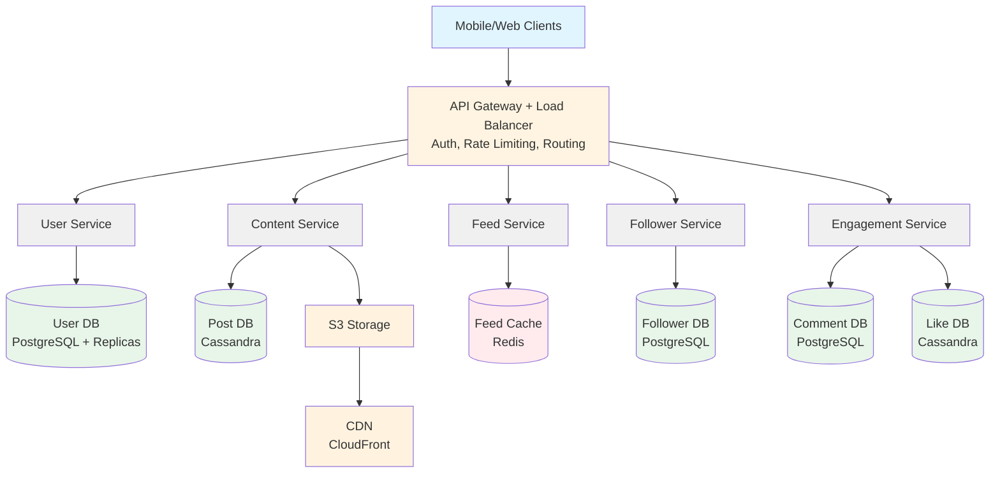
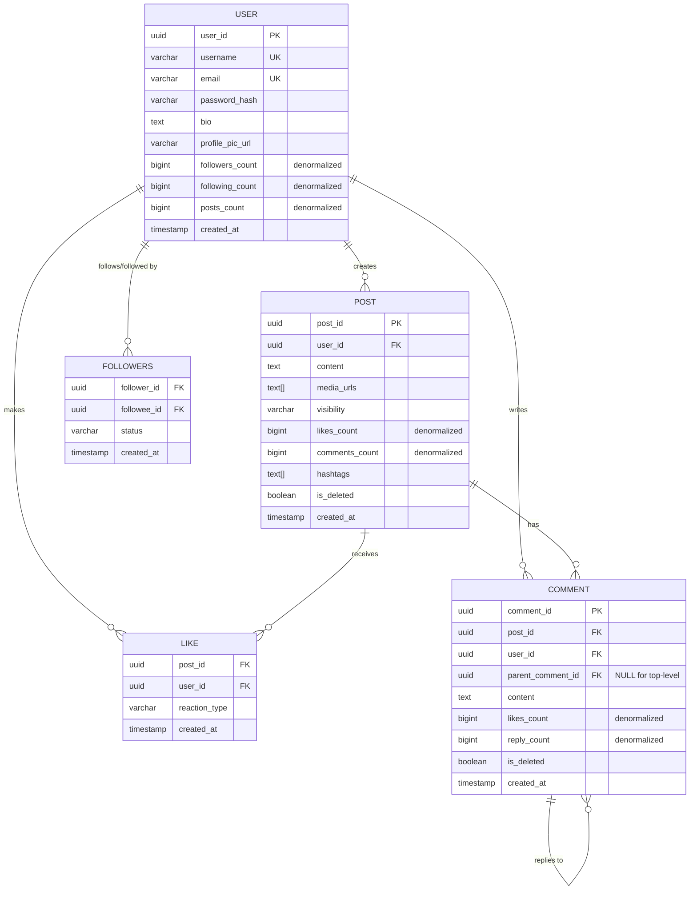
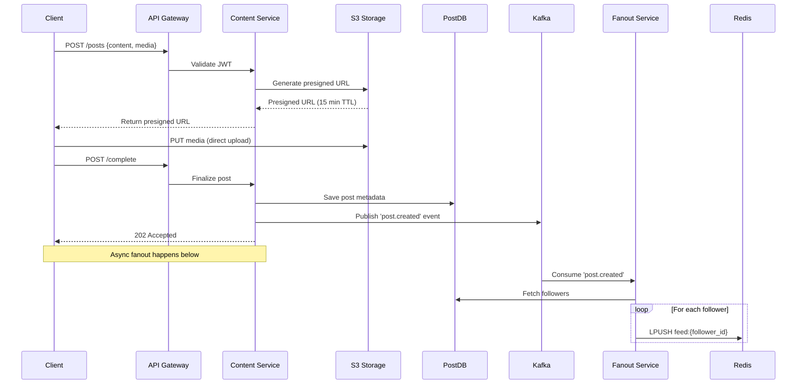
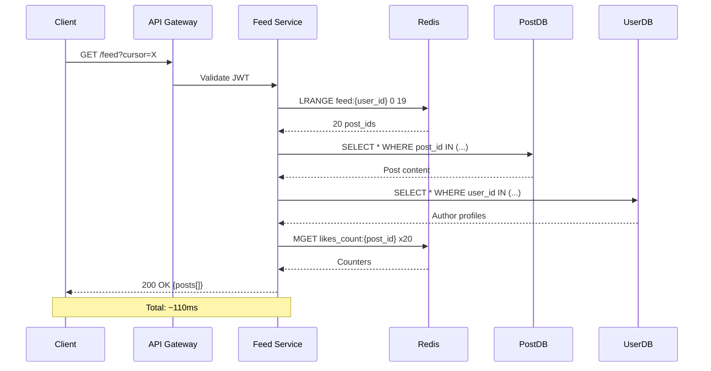
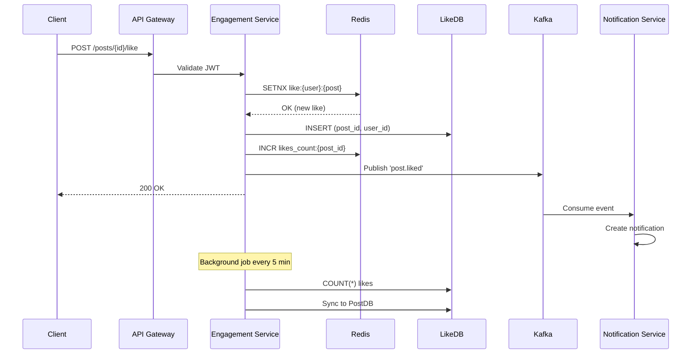
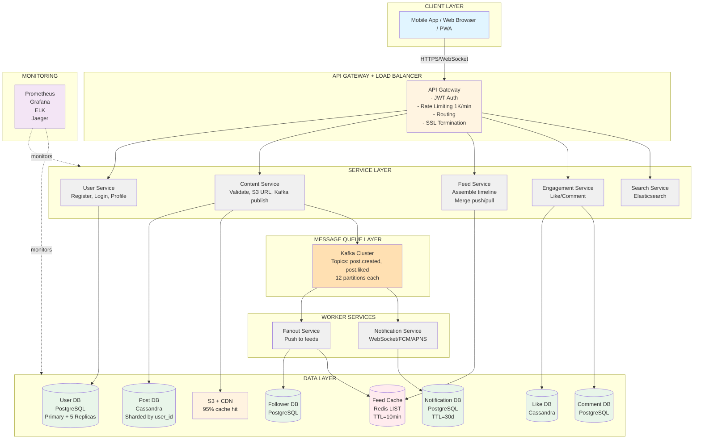

Social Media Platform — Interview Guide (Facebook / Instagram)

> **📄 Two versions available:**
> - **This file** (`interview-guide.md`): Both Mermaid + ASCII diagrams for maximum compatibility
> - **Print version** (`interview-guide-print.md`): Only Mermaid diagrams for clean PDF rendering

> One-liner to open with: "Graph database for social connections → Fanout on write for feed generation → CDN for media delivery → Redis cache for hot data"

---

## 🎯 EXECUTIVE SUMMARY (Read this first!)

**What we're building:** Instagram/Facebook-style social media feed system for 500M daily users

**Core challenge:** When someone posts, how do we instantly show it to millions of followers without the database exploding?

**The answer in 3 parts:**
1. **Normal users** (<5K followers): When you post, we immediately copy your post to all your followers' feeds (fanout on write). Their feeds are pre-built and instant.
2. **Celebrities** (>5K followers): When they post, we do nothing. When YOU open your feed, we fetch their posts on-demand (fanout on read). Saves billions of writes.
3. **Speed tricks**: Redis cache for feeds (10ms reads), Cassandra for posts (horizontal scaling), CDN for images (95% cache hit), Kafka for async processing.

**Key numbers:**
- 100M posts/day (1,200 posts/sec)
- 10B feed loads/day (115,000 reads/sec)
- Feed loads in <500ms
- 10TB media uploaded daily

**Tech stack at a glance:**
- PostgreSQL: User profiles, followers, comments (needs relational integrity)
- Cassandra: Posts, likes (high write volume, time-series data)
- Redis: Feed cache, counters (sub-10ms reads)
- Kafka: Async fanout, notifications (decouples write from propagation)
- S3 + CDN: Media storage and global delivery

**If you read nothing else, remember:**
The entire system hinges on the **hybrid fanout model** — push for normal users, pull for celebrities. That's what makes Instagram scale from 1 user to 2 billion.

---

## 📖 HOW TO READ THIS DOCUMENT

**For interview prep (30 min):**
1. Read Executive Summary above
2. Skim Step 1-4 (requirements, entities, API, high-level design)
3. Deep dive Step 5 (feed generation — this is what interviewers ask about)
4. Review Step 9 (common interview questions)

**For implementation understanding (60 min):**
Read everything in order. The "KEY PATTERNS EXPLAINED" section at the end breaks down every technical concept in plain English.

**For blind/screen reader users:**
- All ASCII diagrams have text descriptions immediately after
- Code examples are labeled with their purpose
- Each section has a numbered summary at the end

**Document structure:**
- 🎯 Emoji headers help you navigate sections quickly
- 💡 Summaries at end of each section recap key points
- 📚 Glossary at end defines all technical terms
- ✅ Self-check questions test your understanding

---

## 🖨️ PDF CONVERSION GUIDE

**Best tools for converting this document to PDF:**

1. **Typora** (Recommended ⭐)
   - Beautiful rendering of Mermaid diagrams
   - Preserves ASCII diagrams with monospace font
   - Export → PDF → works perfectly
   - Download: https://typora.io

2. **Markdown PDF (VS Code Extension)**
   - Install: "Markdown PDF" by yzane
   - Right-click file → "Markdown PDF: Export (pdf)"
   - Renders Mermaid diagrams automatically
   - Settings to adjust: Use Consolas/Courier New for code blocks

3. **Pandoc + LaTeX** (Advanced)
   ```bash
   pandoc interview-guide.md -o interview-guide.pdf \
     --pdf-engine=xelatex \
     -V geometry:margin=0.75in \
     -V monofont="Courier New"
   ```

4. **Online: Dillinger.io**
   - Paste markdown → Preview → Export to PDF
   - Renders Mermaid diagrams
   - Free, no installation

**Important PDF settings:**
- ✅ **Use monospace font** for code/ASCII diagrams (Courier New, Consolas, or Fira Code)
- ✅ **Enable Mermaid rendering** (Typora and Markdown PDF do this automatically)
- ✅ **Set margins to 0.75in** (more content per page)
- ✅ **Page size: Letter or A4**
- ⚠️ **Avoid Google Docs** (breaks ASCII diagrams and doesn't render Mermaid)

**Why we have both Mermaid AND ASCII diagrams:**
- **Mermaid** = Beautiful in PDF, web viewers, and GitHub
- **ASCII** = Works everywhere (screen readers, plain text terminals, email)

**Print-ready checklist:**
- [ ] Mermaid diagrams render correctly
- [ ] ASCII diagrams use monospace font and align properly
- [ ] Page breaks don't split diagrams
- [ ] All emojis render (or remove with Find/Replace if needed)
- [ ] Table of contents generated (optional but helpful)

---

## ♿ ACCESSIBILITY IMPROVEMENTS

This document has been optimized for single-read comprehension and accessibility:

✅ **Executive Summary** upfront — understand the entire system in 3 minutes  
✅ **Text descriptions** after every ASCII diagram for screen readers  
✅ **Section summaries** (💡) recap key points at the end of each section  
✅ **TL;DR boxes** before each pattern explanation for quick scanning  
✅ **Glossary** at the end with plain-English definitions of all technical terms  
✅ **Self-check questions** to verify understanding  
✅ **Real-world analogies** (newspaper delivery, restaurant kitchen) instead of jargon  
✅ **Numbered flows** for step-by-step processes  
✅ **No external dependencies** — all concepts explained inline, no need to click away  

---

## Step 1: Clarify Requirements (2 min)

### Functional Requirements
| # | Feature | Notes |
|---|---------|-------|
| 1 | Register / Login | Profile management |
| 2 | Create post | text / image / video, up to 500MB |
| 3 | Follow users | Unidirectional follow OR bidirectional friend-request |
| 4 | Like / Comment | Nested threads, reaction types |
| 5 | View feed | Personalized, posts from followed users, reverse-chrono |
| 6 | Search | Users, hashtags, posts with autocomplete |
| 7 | Notifications | Likes, comments, follows, mentions |

### Non-Functional Requirements
- **Scale**: 500M DAU, 2B registered users
- **Volume**: 100M posts/day → 1.2K posts/sec
- **Read/Write**: 100:1 (heavy reads)
- **CAP**: Availability >> Consistency (eventual consistency acceptable)
- **Latency**: Feed load <500ms, Likes/Comments <200ms, Post creation <300ms
- **Media**: 10TB uploaded daily, petabytes total

**💡 Section Summary (Requirements):**
We're building a read-heavy system (100:1 read/write ratio) prioritizing availability over consistency. Key constraints: 500M daily users, 1.2K posts/sec, 115K feed reads/sec, sub-500ms feed loads. Media is the largest challenge at 10TB/day.

---

## Step 2: Core Entities (1 min)

```
User          user_id, username, email, bio, profile_pic_url, followers_count (denorm)
Post          post_id, user_id, content, media_urls[], visibility, likes_count (denorm)
Followers     follower_id, followee_id, status (pending/accepted), created_at
Like          post_id + user_id (composite PK), reaction_type
Comment       comment_id, post_id, parent_comment_id (NULL = top-level), likes_count
Feed          feed:{user_id} → Redis LIST of post_ids (latest 1000)
```

**💡 Section Summary (Core Entities):**
6 main entities: User (profiles), Post (content), Followers (social graph), Like (engagement), Comment (nested threads), Feed (cached timeline). Followers creates many-to-many relationships. Feed is denormalized in Redis for speed. Like uses composite key (post_id + user_id) to prevent duplicates.

---

## Step 3: API Design (2 min)

### User Onboarding
```
POST   /api/v1/users/register          → {user_id, token}
POST   /api/v1/users/login             → {token}
GET    /api/v1/users/{user_id}/profile
PUT    /api/v1/users/{user_id}/profile
```

### Post Operations
```
POST   /api/v1/posts                                       → 202 Accepted (async fanout)
GET    /api/v1/posts/{post_id}
PUT    /api/v1/posts/{post_id}                             (author only)
DELETE /api/v1/posts/{post_id}                             (soft delete)
GET    /api/v1/posts/feed?limit={limit}&cursor={cursor}   (infinite scroll — cursor-based)
GET    /api/v1/users/{user_id}/posts                      (profile timeline)
```

> **WHY CURSOR-BASED PAGINATION INSTEAD OF PAGE NUMBERS? (Beginner Explanation)**
> Page numbers (offset=0, offset=20, offset=40) seem simple, but imagine scrolling through Instagram. While you scroll, new posts are being added at the top. When you ask for "page 2", the database shifts all rows down — you either see duplicates or skip posts entirely.
> A cursor is a bookmark: "give me the next 20 posts after post_id X, created before timestamp Y". No matter how many new posts arrive, your bookmark stays stable. You always get the next 20 posts cleanly.
> Offset pagination also requires the DB to scan and skip rows (slow at high offsets). Cursor pagination hits an index directly — fast even at post #10,000.

### Interactions
```
POST   /api/v1/posts/{post_id}/like
DELETE /api/v1/posts/{post_id}/unlike
GET    /api/v1/posts/{post_id}/comments
POST   /api/v1/comments/{comment_id}           (reply or new comment)
POST   /api/v1/users/{user_id}/follow
DELETE /api/v1/users/{user_id}/unfollow
```

### Social Graph
```
GET    /api/v1/users/{user_id}/followers?limit={limit}&cursor={cursor}   (who follows this user)
GET    /api/v1/users/{user_id}/following?limit={limit}&cursor={cursor}   (who this user follows)
```

> **WHY SEPARATE FOLLOWERS AND FOLLOWING ENDPOINTS?**
> Every social profile page needs both lists: "1.2M followers" and "800 following" are clickable — users browse them to discover accounts. These are two separate reverse lookups on the Followers table: `SELECT follower_id WHERE followee_id = X` vs `SELECT followee_id WHERE follower_id = X`. Exposing them as two distinct endpoints makes the intent explicit at the API layer and allows independent pagination — a celebrity's followers list may have millions of entries while their following list has 200. Cursor-based pagination (same reason as feed) prevents the offset-shift problem as users follow/unfollow in real time.

### Search
```
GET    /api/v1/search?q={query}&type={users|posts}&limit={limit}&cursor={cursor}
```

> **WHY A DEDICATED SEARCH ENDPOINT?**
> Search is fundamentally different from every other read in this system: it needs full-text tokenisation, hashtag indexing, and autocomplete — none of which PostgreSQL or Cassandra handle well at scale. The `type` parameter routes to the correct Elasticsearch index (`users_index` vs `posts_index`) so a single endpoint serves both user lookup ("@john") and content discovery ("#travel"). Elasticsearch supports 10K searches/sec with sub-100ms autocomplete latency (listed in the Scaling table). Without this endpoint the entire Search functional requirement (FR #6) has no API surface.

### Notifications
```
GET    /api/v1/notifications?limit={limit}&cursor={cursor}              (notification inbox)
PUT    /api/v1/notifications/{notification_id}/read                     (mark one as read)
PUT    /api/v1/notifications/read-all                                   (mark all as read)
```

> **WHY NOTIFICATION READ/UNREAD ENDPOINTS?**
> The notification flow is fully described in the LLD (Kafka → Notification Svc → WebSocket/FCM), but without API endpoints there is no way for a client to fetch the inbox on app launch or mark items read. `GET /notifications` loads stored rows from the Notification DB (PostgreSQL, 30-day TTL) for users who missed the real-time WebSocket push — e.g., after a cold start or offline period. The two `PUT` variants cover the two UX actions: tapping a single notification vs the "Mark all read" button. Using `PUT` (not `POST`) is correct here because the operation is idempotent — calling it twice leaves the resource in the same state.

**💡 Section Summary (API Design):**
We have 6 API groups: User (register/login/profile), Post (CRUD + feed), Interactions (like/comment/follow), Social Graph (followers/following lists), Search (users/posts/hashtags), and Notifications (inbox). All use cursor-based pagination for infinite scroll. POST operations return 202 Accepted for async processing. All endpoints use JWT authentication and are rate-limited to 1K requests/minute per user.

---

## Step 4: High Level Design

### Mermaid Version (for PDF/visual rendering)



### ASCII Version (for screen readers/text terminals)

```
                         ┌──────────────┐
                         │   User DB    │ (PostgreSQL + read replicas)
                         │  (postgres)  │
                         └──────────────┘
                               ▲
                         ┌──────────────┐
              ┌──────────│  User Svc    │
              │          └──────────────┘
              │
              │          ┌──────────────┐    ┌──────────┐
              ├──────────│ Content Svc  │───▶│  Post DB │ (Cassandra)
              │          └──────────────┘    └──────────┘
              │                │
              │                ▼
┌─────────┐   │          ┌──────────────┐
│users /  │──▶│ API GW & │              │    (media files)
│clients  │   │ LB       │     S3       │◀── CDN (CloudFront)
└─────────┘   │          └──────────────┘
              │
              │          ┌──────────────┐    ┌──────────────┐
              ├──────────│  Feed Svc    │───▶│  Feed Cache  │ (Redis)
              │          └──────────────┘    └──────────────┘
              │
              │          ┌──────────────┐    ┌──────────────┐
              ├──────────│ Follower Svc │───▶│ Follower DB  │ (PostgreSQL/Graph)
              │          └──────────────┘    └──────────────┘
              │
              │          ┌──────────────┐    ┌────────────┐
              └──────────│Engagement Svc│───▶│ Comment DB │ (PostgreSQL)
                         └──────────────┘    └────────────┘
                                             ┌────────────┐
                                             │  Like DB   │ (Cassandra)
                                             └────────────┘
```

**API Gateway responsibilities**: Authentication/JWT, Rate Limiting (1K req/min per user), Routing

> **WHY CDN EXISTS? (Beginner Explanation)**
> Imagine every Instagram photo stored in a single warehouse in Virginia. Every user in Tokyo, São Paulo, and London waits for the image to travel across the world — 200ms+ per photo, on every scroll.
> A CDN (Content Delivery Network) is a network of caches spread across the globe. The first time someone in Tokyo requests a photo, it fetches from S3 in Virginia and stores a copy at the Tokyo edge server. The next million Tokyo users get it from next door — under 5ms.
> At 10TB of media uploaded daily, serving everything from origin would require enormous bandwidth and latency. CDN cuts that cost by 95% and makes every scroll feel instant regardless of where the user lives.

**Key database choices**:
| Service | DB | Why |
|---------|-----|-----|
| User Svc | PostgreSQL + replicas | Relational, profile lookups |
| Content Svc | Cassandra | High write throughput, partition by user_id |
| Follower Svc | PostgreSQL (or graph DB) | Bidirectional edge queries |
| Engagement | Cassandra (likes), PostgreSQL (comments) | High write volume |
| Feed | Redis | Sub-10ms LRANGE, ephemeral data |

> **WHY SEPARATE POST SERVICE AND FEED SERVICE? (Beginner Explanation)**
> Think of a restaurant: the kitchen (Content/Post Service) cooks and stores food; the waiter (Feed Service) decides what to put on your plate and delivers it. You don't want the waiter running into the kitchen to cook every time a customer orders.
> Content Service owns creating, validating, and storing individual posts. Feed Service owns the personalized timeline — who sees what, assembled in what order, from Redis cache.
> They scale completely differently: Content Service handles 1.2K post writes/sec; Feed Service handles 115K read requests/sec. Bundling them together means you have to scale both even when only one is under pressure — expensive and fragile.

**💡 Section Summary (High Level Design):**
6 microservices: User (auth/profiles), Content (posts), Feed (timelines), Follower (social graph), Engagement (likes/comments), Search (Elasticsearch). Each service owns its database. API Gateway handles auth, rate limiting, and routing. CDN serves 95% of media. Services scale independently based on their workload.

---

## Step 5: Low Level Design (Deep Dive)

### Architecture Overview
```
                                                    ┌─────────────────────────────────┐
                                                    │  Post Schema (Cassandra)        │
                                                    │  - post_id, user_id, post_type  │
                                                    │  - content/text, media_url      │
                                                    │  - thumbnail_url, share_count   │
                          ┌──────────────┐          │  - like_count, comment_count    │
              ┌───────────│   User Svc   │──▶UserDB │  - metadata                     │
              │           └──────────────┘          └─────────────────────────────────┘
              │
              │           ┌──────────────┐          ┌──────────────────┐
              ├───────────│ Content Svc  │──────────▶│   PostDB         │──▶ S3
              │           └──────────────┘          └──────────────────┘
              │                 │                          ▲
              │         Post Serializer               Post Consumer Svc
              │                 │                    (text/metadata, image/video)
              │                 ▼
┌─────────┐   │ API GW  ┌──────────────┐   raw_post    ┌──────────────┐
│users /  │──▶│ & LB    │    Kafka     │──────────────▶│ Notification │
│clients  │   │         └──────────────┘   filtered     │    Svc       │
└─────────┘   │                │           blocked       └──────────────┘
              │                ▼
              │           ┌──────────┐  <post, List<FriendsUserId>>   ┌─────────────┐
              │           │  Fanout  │─────────────────────────────▶  │   Kafka     │
              │           │  Svc     │                                └──────┬──────┘
              │           │  (PUSH)  │                                       │
              │           └──────────┘                              Fanout Consumer
              │                │                                            │
              │           Redis (author_latest_post,                        ▼ -write
              │           reset DB post)                          ┌──────────────────┐
              │                                                   │   Feed Cache     │◀── -read
              │           ┌──────────────┐                       │   (Redis)        │
              ├───────────│  Feed Svc    │──read──────────────────┤                  │
              │           └──────────────┘                       └──────────────────┘
              │                 │                                       -write ▼
              │         Followers Cache                            ┌──────────────────┐
              │         (top followers)                            │    FeedDB        │
              │                                                    └──────────────────┘
              │           ┌──────────────┐
              ├───────────│ Follower Svc │──▶ FollowerDB (postgres)
              │           └──────────────┘   - follow_id, follower_id, following_id
              │                              - status, timestamp, metadata
              │           ┌─────────────┐
              │    Kafka──▶Engagement   │──▶ Comment DB
              └───────────│    Svc      │    - comment_id, post_id, user_id
                          └─────────────┘    - like_count, metadata
                                         ──▶ Like DB (postgres)
                                             - like_id, post_id/comment_id
                                             - user_id, reaction_type, metadata
```

### Feed Generation — The Core Problem

#### Push Model (Fanout on Write) — normal users <5K followers
```
User posts
    → Kafka 'post.created'
    → Fanout Svc reads event
    → Query FollowerDB: SELECT follower_id WHERE followee_id = poster_id   (e.g. 500 followers)
    → For each follower: LPUSH feed:{follower_id} {post_id}
                         LTRIM feed:{follower_id} 0 999   (keep latest 1000)
    → Feed pre-built, read is instant: LRANGE feed:{user_id} 0 19  → <10ms
```

> **WHY FANOUT ON WRITE (PUSH MODEL) EXISTS? (Beginner Explanation)**
> Think of a newspaper printing press — it runs once overnight and drops a copy at every subscriber's doorstep before they wake up. When you open the app, your feed is already sitting there, pre-built.
> That's fanout on write: the moment someone posts, the system immediately pushes that post_id into every follower's Redis cache. Reading your feed is instant because the work was done upfront at write time.
> Without it: every time 500M users open the app, each triggers a DB JOIN across posts and followers. That's 115K queries per second hitting the database — it collapses instantly.

#### Pull Model (Fanout on Read) — celebrities >5K followers
```
User loads feed
    → Feed Svc: check Redis feed:{user_id}  (normal users)
    → For each celebrity followed: SELECT * FROM PostDB WHERE user_id = {celebrity_id} LIMIT 100
    → Merge pushed posts + pulled celebrity posts, sort by timestamp
    → Cache merged result in Redis (TTL = 10 min)
```

> **WHY FANOUT ON READ (PULL MODEL) FOR CELEBRITIES? (Beginner Explanation)**
> Selena Gomez has 400M followers. Fanout on write means 1 post = 400M Redis writes in seconds — like trying to print and deliver 400M newspapers simultaneously. The system would catch fire.
> Pull model flips the logic: don't push anything on post creation. When YOU open your feed, the system pulls that celebrity's latest posts on-demand and stitches them in. All 400M followers share the same single cached query result instead of 400M individual cache entries.
> The trade-off: her post takes up to 10 minutes to appear in your feed (the cache TTL). For a social app, nobody notices. For a stock trading app, that would be catastrophic.

#### Hybrid Model (production reality)
```
<5K followers   → pure PUSH   (pre-built feeds)
1K–5K           → hybrid      (push to active followers, pull for inactive)
>5K followers   → pure PULL   (no fanout, query on-demand)
```

> **WHY A HYBRID MODEL? (Beginner Explanation)**
> Pure push breaks for celebrities. Pure pull is slow for everyone else. The hybrid model draws a line at 5K followers.
> Below 5K: you're a normal user — fanout pre-builds your followers' feeds instantly. Above 5K: you're treated as a celebrity — followers pull your posts on-demand at read time.
> This way the system never fans out to millions of caches, but regular users still get sub-10ms feed loads. The 5K threshold is a tunable config, not a magic number — Instagram uses a similar cut-off in production.

### Feed Ranking — Why Not Just Reverse Chronological?

> **WHY FEED RANKING/SCORING EXISTS? (Beginner Explanation)**
> Reverse-chronological (newest first) is simple and fair. But if you follow 500 accounts, the loudest posters bury everyone else — a news account posting 30 times a day drowns out your friend who posts once a week.
> Ranking scores each post by signals: how close are you to the author? how many likes/comments in the first 10 minutes? is this a video (higher engagement)? did you interact with this person recently? Posts you care most about float to the top.
> This system uses reverse-chronological (simpler, covers the interview). In production, Instagram/Facebook run ML ranking models on the assembled feed as a final step before returning it. Mention this as a possible extension if the interviewer probes deeper.

### Post Creation Flow
```
1. Client: POST /api/v1/posts  {content, media_files, visibility, mentions}
2. Content Svc: validate JWT, content length <5000, media <500MB
3. Media path: generate presigned S3 PUT URL (valid 15 min)
       → client uploads direct to S3
       → S3 triggers Lambda: resize images (150/400/1080px), transcode video (360/720/1080p HLS)
4. Create Post row in Cassandra: partition_key=user_id, clustering_key=created_at DESC
5. Publish to Kafka 'post.created': {post_id, user_id, created_at, media_urls}
6. Return 202 Accepted immediately  ← fanout is ASYNC
```

### Feed Load Flow
```
Client: GET /api/v1/posts/feed?limit=20&offset=0

Step 1 (10ms):  LRANGE feed:{user_id} 0 19           → 20 post_ids from Redis
Step 2 (50ms):  SELECT * FROM PostDB WHERE post_id IN (...)   → post content
Step 3 (30ms):  SELECT * FROM UserDB WHERE user_id IN (...)   → author profiles (or cache)
Step 4 (20ms):  MGET likes_count:{post_id} x20              → engagement counts Redis

Total: ~110ms  (well under 500ms target)
```

> **WHY REDIS FOR FEED CACHE? (Beginner Explanation)**
> Think of Redis as a sticky note on your fridge — you glance at it instantly. The database is a filing cabinet in the basement — accurate, but you have to walk down, find the folder, and read the document.
> At 115K feed loads per second, going to the filing cabinet every time would be catastrophic. Redis stores each user's feed as a pre-built LIST of 1000 post_ids, readable in under 10ms with a single LRANGE command.
> Feed data is also ephemeral — if Redis loses it (crash, restart), the worst case is a slightly slower feed load while it rebuilds from the database. You'd never notice. That's what makes it safe to treat as a cache rather than a source of truth.

### Like Interaction — Idempotency
```
Client: POST /api/v1/posts/{post_id}/like

1. Client-side: debounce 300ms, disable button (optimistic UI)
2. Redis: SETNX like:{user_id}:{post_id}  → if 0, already liked → return 200
3. Like DB: INSERT (post_id, user_id) — Cassandra composite PK prevents duplicate
4. Redis: INCR likes_count:{post_id}
5. Kafka: publish 'post.liked' → Notification Svc
6. Background job (5 min): COUNT(*) from Like DB → sync to PostDB (source of truth)
```

> **WHY LIKE COUNTERS ARE HARD TO UPDATE? (Beginner Explanation)**
> Imagine a viral post getting 50,000 likes in one minute. Every like needs to increment a single counter in a database row. In a normal DB, that means: read the current value → add 1 → write it back. With 50,000 concurrent requests, each one waits for a lock on that row — requests pile up, the database slows down, everything breaks. This is called a write hotspot.
> The solution: Redis INCR is atomic and lock-free. It handles 100K increments per second on a single key without anyone waiting. The trade-off: Redis isn't the source of truth. A background job every 5 minutes counts the real rows in the Like DB and syncs the number back.
> You might show "10,234 likes" when the true count is 10,241. For a social app, a 5-minute lag is invisible. For a bank balance, it would be a disaster.

### Follow / Unfollow
```
Follow:
  1. INSERT INTO Followers (follower_id, followee_id)
  2. INCR followers_count:{followee_id}, INCR following_count:{follower_id} in Redis
  3. Backfill: add followee's last 100 posts to follower's feed in Redis

Unfollow:
  1. DELETE FROM Followers
  2. DECR counts
  3. LREM feed:{follower_id} — purge followee's posts from feed
```

### Notification Flow
```
Kafka topics consumed: 'post.liked', 'post.commented', 'user.followed'
    → Check user preferences (notification settings)
    → Aggregate: 5 likes within 5 min → "John and 4 others liked your post"
    → Deliver: WebSocket (in-app active users) / FCM/APNS (mobile background)
    → Store in Notification DB (PostgreSQL) for inbox, clean after 30 days
```

**💡 Section Summary (Low Level Design):**
The heart of the system is hybrid fanout: push (write to followers' caches) for normal users, pull (fetch on-demand) for celebrities. Posts return 202 immediately, fanout happens async via Kafka. Feed loads in 110ms by reading post_ids from Redis, batch-fetching content from PostDB and UserDB. Likes use Redis INCR for instant feedback, background job syncs to DB every 5 min (eventual consistency). Notifications are aggregated and delivered via WebSocket for active users.

---

## Step 6: Entity Relationship Diagram

### Mermaid Version (for PDF/visual rendering)



**Redis Cache Patterns:**
- `feed:{user_id}` → LIST of post_ids (1000 latest)
- `likes_count:{post_id}` → STRING counter
- `comments_count:{post_id}` → STRING counter
- `like:{user_id}:{post_id}` → STRING flag (idempotency)
- `followers_count:{user_id}` → STRING counter
- `author_latest_post:{user_id}` → STRING cached celebrity posts

### ASCII Version (for screen readers/text terminals)

```
┌─────────────────┐         ┌──────────────────┐         ┌─────────────────┐
│      USER       │         │       POST       │         │    FOLLOWERS    │
├─────────────────┤         ├──────────────────┤         ├─────────────────┤
│ user_id (PK)    │────┐    │ post_id (PK)     │         │ follower_id (FK)│
│ username        │    │    │ user_id (FK)     │◄────────│ followee_id (FK)│
│ email           │    └───►│ content          │         │ status          │
│ password_hash   │         │ media_urls[]     │         │ created_at      │
│ bio             │         │ visibility       │         └─────────────────┘
│ profile_pic_url │         │ likes_count      │                │
│ followers_count │         │ comments_count   │                │ (many-to-many
│ following_count │         │ hashtags[]       │                │  self-referential)
│ posts_count     │         │ is_deleted       │                │
│ created_at      │         │ created_at       │                │
└─────────────────┘         └──────────────────┘                │
        │                            │                           │
        │                            │                           │
        │                   ┌────────┴────────┐                 │
        │                   │                 │                 │
        │            ┌──────▼──────┐   ┌──────▼──────┐         │
        │            │    LIKE     │   │   COMMENT   │         │
        │            ├─────────────┤   ├─────────────┤         │
        └───────────►│ post_id (FK)│   │ comment_id  │         │
                     │ user_id (FK)│   │ post_id (FK)│         │
                     │ reaction    │   │ user_id (FK)│◄────────┘
                     │ created_at  │   │ parent_id   │
                     └─────────────┘   │ content     │
                                       │ likes_count │
                                       │ reply_count │
                                       │ created_at  │
                                       │ is_deleted  │
                                       └─────────────┘

┌────────────────────────────────────────────────────────────────────┐
│ REDIS CACHE PATTERNS                                               │
├────────────────────────────────────────────────────────────────────┤
│ feed:{user_id}              → LIST of post_ids (1000 latest)       │
│ likes_count:{post_id}       → STRING counter                       │
│ comments_count:{post_id}    → STRING counter                       │
│ like:{user_id}:{post_id}    → STRING flag (idempotency check)      │
│ followers_count:{user_id}   → STRING counter                       │
│ author_latest_post:{user_id}→ STRING cached celebrity posts        │
└────────────────────────────────────────────────────────────────────┘
```

**📝 Text Description of ER Diagram (for screen readers):**

This diagram shows 5 main database tables and their connections:

1. **USER table** stores user profiles with fields: user_id (primary key), username, email, password_hash, bio, profile picture URL, and denormalized counters for followers, following, and posts.

2. **POST table** stores posts with fields: post_id (primary key), user_id (foreign key linking to USER), content text, media URLs array, visibility setting, denormalized like and comment counts, hashtags, soft delete flag, and timestamp.

3. **FOLLOWERS table** creates the many-to-many relationship between users: follower_id and followee_id (both foreign keys to USER), status (pending/accepted), and timestamp. This is a self-referential relationship where users can follow other users.

4. **LIKE table** connects users to posts they liked: post_id and user_id together form the primary key (preventing duplicate likes), reaction type (like/love/haha/wow/sad/angry), and timestamp.

5. **COMMENT table** stores both top-level comments and replies: comment_id (primary key), post_id (foreign key), user_id (foreign key), parent_comment_id (NULL for top-level, points to another comment for replies), content, denormalized counters for likes and replies, soft delete flag, and timestamp.

**Redis cache patterns** shown at bottom store temporary data:
- feed:{user_id} → LIST of 1000 most recent post IDs for that user's timeline
- likes_count:{post_id} → Counter updated in real-time
- comments_count:{post_id} → Counter updated in real-time
- like:{user_id}:{post_id} → Flag to prevent duplicate likes (idempotency)
- followers_count:{user_id} → Cached follower count
- author_latest_post:{user_id} → Cached recent posts from celebrities

**Key Relationships:**
- User → Post: One-to-Many (a user creates many posts)
- User → Like: One-to-Many (a user likes many posts)
- Post → Like: One-to-Many (a post has many likes)
- User → Comment: One-to-Many (a user writes many comments)
- Post → Comment: One-to-Many (a post has many comments)
- Comment → Comment: One-to-Many (nested replies, self-referential via parent_id)
- User → Followers: Many-to-Many (a user follows many users and is followed by many)

**💡 Section Summary:**
The database uses PostgreSQL for structured data (users, followers, comments) and Cassandra for high-volume data (posts, likes). Redis caches feed timelines and counters. The Followers table creates the social graph, allowing users to follow each other in a many-to-many relationship.

---

## Step 7: API Flow Diagram

### Post Creation Flow (Mermaid - renders beautifully in PDF)



### Feed Load Flow (Mermaid)



### Like Interaction Flow (Mermaid)



### ASCII Versions (for screen readers/text terminals)

### Post Creation Flow
```
Client                API Gateway           Content Svc           S3/Media         PostDB         Kafka           Fanout Svc
  │                        │                     │                  │                │              │                │
  │──POST /posts──────────►│                     │                  │                │              │                │
  │  {content, media}      │                     │                  │                │              │                │
  │                        │──validate JWT──────►│                  │                │              │                │
  │                        │                     │──presigned URL──►│                │              │                │
  │                        │◄────presigned URL───│                  │                │              │                │
  │◄───presigned URL───────│                     │                  │                │              │                │
  │                        │                     │                  │                │              │                │
  │──PUT media────────────────────────────────────────────────────►│                │              │                │
  │                        │                     │  (direct upload) │                │              │                │
  │                        │                     │                  │                │              │                │
  │──POST /complete────────►│                     │                  │                │              │                │
  │                        │──save post─────────►│──────────────────────────────────►│              │                │
  │                        │                     │                  │                │              │                │
  │                        │                     │──publish 'post.created'──────────────────────────►│                │
  │                        │                     │                  │                │              │                │
  │◄───202 Accepted────────│◄────202 Accepted───│                  │                │              │                │
  │                        │                     │                  │                │              │                │
  │                        │                     │                  │                │              │──get followers─►│
  │                        │                     │                  │                │              │  (FollowerDB)  │
  │                        │                     │                  │                │              │                │
  │                        │                     │                  │                │              │──LPUSH feed:*──►│
  │                        │                     │                  │                │              │  (Redis)       │
```

### Feed Load Flow
```
Client          API Gateway       Feed Svc         Redis           PostDB          UserDB
  │                  │                │               │               │               │
  │──GET /feed──────►│                │               │               │               │
  │  ?cursor=X       │                │               │               │               │
  │                  │──validate JWT─►│               │               │               │
  │                  │                │──LRANGE───────►│               │               │
  │                  │                │  feed:{uid}    │               │               │
  │                  │                │◄─post_ids[20]─│               │               │
  │                  │                │                │               │               │
  │                  │                │──get posts IN(post_ids)───────►│               │
  │                  │                │◄─────post content──────────────│               │
  │                  │                │                │               │               │
  │                  │                │──get authors IN(user_ids)─────────────────────►│
  │                  │                │◄──────author profiles──────────────────────────│
  │                  │                │                │               │               │
  │                  │                │──MGET likes_count:{post_id}───►│               │
  │                  │                │◄─────counters─────────────────│               │
  │                  │                │                │               │               │
  │                  │◄───feed JSON───│                │               │               │
  │◄───200 OK────────│                │               │               │               │
  │  {posts[]}       │                │               │               │               │
```

### Like Interaction Flow
```
Client          API Gateway     Engagement Svc      Redis           LikeDB          Kafka           Notification Svc
  │                  │                │               │               │               │                    │
  │──POST /like─────►│                │               │               │               │                    │
  │  post_id         │                │               │               │               │                    │
  │                  │──validate JWT─►│               │               │               │                    │
  │                  │                │──SETNX────────►│               │               │                    │
  │                  │                │  like:uid:pid  │               │               │                    │
  │                  │                │◄──OK (new)────│               │               │                    │
  │                  │                │                │               │               │                    │
  │                  │                │──INSERT (post_id, user_id)────►│               │                    │
  │                  │                │                │               │               │                    │
  │                  │                │──INCR likes_count:post_id─────►│               │                    │
  │                  │                │                │               │               │                    │
  │                  │                │──publish 'post.liked'─────────────────────────►│                    │
  │                  │                │                │               │               │──create notif─────►│
  │                  │◄───200 OK──────│                │               │               │                    │
  │◄───200 OK────────│                │               │               │               │                    │
  │                  │                │               │               │               │                    │
  │                  │                │  [Background Job - every 5 min]               │                    │
  │                  │                │◄──COUNT(*) likes──────────────│               │                    │
  │                  │                │──sync to PostDB───────────────────────────────►│                    │
```

**📝 Text Description of API Flow Diagrams (for screen readers):**

> **Note:** Each flow has two versions:
> - **Mermaid diagrams** render beautifully in PDF converters (Typora, Markdown PDF, GitHub)
> - **ASCII diagrams** work in plain text, screen readers, and terminals
> Both show the same information — use whichever renders better in your tool!

**Post Creation Flow:**
1. Client sends POST request to create a post with content and media files
2. API Gateway validates JWT authentication token
3. Content Service generates a presigned S3 URL (valid for 15 minutes) and returns it to client
4. Client uploads media files directly to S3 (not through our servers)
5. Client calls POST /complete to finalize the post
6. Content Service saves post metadata to Cassandra PostDB
7. Content Service publishes 'post.created' event to Kafka
8. Returns 202 Accepted to client immediately (fanout happens asynchronously)
9. Fanout Service consumes Kafka event, fetches author's followers from FollowerDB
10. Fanout Service pushes post_id to each follower's feed in Redis using LPUSH

**Feed Load Flow:**
1. Client requests GET /feed with cursor parameter for pagination
2. API Gateway validates JWT
3. Feed Service runs LRANGE on Redis to get 20 post IDs from feed:{user_id}
4. Feed Service batch-fetches post content from PostDB using WHERE post_id IN (...)
5. Feed Service batch-fetches author profiles from UserDB using WHERE user_id IN (...)
6. Feed Service runs MGET on Redis to get like/comment counters for all 20 posts
7. Feed Service assembles JSON response and returns it
8. Total time: ~110ms (10ms Redis + 50ms PostDB + 30ms UserDB + 20ms counters)

**Like Interaction Flow:**
1. Client sends POST /posts/{post_id}/like
2. API Gateway validates JWT
3. Engagement Service checks Redis with SETNX like:{user_id}:{post_id} (idempotency)
4. If key didn't exist (new like), insert row into LikeDB with composite PK (post_id, user_id)
5. Increment likes_count:{post_id} counter in Redis (instant feedback)
6. Publish 'post.liked' event to Kafka
7. Return 200 OK to client immediately
8. Notification Service consumes Kafka event and creates notification
9. Background job runs every 5 minutes: COUNT(*) all likes from LikeDB and sync to PostDB

**💡 Section Summary:**
All APIs follow async patterns: POST operations return 202 Accepted immediately, background workers handle heavy lifting. Read operations use Redis cache first, then batch-fetch from DB. Like interactions use Redis for instant feedback, then eventual consistency with background sync.

---

## Step 8: Detailed Architecture with Data Flow

### Mermaid Version (for PDF/visual rendering)



### ASCII Version (for screen readers/text terminals)

```
                            ┌────────────────────────────────────────────┐
                            │         CLIENT LAYER                        │
                            │  Mobile App / Web Browser / PWA             │
                            └────────────┬───────────────────────────────┘
                                         │ HTTPS/WebSocket
                                         ▼
                            ┌────────────────────────────────────────────┐
                            │       API GATEWAY + LOAD BALANCER          │
                            │  - JWT Authentication                      │
                            │  - Rate Limiting (1K req/min per user)     │
                            │  - Request Routing                         │
                            │  - SSL Termination                         │
                            └────┬──────┬──────┬──────┬──────┬──────────┘
                                 │      │      │      │      │
        ┌────────────────────────┴──┬───┴──┬───┴──┬───┴──┬───┴────────────────────┐
        │                           │      │      │      │                        │
        ▼                           ▼      ▼      ▼      ▼                        ▼
┌───────────────┐          ┌──────────────────────────────────┐       ┌────────────────┐
│   User Svc    │          │        Content Svc               │       │  Feed Svc      │
│               │          │  - Validate post                 │       │  - Assemble    │
│  - Register   │          │  - Generate S3 URL               │       │    timeline    │
│  - Login      │          │  - Create post record            │       │  - Merge push  │
│  - Profile    │          │  - Publish to Kafka              │       │    & pull      │
│  - Search     │          └──────────┬───────────────────────┘       │  - Cache mgmt  │
└───────┬───────┘                     │                               └────────┬───────┘
        │                             │                                        │
        ▼                             ▼                                        ▼
┌───────────────┐          ┌─────────────────┐                    ┌─────────────────────┐
│   User DB     │          │   Post DB       │                    │   Feed Cache        │
│ (PostgreSQL)  │          │  (Cassandra)    │                    │   (Redis)           │
│  - Primary    │          │  - Sharded by   │                    │  LIST per user      │
│  - 5 Replicas │          │    user_id      │                    │  feed:{user_id}     │
└───────────────┘          │  - Time-series  │                    │  LPUSH/LRANGE       │
                           │    clustering   │                    │  TTL = 10 min       │
                           └─────────────────┘                    └─────────────────────┘
                                     │
                                     ▼
                           ┌─────────────────┐
                           │   S3 + CDN      │
                           │  - Original     │
                           │  - Thumbnails   │
                           │  - HLS videos   │
                           │  95% cache hit  │
                           └─────────────────┘

        ┌────────────────────────────────────────────────────────────────────┐
        │                    MESSAGE QUEUE LAYER                             │
        │  ┌────────────────────────────────────────────────────────────┐    │
        │  │                  KAFKA CLUSTER                             │    │
        │  │  Topics: post.created, post.liked, post.commented,         │    │
        │  │          user.followed, notification.send                  │    │
        │  │  Partitions: 12 per topic (keyed by user_id/post_id)      │    │
        │  └──────┬─────────────────────────────────────┬───────────────┘    │
        └─────────┼─────────────────────────────────────┼────────────────────┘
                  │                                     │
                  ▼                                     ▼
        ┌──────────────────┐                 ┌──────────────────┐
        │   Fanout Svc     │                 │ Notification Svc │
        │  - Read event    │                 │  - Aggregate     │
        │  - Get followers │                 │  - WebSocket     │
        │  - Push to feeds │                 │  - FCM/APNS      │
        │  - Handle hybrid │                 │  - Store inbox   │
        └────────┬─────────┘                 └────────┬─────────┘
                 │                                    │
                 ▼                                    ▼
        ┌──────────────────┐                 ┌──────────────────┐
        │  Follower DB     │                 │ Notification DB  │
        │  (PostgreSQL)    │                 │  (PostgreSQL)    │
        │  - Indexed edges │                 │  TTL = 30 days   │
        └──────────────────┘                 └──────────────────┘

        ┌────────────────────────────────────────────────────────────────────┐
        │                    ENGAGEMENT LAYER                                │
        │  ┌──────────────────┐          ┌──────────────────┐               │
        │  │ Engagement Svc   │          │  Search Svc      │               │
        │  │  - Like/Unlike   │          │  - Elasticsearch │               │
        │  │  - Comment       │          │  - Autocomplete  │               │
        │  │  - Reply         │          │  - Hashtag index │               │
        │  └────────┬─────────┘          └──────────────────┘               │
        │           │                                                        │
        │    ┌──────┴──────┐                                                │
        │    ▼             ▼                                                │
        │ ┌─────────┐  ┌──────────┐                                        │
        │ │ Like DB │  │Comment DB│                                        │
        │ │(Cassand)│  │(Postgres)│                                        │
        │ └─────────┘  └──────────┘                                        │
        └────────────────────────────────────────────────────────────────────┘

                    ┌────────────────────────────────────┐
                    │   MONITORING & OBSERVABILITY       │
                    │  - Prometheus (metrics)            │
                    │  - Grafana (dashboards)            │
                    │  - ELK Stack (logs)                │
                    │  - Jaeger (distributed tracing)    │
                    └────────────────────────────────────┘
```

**📝 Text Description of Detailed Architecture (for screen readers):**

> **Note:** Like other sections, this diagram has both:
> - **Mermaid version** (graph diagram with subgraphs) renders cleanly in PDF/GitHub
> - **ASCII version** (multi-layer box diagram) works in terminals and screen readers
> Both convey the same 7-layer architecture — choose based on your viewing tool!

This is a multi-layer architecture diagram showing 6 main layers:

**Layer 1 - Client Layer:**
Mobile apps, web browsers, and progressive web apps connect via HTTPS and WebSocket.

**Layer 2 - API Gateway + Load Balancer:**
Handles JWT authentication, rate limiting (1,000 requests per minute per user), request routing to services, and SSL termination.

**Layer 3 - Service Layer:**
- **User Service**: Handles registration, login, profile management, and user search. Connects to PostgreSQL User DB with 1 primary and 5 read replicas.
- **Content Service**: Validates posts, generates S3 presigned URLs, creates post records, and publishes to Kafka. Connects to Cassandra Post DB (sharded by user_id with time-series clustering) and S3+CDN for media storage.
- **Feed Service**: Assembles personalized timelines, merges push and pull feeds, and manages cache. Connects to Redis Feed Cache (LIST data structure per user, 10-minute TTL).
- **Follower Service**: Not shown in detail but manages follower relationships.
- **Engagement Service**: Manages likes and comments.
- **Search Service**: Powered by Elasticsearch for autocomplete and hashtag indexing.

**Layer 4 - Message Queue Layer:**
Kafka cluster with topics: post.created, post.liked, post.commented, user.followed, notification.send. Each topic has 12 partitions keyed by user_id or post_id for ordered processing.

**Layer 5 - Worker Services:**
- **Fanout Service**: Consumes post.created events, fetches followers from FollowerDB (PostgreSQL with indexed edges), and pushes post IDs to Redis feeds. Implements hybrid fanout (push for <5K followers, pull for celebrities).
- **Notification Service**: Aggregates events, delivers via WebSocket for active users or FCM/APNS for mobile, and stores in Notification DB (PostgreSQL with 30-day TTL).

**Layer 6 - Data Layer:**
- User DB: PostgreSQL primary + 5 replicas
- Post DB: Cassandra sharded by user_id
- Follower DB: PostgreSQL with indexed edges for bidirectional lookups
- Like DB: Cassandra for high write volume
- Comment DB: PostgreSQL for nested thread support
- Feed Cache: Redis with LRU/LFU eviction
- Notification DB: PostgreSQL with 30-day TTL
- S3 + CDN: Original media, thumbnails, HLS videos with 95% cache hit rate

**Layer 7 - Monitoring & Observability:**
Prometheus (metrics), Grafana (dashboards), ELK Stack (logs), Jaeger (distributed tracing).

**Data Flow Highlights:**
1. **Post Creation**: Client → API GW → Content Svc → Kafka → Fanout Svc → Redis feeds
2. **Feed Load**: Client → API GW → Feed Svc → Redis (post_ids) → PostDB (content) → UserDB (profiles)
3. **Like Action**: Client → API GW → Engagement Svc → Redis (counter) → LikeDB → Kafka → Notification
4. **Follow**: Client → API GW → Follower Svc → FollowerDB → Backfill feed cache

**💡 Section Summary:**
The architecture separates concerns into specialized services. Heavy write operations (posts, likes) go to Cassandra. Relational data (users, followers, comments) goes to PostgreSQL. All feeds are cached in Redis. Kafka decouples write operations from fanout propagation. CDN serves 95% of media requests without touching our servers.

---

## Step 9: Common Interview Questions

**Q: Why fanout on write for normal users?**
100:1 read/write ratio. Pre-generating feeds means 1 slow write enables 100 fast reads. LRANGE from Redis = <10ms. For celebrities with 10M followers, 1 post = 10M writes → impractical, so switch to pull.

**Q: How to handle the celebrity hotspot?**
(1) Flag users as celebrity if followers_count > 5K in User table.
(2) Celebrity posts → PostDB only, skip fanout.
(3) Feed load: merge pushed posts (LRANGE) + pulled celebrity posts (query PostDB).
(4) Celebrity posts cached in Redis with higher TTL (1hr vs 10min), all followers share same cache.

**Q: How to ensure like count consistency between cache and DB?**
Eventual consistency: Redis INCR is fast and best-effort. Cron job every 5 min queries `SELECT COUNT(*) GROUP BY post_id` from Like DB → updates PostDB. If Redis count differs from DB by >10%, invalidate and reload. Redis crash → background job rebuilds within 5 min. Accept ±5% drift for <5 min (not a financial system).

**Q: How to prevent duplicate likes?**
3-layer idempotency: (1) Client-side: debounce 300ms + disable button. (2) Redis: `SETNX like:{user_id}:{post_id}` — if key exists, already liked. (3) Cassandra composite PK (post_id, user_id) — duplicate insert fails silently.

**Q: How to handle nested comments efficiently?**
Schema: `parent_comment_id` (NULL = top-level). Load strategy: fetch top-level first (`WHERE parent_comment_id IS NULL LIMIT 20`), lazy-load replies on expand. Max depth = 3 levels. Index: `(post_id, parent_comment_id, created_at)`.

**Q: Why Redis for feed instead of database?**
(1) Speed: LRANGE = <10ms vs DB query = 100ms+. (2) Scale: Redis handles 100K ops/sec. (3) Feed is ephemeral — loss acceptable (rebuild from DB). (4) Reduces DB load by 90%.

**Q: What happens when a user with 1M followers posts?**
Celebrity flag bypasses fanout entirely. Post written to PostDB only. Followers see it on next feed load (pull). Notifications batched — top 1000 engaged followers notified immediately, rest get digest. Prevents: 1M DB writes + 1M Redis writes + 1M push notifications.

**Q: How to handle media upload failures?**
Presigned S3 URL (15 min expiry) → chunked multipart upload (5MB chunks, 10 parallel). Progress in Redis: `upload:{upload_id} = {chunks_uploaded, total_chunks}`. On failure: query missing chunks, upload only those. `POST /upload/{id}/complete` assembles in S3. Exponential backoff (1s, 2s, 4s), circuit breaker after 3 failures.

**Q: How to implement real-time notifications?**
WebSocket + Redis pub/sub: Client opens WS on app launch (JWT auth). Server subscribes to `notifications:{user_id}` Redis channel. Engagement event → Redis pub/sub → WS push to client. Offline: store in Notification DB, deliver on reconnect. Mobile: FCM/APNS instead of persistent WS.

**Q: How to handle privacy controls?**
`visibility` enum on Post (public/friends/private). Fanout on write: only push to follower's feed if `visibility=public` OR `visibility=friends AND is_mutual_follower`. Direct access: check relationship at read time. Mutual follow = bidirectional edge in Followers table. Privacy check cached: `friend:{A}:{B}` in Redis (TTL=1hr).

**Q: How to scale at 500M DAU?**
DB sharding by user_id (1000 shards). 5 PostgreSQL read replicas (99% reads). Redis caching cuts DB load 90%. CDN 95% cache hit for media. Kafka decouples write from fanout. Denormalization avoids COUNT(*) queries. Connection pooling (100 connections/server × 50 servers = 5K total).

**💡 Section Summary (Common Interview Questions):**
Interviewers focus on: hybrid fanout (why/when push vs pull), celebrity hotspot (how to avoid write explosion), consistency (eventual for counters, strong for critical data), idempotency (Redis SETNX + composite PKs), Redis benefits (speed, scale, ephemeral data), nested comments (parent_id + lazy load), real-time notifications (WebSocket + Redis pub/sub), privacy (visibility checks + cache), scaling (sharding, replicas, CDN, Kafka, denormalization).

---

## Step 10: Scaling Techniques

| Technique | Impact |
|-----------|--------|
| Cassandra sharding by user_id | Horizontal scale for posts |
| PostgreSQL read replicas (×5) | 99% reads hit replicas |
| Redis feed cache (TTL=10min) | 90% fewer DB queries |
| CDN (CloudFront) | 95% media cache hit, <50ms |
| Kafka async fanout | Decouples post creation from propagation |
| Denormalization (like/follower counts) | 100ms COUNT → 1ms field read |
| Batch like count sync (5min) | 100× fewer DB writes |
| Elasticsearch for search | 10K searches/sec, <100ms autocomplete |
| Rate limiting (1K req/min) | Prevents abuse |
| Lazy loading (20 posts/scroll) | Page load 5s → 500ms |

**💡 Section Summary (Scaling Techniques):**
10 key techniques enable 500M DAU: Cassandra shards posts by user_id for horizontal scaling. PostgreSQL read replicas handle 99% of reads. Redis cuts DB queries 90%. CDN serves 95% of media (saving origin bandwidth). Kafka decouples writes from fanout. Denormalization trades storage for query speed. Background jobs batch writes (like count sync). Elasticsearch handles 10K searches/sec. Rate limiting prevents abuse. Cursor pagination with lazy loading keeps feeds fast at any scroll depth.

---

## Critical Don'ts (Interviewer Red Flags)

- NEVER fanout on write for celebrities (1 post = 10M writes = system overload)
- NEVER store media as BLOBs in DB (use S3 + store URLs only)
- NEVER process video synchronously (return 202, transcode async via Lambda)
- NEVER use strong consistency for like counts (eventual consistency is fine)
- NEVER forget idempotency for likes (Redis SETNX + Cassandra composite PK)
- NEVER skip the hybrid fanout model — it's what makes the system scale

---

## Interview Flow Cheatsheet

```
1. Requirements   (2 min)  → Functional + NFR, confirm DAU/scale
2. Core Entities  (1 min)  → User, Post, Follower, Like, Comment, Feed
3. API Design     (2 min)  → CRUD + feed + interactions
4. HLD            (5 min)  → 6 microservices + their DBs + API Gateway
5. Deep Dive      (10 min) → Feed generation (push/pull/hybrid) + fanout via Kafka
6. Scaling        (5 min)  → Redis, CDN, sharding, replicas, denormalization
7. Q&A            (5 min)  → Celebrity problem, idempotency, consistency
```

---

## KEY PATTERNS EXPLAINED (Easy English)

> **For developers preparing for interviews:** These are the core concepts that make this design work at scale. Understanding these will help you answer "why" questions confidently.

### 1. Fan-Out on Write vs Fan-Out on Read

**💡 TL;DR:** Push (fanout on write) pre-builds feeds instantly but breaks for celebrities. Pull (fanout on read) avoids write explosion but is slower. Production uses both: push for <5K followers, pull for celebrities.

**What it is:** Two different ways to build a user's feed.

**Fan-Out on Write (Push Model):**
- When someone posts, immediately copy that post_id to all their followers' feeds
- Think of it like a newspaper delivery: print once, deliver to every doorstep overnight
- When you open Instagram, your feed is already waiting for you
- **Perfect for**: Regular users with <5K followers
- **Problem**: If someone has 10M followers, that's 10M writes for one post!

**Fan-Out on Read (Pull Model):**
- Don't copy anything when someone posts
- When YOU open your feed, fetch posts from everyone you follow on-demand
- Like going to each person's house to pick up their newspaper yourself
- **Perfect for**: Celebrities with millions of followers
- **Problem**: Slower because work happens at read time

**Hybrid (Production Reality):**
- Below 5K followers → use push (instant feeds)
- Above 5K followers → use pull (avoid write explosion)
- Instagram, Twitter, Facebook all use this hybrid approach

---

### 2. N+1 Query Problem

**💡 TL;DR:** Loading 20 posts with 20 separate author queries = 41 total DB queries = death at scale. Fix: batch-fetch with IN clause = 3 queries total. Use JOIN FETCH or eager loading in your ORM.

**The Problem:**
Imagine loading 20 posts in your feed. Your code does:
```
1. Get 20 post IDs from cache
2. For each post:
   - Query database: "Get post details" (20 queries)
   - Query database: "Get author profile" (20 more queries)
```
Total: 1 + 20 + 20 = **41 database queries** just to show 20 posts!

With 1 million users loading feeds, that's **41 million queries per second** — your database dies instantly.

**The Solution:**
Use batch queries (SQL IN clause or JOIN):
```
1. Get 20 post IDs from cache
2. Query database ONCE: "Get all 20 posts WHERE post_id IN (...)"
3. Query database ONCE: "Get all authors WHERE user_id IN (...)"
```
Total: **3 queries** instead of 41. That's why frameworks have "JOIN FETCH" or "eager loading".

---

### 3. Database Indexes (Simple Explanation)

**💡 TL;DR:** Index = book's table of contents. Without it, database reads every row (slow). B-Tree for ranges/sorting, Hash for exact matches, Composite for multi-column queries. Left-prefix rule: Index (A,B,C) works for A, (A,B), (A,B,C) but NOT just B or C.

**Without Index:**
Database has to scan every single row to find what you want. Like finding a word in a book by reading every page from start to finish.

**With Index:**
Database maintains a sorted lookup table (like a book's index). Find entries instantly.

**B-Tree Index:** Standard index. Good for: `WHERE user_id = X`, `WHERE created_at > Y`, sorting
**Hash Index:** Lightning fast for exact matches only: `WHERE email = 'john@example.com'`
**Composite Index on (user_id, created_at):** One index serves both queries:
- "All posts by user X"
- "Posts by user X after date Y"

**Left-Prefix Rule:** Index (A, B, C) can be used for queries on A, (A,B), or (A,B,C) — but NOT just B or C alone.

---

### 4. Cursor Pagination vs Offset Pagination

**💡 TL;DR:** OFFSET 9980 LIMIT 20 = scan and skip 9,980 rows (slow, breaks with new posts). Cursor = WHERE created_at < last_timestamp LIMIT 20 (direct index seek, stable). Always use cursor for infinite scroll feeds.

**Offset Pagination (BAD for feeds):**
```
Page 1: OFFSET 0 LIMIT 20   → rows 1-20
Page 2: OFFSET 20 LIMIT 20  → rows 21-40
```
**Problems:**
- New posts arrive while you scroll → you see duplicates or miss posts
- Database must scan and skip the first 9,980 rows to show row 10,000 (very slow)

**Cursor Pagination (GOOD for feeds):**
```
Page 1: WHERE created_at < now() LIMIT 20
Page 2: WHERE created_at < last_post_timestamp LIMIT 20
```
**Benefits:**
- Always shows next 20 posts after your last one (no duplicates, no skips)
- Direct index lookup — always fast, even at post #10,000
- This is how Instagram, Twitter infinite scroll works

---

### 5. Graceful Degradation

**💡 TL;DR:** When a service breaks, show reduced functionality instead of error page. Recommendation down? Show popular posts. Redis down? Query DB directly. Users barely notice = good design.

**The Concept:** When something breaks, the app should still work (maybe with reduced features) instead of showing an error page.

**Example in this system:**
- Recommendation service is down → show popular/recent posts instead
- Redis cache is down → query database directly (slower but works)
- Search service is down → hide search bar, show recent posts
- Like count service is down → show "💖" without a number

**Bad Design:** Any service failure → entire app shows "500 Internal Server Error"

**Good Design:** Services fail gracefully → users barely notice, maybe a feature is slower

---

### 6. CAP Theorem (Simple Version)

**💡 TL;DR:** In distributed systems, pick 2 of 3: Consistency (same data everywhere), Availability (always responds), Partition tolerance (works during network splits). Social media = AP (always available, eventual consistency OK). Banking = CP (correct balance, can go offline during issues).

In a distributed system, you can only have 2 out of 3:
- **C**onsistency: Everyone sees the same data at the same time
- **A**vailability: The system always responds (no downtime)
- **P**artition tolerance: System works even when servers can't talk to each other

**Social Media is AP (Availability + Partition Tolerance):**
- Users MUST be able to scroll their feed even during server failures
- It's okay if your feed shows posts that are 30 seconds out of order
- It's okay if a like count is off by ±5 for a few seconds
- No one cares if cat photos appear in slightly wrong order

**Banking would be CP (Consistency + Partition):**
- Your account balance MUST be correct every time
- During network issues, ATM can go offline temporarily
- Never show wrong balance just to stay "available"

---

### 7. Database Sharding

**💡 TL;DR:** Split data across multiple DB servers. Hash user_id to pick shard. Keeps related data together (user + posts on same shard). Avoid sharding by time (all new data hits one shard = hotspot).

**The Problem:** One database can't handle 2 billion users.

**Sharding = Split data across multiple database servers:**

**Shard by user_id:**
- User IDs 0-99M → Database Server 1
- User IDs 100M-199M → Database Server 2
- User IDs 200M-299M → Database Server 3
- ...etc

**How to choose which shard:** Hash the user_id: `shard_number = user_id % 20`

**Benefits:**
- Each database handles 1/20th of the data
- Queries only hit one shard (fast!)

**Important:** Keep related data together. User's posts should be on the same shard as their profile (both keyed by user_id).

**Avoid:** Sharding by `created_at` — all new posts go to the "current time" shard, creating a permanent bottleneck.

---

### 8. Read Replica Lag & Read-Your-Own-Writes

**💡 TL;DR:** Writes → primary, reads → replicas (1-5 sec lag). After YOU write, route YOUR reads to primary for 5 sec (see your own post). Everyone else reads from replicas (don't know you posted).

**The Problem:**
- You post a photo on Instagram
- Immediately view your profile
- Your post isn't there!
- (Appears 2 seconds later)

**Why it happens:**
- Writes go to Primary database
- Reads come from Replica databases (copies)
- Replicas lag 1-5 seconds behind primary

**The Fix:**
After YOU write something, route YOUR reads to the primary for the next 5 seconds. Everyone else can read from replicas (they don't know you just posted).

**Implementation:**
Session token stores `last_write_timestamp`. API Gateway routes to primary if `now() - last_write < 5 seconds`.

---

### 9. Cache Strategies (Redis)

**💡 TL;DR:** Cache-aside = lazy load on miss. Write-through = update cache + DB together. Write-behind = update cache first, DB later (risky). This system uses write-through for feeds, cache-aside for profiles.

**Cache-Aside (Lazy Loading):**
1. Try to read from cache
2. If miss → query database → save to cache → return to user
3. Next person gets cached version (fast!)

**Write-Through:**
1. User writes data
2. Update database AND cache simultaneously
3. Cache is always fresh, no lag

**Write-Behind:**
1. Update cache immediately (fast response)
2. Update database later in background (async)
3. Risky: if cache crashes before DB write, data is lost

**This system uses:**
- Feed cache → write-through (fanout writes to Redis + DB together)
- Profile cache → cache-aside (load on first read, invalidate on update)

---

### 10. Cache Stampede / Thundering Herd

**💡 TL;DR:** Cache expires → 10K requests hit DB simultaneously → DB dies. Fix: serve stale cache while ONE background job refreshes. Alternative: add random jitter to TTL so not all caches expire at once.

**The Problem:**
- Trending topics cache expires every 5 minutes
- All 10,000 online users request trending topics at the same instant
- Cache is empty → all 10,000 requests hit the database simultaneously
- Database overloads and crashes

**The Solution (Stale-While-Revalidate):**
1. When cache expires, keep serving the old (stale) version
2. ONE background job refreshes the cache
3. Users see 5-minute-old trends (nobody notices)
4. Database sees 1 query instead of 10,000

**Alternative:** Add random jitter to TTL (5 min ± 30 seconds) so caches don't all expire at once.

---

### 11. Bloom Filter (Space-Efficient Set)

**💡 TL;DR:** Track "seen post?" for 1 trillion combinations with 1/100th memory. Says "definitely NOT seen" (100% accurate) or "probably seen" (99.9% accurate, 0.1% wrong). For feeds, showing 1 duplicate per 1000 scrolls is acceptable.

**The Problem:** Track "has user X seen post Y?" for 1 billion users × 1000 posts each = 1 trillion combinations. Can't store exact set (too much memory).

**Bloom Filter = Probabilistic data structure:**
- Uses 1/100th the memory of an exact set
- Can answer: "Definitely NOT in set" OR "Probably in set (99.9% sure)"
- **Never has false negatives** (if it says NO, it's definitely NO)
- **May have false positives** (if it says YES, it's 99.9% YES, 0.1% wrong)

**Trade-off:** Occasionally shows a post you've already seen (1 in 1000 times). For a social feed, that's completely acceptable.

**HyperLogLog:** Similar concept for counting unique visitors. Counts 100 million users with only 12 KB memory (99.2% accurate).

---

### 12. Kafka Partitions & Consumer Groups

**💡 TL;DR:** Partition key (user_id) ensures order — all events from one user go to same partition. Consumer group = 12 partitions, 12 workers, 1:1 mapping. Hot partition = celebrity drowns one worker. Fix: use batch_id key for celebrities.

**Kafka Partition Key:**
When publishing a message, choose a key (e.g., user_id). All messages with the same key go to the same partition. This guarantees order — post 2 never processes before post 1.

**Consumer Group:**
- Topic has 12 partitions
- You deploy 12 worker instances
- Each worker consumes from 1 partition
- Automatic load balancing

**Hot Partition Problem:**
Celebrity with 500M followers → all their events go to one partition → that worker drowns while others are idle.

**Solution:** For celebrities, use `batch_id` as key to spread across partitions. For normal users, use `user_id`.

---

### 13. Cache Eviction Policies

**💡 TL;DR:** LRU = evict least recently used (bad for social media — evicts popular content accessed 5 min ago). LFU = evict least frequently used (good — keeps trending content). TTL = expires after X seconds. Use allkeys-lfu for feeds.

When cache is full, which item gets removed?

**LRU (Least Recently Used):**
Removes item that hasn't been accessed in the longest time. Problem: Celebrity profile accessed 5 min ago gets evicted before a one-time profile accessed 30 seconds ago.

**LFU (Least Frequently Used):**
Tracks how many times each item is accessed. Celebrity profile (accessed 1000x/hour) stays. One-time profile (accessed 1x) gets evicted first. **Better for social media.**

**TTL (Time To Live):**
Each item expires after X seconds regardless of usage. Combines with LRU/LFU.

**This system:** Redis uses `allkeys-lfu` — trending content stays, one-time lookups get evicted.

---

### 14. Negative Caching

**💡 TL;DR:** Cache "user not found" results for 30 sec to stop retry spam. Works for typos, deleted accounts, invalid IDs. TTL kept short so new usernames become available quickly.

**The Problem:**
- User types "@batmaan" (typo, user doesn't exist)
- Database query: user not found
- User retries 10 times → 10 database queries for a user that doesn't exist
- Multiply by 1000 users making typos → database overload

**The Solution:**
Cache "user not found" results for 30 seconds.

**Why 30 seconds?**
Long enough to stop retry spam, short enough that newly-created usernames become available quickly.

**Also used for:**
- Deleted accounts (cache "account deleted" to stop stale positive caches)
- Suspended accounts
- Invalid post IDs

---

### 15. Write Hotspot Problem (Like Counters)

**💡 TL;DR:** Viral post = 50K concurrent likes = row lock = database death. Fix: Redis INCR (lock-free, 100K ops/sec). Trade-off: Redis count may be ±7 off from DB. Background job syncs every 5 min. Acceptable for likes, not for money.

**The Problem:****
Viral post gets 50,000 likes in 1 minute. Traditional database:
1. Read current count (lock the row)
2. Add 1
3. Write back (unlock)

With 50,000 concurrent requests, everyone waits for the lock → database slows down, requests pile up, system crashes.

**The Solution:**
Use Redis INCR (atomic, lock-free operation). Handles 100K increments/second on a single key.

**Trade-off:** Redis count may be slightly off from true database count. Background job syncs every 5 minutes.

- Show "10,234 likes" when true count is 10,241 → acceptable for social media
- Would be catastrophic for a bank account balance

---

**These 15 patterns are the foundation of every large-scale social media platform. Master these, and you can design Instagram, Twitter, Facebook, TikTok, LinkedIn feeds with confidence.**

---

## 📚 GLOSSARY (Quick Reference)

**API Gateway**: Entry point for all client requests. Handles authentication, rate limiting, and routing to backend services.

**Cassandra**: NoSQL database optimized for high write volume and time-series data. Used for posts and likes.

**CDN (Content Delivery Network)**: Global network of cache servers. Stores media files close to users geographically (95% cache hit rate = 95% of requests served from nearby cache).

**Composite Primary Key**: Database key made of multiple columns. Example: (post_id, user_id) prevents duplicate likes.

**Cursor Pagination**: Pagination using a bookmark (last seen timestamp/ID) instead of page numbers. Avoids duplicates and skips during scrolling.

**Denormalization**: Storing computed values (like follower_count) directly in the database instead of counting every time. Trade-off: faster reads, but must keep in sync.

**Eventual Consistency**: Data becomes consistent after a short delay (seconds). Acceptable for like counts, not for bank balances.

**Fanout on Write (Push)**: When someone posts, immediately copy post_id to all followers' feeds. Instant reads, slow writes.

**Fanout on Read (Pull)**: When someone posts, do nothing. When YOU open feed, fetch posts from people you follow. Slow reads, instant writes.

**Idempotency**: Calling the same operation twice has the same result as calling it once. Prevents duplicate likes if user taps twice.

**Kafka**: Distributed message queue. Decouples write operations from fanout propagation (post creation returns immediately, fanout happens in background).

**Partition (Kafka)**: Ordered log of messages. Keying by user_id ensures all events from one user go to same partition (preserves order).

**PostgreSQL**: Relational SQL database. Used for users, followers, comments (needs JOINs and foreign keys).

**Presigned URL**: Time-limited URL (valid 15 minutes) that lets clients upload directly to S3 without our servers handling the data.

**Read Replica**: Copy of database used only for reads. Writes go to primary, reads come from 5 replicas. Reduces load but creates 1-5 second lag.

**Redis**: In-memory cache. Stores feeds as LISTs, counters as STRINGs. Sub-10ms reads, 100K ops/sec per server.

**Sharding**: Splitting database across multiple servers. user_id 0-99M → Server 1, 100M-199M → Server 2, etc.

**WebSocket**: Persistent connection for real-time updates (notifications). Unlike HTTP which closes after each request.

**202 Accepted**: HTTP status code meaning "I received your request and will process it later." Used for async operations like post creation.

---

## ✅ SELF-CHECK: Can You Answer These?

After reading this document once, you should be able to explain:

**Basic Architecture:**
- [ ] Why do we use Redis for feeds instead of PostgreSQL?
- [ ] Why do we use Cassandra for posts instead of PostgreSQL?
- [ ] What does the API Gateway do?
- [ ] Why does post creation return 202 instead of 200?

**Feed Generation (Most Important):**
- [ ] What is fanout on write and when do we use it?
- [ ] What is fanout on read and when do we use it?
- [ ] Why can't we fanout on write for celebrities?
- [ ] What happens when you follow someone? (feed backfill)

**Scaling:**
- [ ] How does Redis reduce database load?
- [ ] Why use CDN for images instead of serving from S3?
- [ ] What happens when like count in Redis doesn't match database?
- [ ] How do we prevent duplicate likes when user taps button twice?

**Data Flow:**
- [ ] Trace the path of a post from creation to appearing in followers' feeds
- [ ] Trace the path of a like from button tap to notification
- [ ] How does feed load fetch 20 posts in 110ms?

**Trade-offs:**
- [ ] Push vs Pull: Speed vs Write volume
- [ ] Redis vs Database: Speed vs Durability
- [ ] Eventual consistency vs Strong consistency
- [ ] CDN cost vs Origin bandwidth cost

If you can confidently answer 12+ of these questions, you're ready for the interview! 🎉

---

## 🎓 FINAL NOTES FOR IMPLEMENTATION

**This document is interview-focused, not production-complete.** Real Instagram also has:
- ML-based feed ranking (engagement prediction, personalization)
- Stories/Reels (separate feed system, ephemeral content)
- Direct messaging (different consistency requirements)
- Content moderation (ML + human review)
- Analytics pipeline (Hadoop/Spark for metrics)
- A/B testing framework
- Privacy controls (blocked users, private accounts, close friends)
- Spam/bot detection
- GDPR compliance (data export, deletion)

**After this interview guide, next steps:**
1. Build a prototype: 1000 users, fanout on write, Redis feed cache
2. Add load testing: Simulate 10K concurrent users
3. Implement hybrid fanout: Detect celebrity threshold dynamically
4. Add monitoring: Prometheus + Grafana dashboards
5. Read Instagram Engineering Blog: Real-world stories from their team

**Remember:** System design interviews test your **thinking process**, not perfect solutions. Explaining trade-offs clearly is more valuable than knowing every optimization.

Good luck! 🚀
