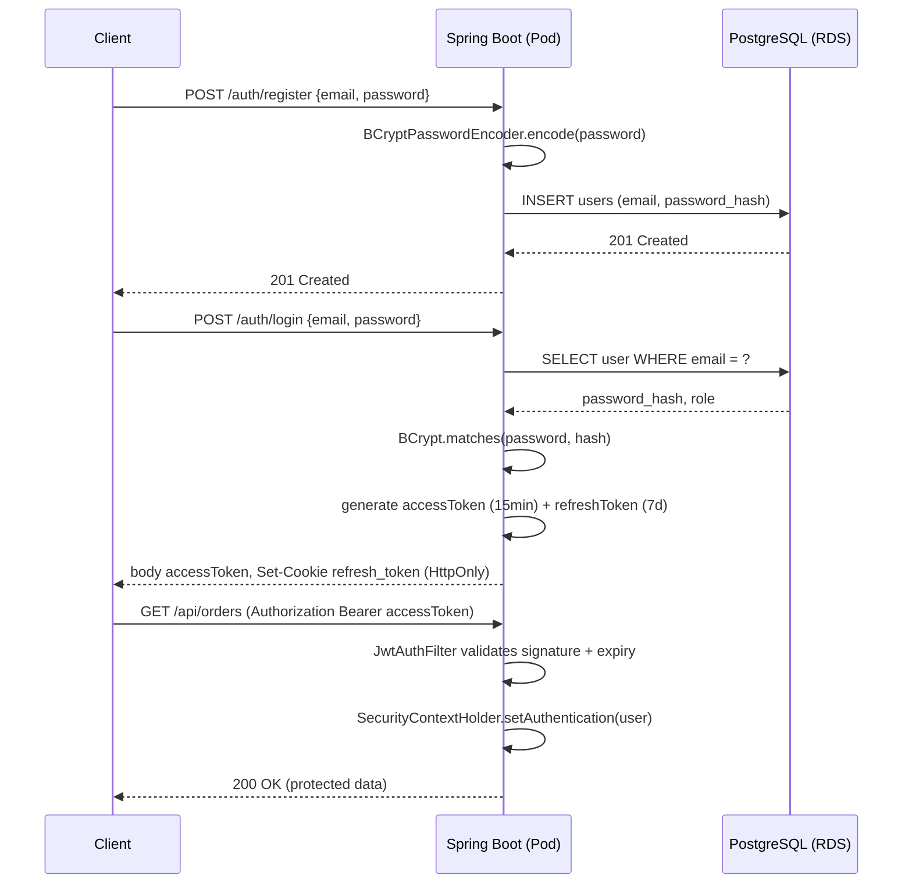
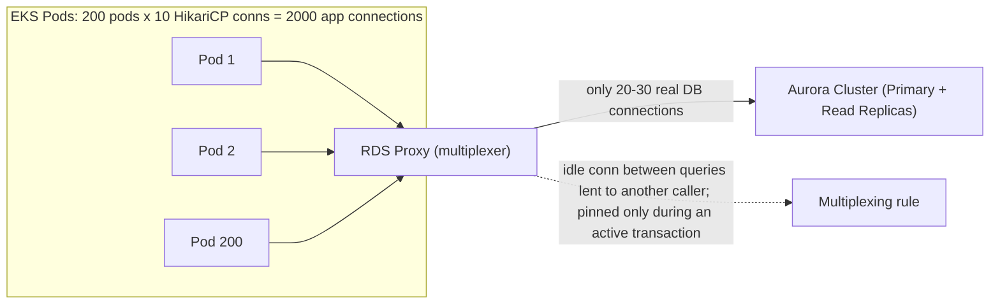
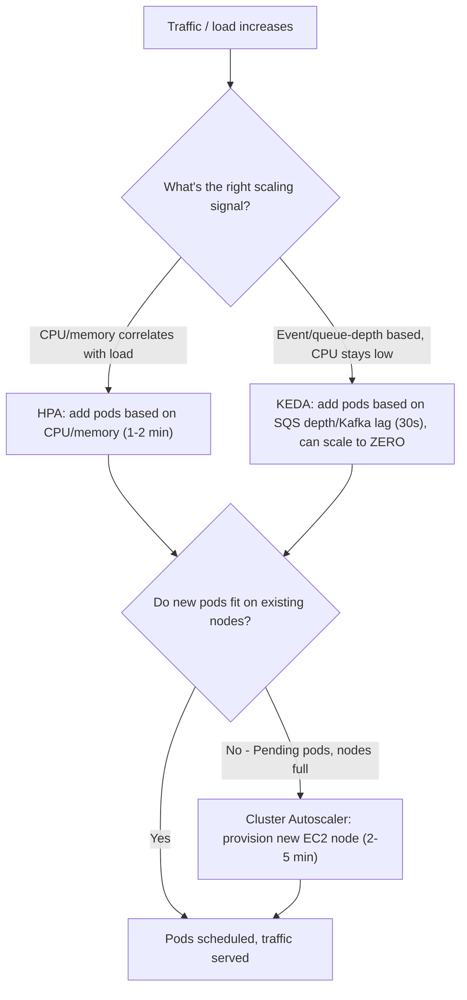

## [8.spring-security-jwt-postgres-auth-eks-interview-print.md] Registration → Hash → JWT Issue → Validate (Sequence Diagram)

## [9.rds-aurora-connection-pooling-eks-interview-print.md] Connection Multiplexing Flow (500 App Conns → 20 DB Conns)

## [10.eks-hpa-keda-production-traps-interview-print.md] HPA → KEDA → Cluster Autoscaler (Decision Flowchart)

